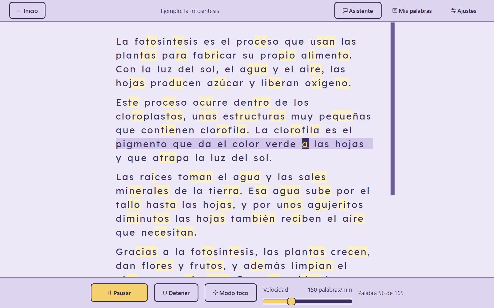
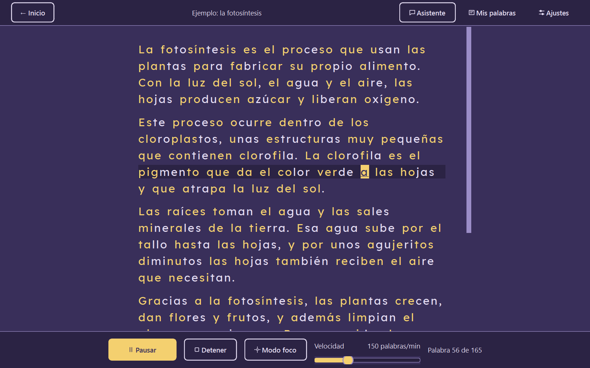
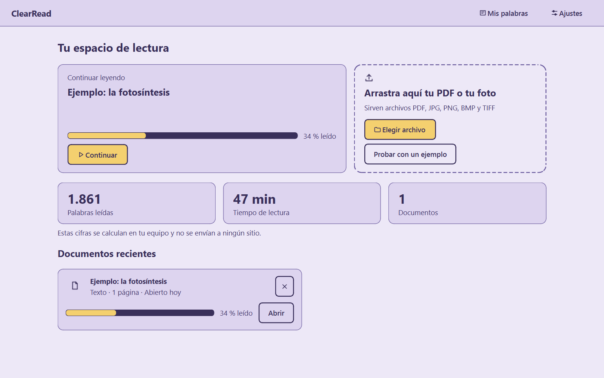
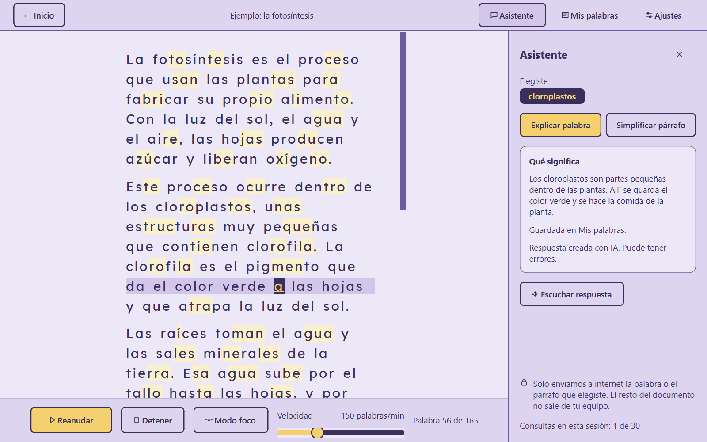

<p align="center">
  
</p>

<h1 align="center">ClearRead</h1>

<p align="center">
  <b>Lectura asistida para estudiantes con dislexia.</b><br>
  Convierte PDFs y fotos de apuntes en un texto cómodo de leer, que la app lee en voz alta resaltando cada palabra.
</p>

<p align="center">
  Windows 10/11 · 100% offline · Asistente de IA opcional
</p>

---

<p align="center">
  
  
</p>

## El problema

Leer una guía fotocopiada, un examen o unos apuntes escaneados exige un esfuerzo extra a quien tiene dislexia: letras apretadas, líneas densas en las que es fácil perderse y palabras largas difíciles de descomponer. ClearRead transforma ese material en una superficie de lectura adaptada y añade apoyo auditivo sincronizado.

## Qué hace

| Función | Descripción |
|:---|:---|
| **Abre PDFs y fotos** | PDF (digital o escaneado), JPG, PNG, JFIF, BMP y TIFF. Arrastrar y soltar o elegir archivo. |
| **OCR local con IA** | Reconoce el texto de fotos y escaneos con un modelo de deep learning (RapidOCR sobre ONNX) que funciona sin internet y reconoce la ñ, las tildes y los signos ¿ ¡. Endereza automáticamente páginas inclinadas. |
| **Lectura en voz alta sincronizada** | La voz de Windows lee el texto respetando comas y puntos mientras se resalta la palabra que suena y una regleta marca la línea. Pausar, reanudar y velocidad ajustable. |
| **Clic para leer desde ahí** | Pulsa cualquier palabra y la lectura empieza en ella. |
| **Sílabas coloreadas** | Segmentación silábica fonética del español (opcional). |
| **Modo foco** | Atenúa todo menos la línea que se está leyendo. |
| **Tipografía adaptable** | Lexend (por defecto), Atkinson Hyperlegible u OpenDyslexic; tamaño, interlineado y espaciado ajustables. |
| **Temas claro y oscuro** | Contraste de texto ≥ 7:1 (WCAG AAA), comprobado con la fórmula oficial del W3C. |
| **Asistente de IA (opcional)** | Clic derecho → *Explicar esta palabra* o *Simplificar este párrafo*, en lenguaje sencillo. Solo se envía el texto que eliges. |
| **Mis palabras** | Glosario automático con las palabras que te explicó el asistente, para repasarlas sin conexión. |
| **Continuar leyendo** | Recuerda dónde quedaste en cada documento; los recientes abren al instante sin volver a procesarlos. |
| **Español e inglés** | La interfaz se puede usar en los dos idiomas. |

<p align="center">
  
  
</p>

## Descarga e instalación

1. Ve a [**Releases**](https://github.com/SoFzzz/ClearRead/releases) y descarga `ClearRead-v1.0.0-win64.zip`.
2. Descomprímelo y abre `ClearRead\ClearRead.exe`.
3. Si Windows muestra *"Windows protegió su PC"*: **Más información → Ejecutar de todas formas**. Aparece porque el programa no está firmado digitalmente.

No necesita Python ni internet. El asistente de IA es la única función que requiere conexión; sin ella, el resto de la app funciona igual.

## Privacidad

- Tus documentos **nunca salen de tu equipo**: el OCR, la voz y el formato son locales.
- El asistente de IA solo envía **la palabra o el párrafo que eliges**, y la primera vez te pide permiso.
- Los documentos recientes y las estadísticas se guardan solo en tu equipo (`%APPDATA%\ClearRead`) y se pueden borrar desde Ajustes.

## Arquitectura

```
ClearRead.exe (escritorio, núcleo offline)  ──HTTPS──►  Backend FastAPI (Render)  ──►  DeepSeek
  OCR · voz · formato · temas                           guarda la clave de la IA
                                                        limita el uso diario
```

- **App de escritorio:** Python 3.11 + PySide6 (Qt). El OCR y la voz corren en hilos propios para que la interfaz nunca se congele.
- **Backend propio:** FastAPI desplegado en Render. La clave de DeepSeek vive solo en el servidor, nunca en el `.exe`.
- La especificación completa está en [`document.md`](document.md) y el sistema de diseño en [`docs/design-system/README.md`](docs/design-system/README.md).

### Tecnologías

| Capa | Tecnología |
|:---|:---|
| Interfaz | PySide6 (Qt 6) |
| PDF | pypdfium2 |
| OCR | RapidOCR + ONNX Runtime, modelo de reconocimiento latino PP-OCRv5 |
| Imagen | OpenCV, Pillow |
| Voz | SAPI5 de Windows vía pyttsx3 |
| Sílabas | silabeador |
| Backend | FastAPI, uvicorn, httpx |
| IA | DeepSeek |
| Empaquetado | PyInstaller (`--onedir`) |

## Para desarrolladores

Requisitos: Windows, **Python 3.11 x64**.

```powershell
# App
py -3.11 -m venv .venv
.\.venv\Scripts\python -m pip install -e ".[dev]"
.\.venv\Scripts\python -m clearread          # ejecutar
.\.venv\Scripts\python -m pytest tests/ -v   # tests

# Backend
py -3.11 -m venv backend\.venv
.\backend\.venv\Scripts\python -m pip install -e ".\backend[dev]"
.\backend\.venv\Scripts\python -m pytest backend/tests -v

# Compilar el .exe (requiere resources/client_token.local.json, no versionado)
.\.venv\Scripts\python -m PyInstaller clearread.spec --clean --noconfirm
```

Guías: [despliegue del backend](docs/deploy.md) · [publicar una versión](docs/release.md).

### Estructura

```
src/clearread/      app de escritorio (core, services, workers, ui)
backend/            API FastAPI (proyecto independiente)
resources/          fuentes, modelos ONNX, iconos y documento de ejemplo
tests/              pruebas automáticas y scripts de prueba manual
docs/               design system, despliegue y publicación
document.md         especificación técnica y requisitos
```

## Limitaciones conocidas

- Solo Windows (la voz usa SAPI5).
- El OCR tarda unos segundos por página en documentos densos; las fórmulas químicas o matemáticas no se reconocen bien.
- La primera consulta al asistente puede tardar hasta un minuto si el servidor gratuito estaba en reposo.
- El reconocimiento con fotos de móvil reales aún no se ha calibrado con un set propio de fotos.
- La tipografía y el modo foco no se han probado todavía con lectores con dislexia.

## Créditos

- Fuentes: [Lexend](https://github.com/googlefonts/lexend), [Atkinson Hyperlegible](https://github.com/googlefonts/atkinson-hyperlegible) y [OpenDyslexic](https://github.com/antijingoist/opendyslexic), bajo licencia SIL Open Font License.
- Modelos OCR: PaddleOCR PP-OCR, distribuidos en ONNX por RapidOCR, bajo licencia Apache 2.0.
- Detalles de origen y licencias en [`resources/fonts/README.md`](resources/fonts/README.md) y [`resources/models/README.md`](resources/models/README.md).

---

Proyecto académico de la Universidad Cooperativa de Colombia (UCC), curso de Diseño.
