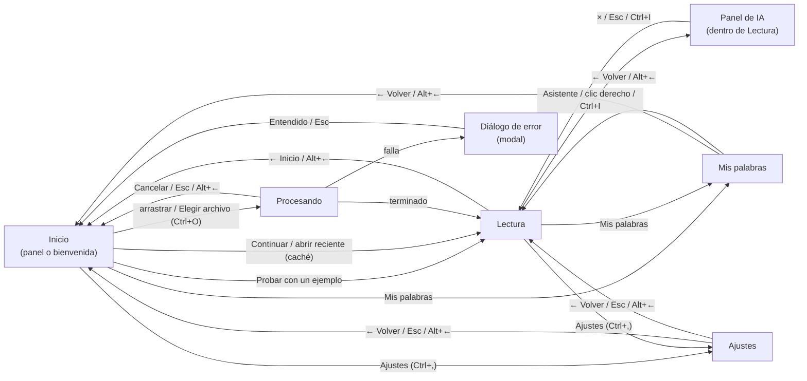

# ClearRead Desktop — Design System

> **Versión:** 2.0 (rediseño del Día 12 de `document.md` §6.5) · **Fecha:** 2026-10-07
> **Estado:** decisiones de la usuaria (2026-10-07) ya aplicadas en el código. La versión 1.0 (Día 2) queda sustituida.
> **Capturas reales de esta versión:** [`mockups/real/v2/`](mockups/real/v2/), hechas con la app real y el documento de ejemplo (ver [§6](#6-páginas)).
> **Mockups v1** ([`mockups/*.png`](mockups/) y [`mockups/source/`](mockups/source/), de Claude Design): son del diseño anterior (3 temas, turquesa y naranja). Se conservan como historial; **no representan** la app actual.

Este documento traduce los requisitos de `document.md` a un sistema visual implementable con widgets y QSS de PySide6. Sigue el **diseño atómico**: fundamentos (tokens) → átomos → moléculas → organismos → plantillas → páginas.

## Índice

- [0. Principios para dislexia](#0-principios-para-dislexia)
- [1. Fundamentos (tokens)](#1-fundamentos-tokens)
  - [1.1 Paleta: dos colores de marca y sus tonos](#11-paleta-dos-colores-de-marca-y-sus-tonos)
  - [1.2 Tokens semánticos por tema](#12-tokens-semánticos-por-tema)
  - [1.3 Contraste: salida de contrast.py](#13-contraste-salida-de-contrastpy)
  - [1.4 Tipografía](#14-tipografía)
  - [1.5 Espaciado](#15-espaciado)
  - [1.6 Radios, bordes y elevación](#16-radios-bordes-y-elevación)
  - [1.7 Iconografía](#17-iconografía)
  - [1.8 Movimiento](#18-movimiento)
- [2. Átomos](#2-átomos)
- [3. Moléculas](#3-moléculas)
- [4. Organismos](#4-organismos)
- [5. Plantillas](#5-plantillas)
- [6. Páginas](#6-páginas)
- [7. Navegación](#7-navegación)
- [8. Checklist de accesibilidad](#8-checklist-de-accesibilidad)
- [9. Voz y tono](#9-voz-y-tono)
- [10. Traspaso a Qt](#10-traspaso-a-qt)
- [11. Decisiones y tareas pendientes](#11-decisiones-y-tareas-pendientes)

---

## 0. Principios para dislexia

| # | Principio | Cómo se aplica en ClearRead |
|:--|:--|:--|
| P1 | **Sin cursivas** | Ningún estilo usa `font-style: italic`, ni en la interfaz ni en el lector. |
| P2 | **Sin texto justificado** | Todo el texto se alinea a la izquierda. El justificado crea "ríos" de espacio que rompen el seguimiento de la línea. |
| P3 | **Líneas de ≤ 70 caracteres** | La columna de lectura mide como máximo 820 px con 40 px de margen interior (740 px útiles). Con Lexend a 18 pt salen 40–45 caracteres por línea (ver [§1.4](#14-tipografía)). Los textos de la interfaz (diálogos, panel de IA) tienen ancho máximo de 520 px. |
| P4 | **Espaciado moderado y ajustable** | Por defecto, letra +0,12 em, palabra +0,16 em, interlineado 1,5 y 18 pt (decisión de la usuaria, [§1.4](#14-tipografía)). Nada de espaciados extremos; los deslizadores de Ajustes permiten cambiarlo. 14 px entre párrafos. |
| P5 | **Sin mayúsculas sostenidas** | Ningún botón, título ni etiqueta va en MAYÚSCULAS: "Elegir archivo", no "ELEGIR ARCHIVO". |
| P6 | **Baja carga cognitiva** | Una acción principal por zona (un solo botón amarillo), pocas opciones, textos cortos, sin jerga y sin animaciones que distraigan. |
| P7 | **Nunca solo color** | Todo estado tiene una segunda señal: forma, borde, icono, grosor o texto. Con solo dos colores de marca esto es obligatorio, no una mejora. |
| P8 | **Fondos suaves** | Ningún tema usa blanco ni negro puros. El Claro es lavanda; el Oscuro es el morado de marca. |

---

## 1. Fundamentos (tokens)

### 1.1 Paleta: dos colores de marca y sus tonos

**Decisión de la usuaria (2026-10-07):** la app tiene **solo dos colores de marca**, el morado `#392F5A` (principal) y el amarillo `#F4D06F` (secundario). Se permiten únicamente **tonos más claros u oscuros derivados de ellos**: nada de turquesa, naranja, marrón, azul ni crema. El error y el éxito se distinguen con **icono + texto**, nunca con otro color.

Todo tono derivado conserva el matiz de su color de origen (morado ≈ 254°, amarillo ≈ 44°); solo cambian la luminosidad y la saturación. Se eligieron a ojo y se comprobaron con `contrast.py` y con el test de matiz de `tests/test_theme.py`.

| Hex | Origen | Matiz / Sat. / Luz. | Dónde se usa |
|:--|:--|:--|:--|
| `#392F5A` | **Morado (marca)** | 254° / 31 % / 27 % | Texto del Claro; fondo del Oscuro; fondo de la palabra que suena (Claro); texto sobre amarillo |
| `#F4D06F` | **Amarillo (marca)** | 44° / 86 % / 70 % | Botones primarios, barras de progreso, deslizadores; palabra que suena (Oscuro); letra de la palabra que suena (Claro); sílaba par del Oscuro |
| `#EDE8F7` | Morado, muy claro | 260° / 48 % / 94 % | Fondo del Claro |
| `#DDD4EF` | Morado, claro | 260° / 46 % / 88 % | Superficies del Claro (barras, tarjetas, panel de IA) |
| `#D2C7EA` | Morado, claro | 259° / 45 % / 85 % | Regleta y *hover* del Claro |
| `#6B5C9E` | Morado, medio | 254° / 26 % / 49 % | Bordes del Claro |
| `#43386B` | Morado, algo más claro | 253° / 31 % / 32 % | Texto secundario del Claro |
| `#4F417C` | Morado, algo más claro | 254° / 31 % / 37 % | Líneas atenuadas del modo foco (Claro) |
| `#FBF0CC` | Amarillo, muy claro | 46° / 85 % / 89 % | Fondo de las sílabas impares (Claro); botón primario presionado |
| `#F8E3A9` | Amarillo, claro | 44° / 85 % / 82 % | Botón primario en *hover* |
| `#E4DCF3` | Morado, muy claro | 261° / 49 % / 91 % | Texto del Oscuro; sílaba impar del Oscuro; botón secundario del Oscuro |
| `#CFC4E8` | Morado, claro | 258° / 44 % / 84 % | Texto secundario y líneas atenuadas del Oscuro |
| `#9B8DC7` | Morado, medio | 254° / 34 % / 67 % | Bordes del Oscuro |
| `#2B2344` | Morado, oscuro | 255° / 32 % / 20 % | Superficies y regleta del Oscuro |
| `#261F3C` | Morado, muy oscuro | 254° / 32 % / 18 % | Pista de sliders y progreso (Oscuro); anillo de foco sobre amarillo (Oscuro) |
| `#4A3D75` | Morado, algo más claro | 254° / 31 % / 35 % | *Hover* del botón secundario (Oscuro) |

**Qué cambia respecto a la v1.** Desaparecen crema, turquesa, naranja, el marrón de la sílaba impar, el verde de la regleta del Claro y el tema Alto Contraste. Los fondos son lavanda en vez de crema, así que ningún tema usa un tercer matiz.

### 1.2 Tokens semánticos por tema

Los nombres de token están en inglés (van así en `theme.py`); los nombres de tema que ve el usuario están en español (`strings.py`). **Solo existen dos temas: Claro y Oscuro** (Alto Contraste se eliminó el 2026-10-07).

| Token | Claro | Oscuro | Uso |
|:--|:--|:--|:--|
| `bg` | `#EDE8F7` | `#392F5A` | Fondo de ventana y del lector |
| `surface` | `#DDD4EF` | `#2B2344` | Barra superior, barra de reproducción, panel de IA, tarjetas |
| `text` | `#392F5A` | `#E4DCF3` | Texto principal |
| `text-muted` | `#43386B` | `#CFC4E8` | Texto secundario (metadatos, ayudas) |
| `syllable-even` | `#392F5A` | `#F4D06F` | Sílabas 1.ª, 3.ª, … |
| `syllable-odd` | `#392F5A` | `#E4DCF3` | Sílabas 2.ª, 4.ª, … |
| `syllable-odd-bg` | `#FBF0CC` | — (sin fondo) | Fondo suave de las sílabas impares (solo Claro) |
| `word-highlight-bg` | `#392F5A` | `#F4D06F` | Fondo de la palabra que suena |
| `word-highlight-fg` | `#F4D06F` | `#392F5A` | Letra de la palabra que suena (sustituye al color de sílaba) |
| `ruler-bg` | `#D2C7EA` | `#2B2344` | Regleta de la línea activa (color opaco, sin alfa) |
| `dim-text` | `#4F417C` | `#CFC4E8` | Líneas que no son la activa, en modo foco |
| `focus-ring` | `#392F5A` | `#F4D06F` | Anillo de foco de teclado |
| `focus-ring-primary` | `#392F5A` | `#261F3C` | Anillo de foco sobre un botón amarillo |
| `primary-bg` | `#F4D06F` | `#F4D06F` | Botón primario, relleno de sliders y progreso. **No cambia entre temas** |
| `primary-fg` | `#392F5A` | `#392F5A` | Texto/icono del botón primario. **No cambia entre temas** |
| `primary-bg-hover` | `#F8E3A9` | `#F8E3A9` | Primario en *hover* |
| `primary-bg-pressed` | `#FBF0CC` | `#FBF0CC` | Primario presionado |
| `primary-border` | `#392F5A` | `#F4D06F` | Borde del botón primario: morado en Claro (el amarillo no se distingue del fondo), invisible en Oscuro |
| `secondary` | `#392F5A` | `#E4DCF3` | Texto y borde del botón secundario |
| `secondary-bg-hover` | `#D2C7EA` | `#4A3D75` | Fondo del secundario en *hover*; opción marcada |
| `border` | `#6B5C9E` | `#9B8DC7` | Bordes de campos, tarjetas, zona de arrastre, separadores |
| `track` | `#392F5A` | `#261F3C` | Ranura de sliders y pista de progreso |
| `track-border` | `#392F5A` | `#9B8DC7` | Borde de la pista y del tirador |
| `disabled-fg` | `#43386B` | `#CFC4E8` | Texto de control deshabilitado |
| `disabled-bg` | `#DDD4EF` | `#2B2344` | Fondo de control deshabilitado (borde **discontinuo**) |

Ya no hay tokens `error` ni `success`: el error se dibuja con el icono "!" en círculo y el texto en `text`; el éxito, con una marca ✓ y texto.

Tema por defecto: **Claro**. Un archivo `config.json` antiguo con `"high_contrast"` se abre en Claro.

### 1.3 Contraste: salida de contrast.py

**Método.** Todas las cifras salen de `.claude/skills/contrast-check/contrast.py` (fórmula W3C), ejecutado el 2026-10-07. Antes se validó con los tres pares de referencia de la skill (`21.00`, `5.75`, `4.44`): coincidieron. `tests/test_theme.py` recalcula cada par con la misma fórmula y falla si alguno baja del umbral.

**Umbrales.** Texto ≥ **7,0:1** (AAA, NFR-A11Y01). Componentes, bordes y anillo de foco ≥ **3,0:1** (WCAG 1.4.11). El script solo conoce el umbral 7,0: en los bloques "no texto", su `FAIL` significa "< 7"; el veredicto contra 3,0 está en las tablas.

#### Texto (umbral 7,0)

| Tema | Par (texto / fondo) | Ratio | Veredicto |
|:--|:--|--:|:--|
| Claro | `text` / `bg` | **10,12** | PASS |
| Claro | `text` / `surface` · `ruler-bg` | 8,53 · 7,58 | PASS |
| Claro | `text-muted` / `bg` · `surface` | 8,67 · 7,31 | PASS |
| Claro | `syllable-odd` / `syllable-odd-bg` | **10,67** | PASS |
| Claro | `dim-text` / `bg` | 7,35 | PASS |
| Claro | `word-highlight-fg` / `word-highlight-bg` | **8,16** | PASS |
| Claro | `primary-fg` / `primary-bg` · `hover` · `pressed` | **8,16** · 9,58 · 10,67 | PASS |
| Claro | `secondary` / `bg` · `surface` · `hover` | 10,12 · 8,53 · 7,58 | PASS |
| Oscuro | `text` / `bg` · `surface` | **9,16** · 11,10 | PASS |
| Oscuro | `text-muted` y `dim-text` / `bg` · `surface` | 7,36 · 8,91 | PASS |
| Oscuro | `syllable-even` (amarillo) / `bg` · `ruler-bg` | 8,16 · 9,88 | PASS |
| Oscuro | `syllable-odd` (lavanda) / `bg` · `ruler-bg` | 9,16 · 11,10 | PASS |
| Oscuro | `word-highlight-fg` / `word-highlight-bg` | 8,16 | PASS |
| Oscuro | `primary-fg` / `primary-bg` · `hover` · `pressed` | **8,16** · 9,58 · 10,67 | PASS |
| Oscuro | `secondary` / `secondary-bg-hover` | 7,15 | PASS |

#### No texto (umbral 3,0)

| Tema | Par | Ratio | Veredicto |
|:--|:--|--:|:--|
| Claro | `border` / `bg` · `surface` | 4,79 · 4,04 | PASS |
| Claro | `focus-ring` / `bg` · `surface` | 10,12 · 8,53 | PASS |
| Claro | `focus-ring-primary` / `primary-bg` (anillo sobre amarillo) | 8,16 | PASS |
| Claro | `primary-border` / `bg` (borde del botón amarillo) | 10,12 | PASS |
| Claro | `primary-bg` (amarillo) / `track` (relleno de barra) | 8,16 | PASS |
| Claro | `word-highlight-bg` / `bg` | 10,12 | PASS |
| Claro | `primary-bg` / `bg` (sin borde) | 1,24 | **no cumple**: por eso el primario del Claro lleva borde morado |
| Claro | `ruler-bg` / `bg` | 1,34 | apoyo visual (ver [§4.2](#42-lector-readerwidget)) |
| Oscuro | `border` / `bg` · `surface` | 4,07 · 4,93 | PASS |
| Oscuro | `focus-ring` / `bg` | 8,16 | PASS |
| Oscuro | `focus-ring-primary` / `primary-bg` | 10,49 | PASS |
| Oscuro | `primary-bg` / `bg` · `track` | 8,16 · 10,49 | PASS |
| Oscuro | `track-border` / `bg` | 4,07 | PASS |
| Oscuro | `word-highlight-bg` / `bg` | 8,16 | PASS |
| Oscuro | `ruler-bg` / `bg` | 1,21 | apoyo visual (ver [§4.2](#42-lector-readerwidget)) |

**Honestidad sobre dos límites.**
1. **Modo foco.** Las líneas atenuadas también deben cumplir 7:1, así que solo pueden bajar del 10,12 al 7,35 (Claro) o del 9,16 al 7,36 (Oscuro). La diferencia es visible pero moderada; la línea activa se distingue además por la regleta y, en el Oscuro, por el amarillo.
2. **Regleta.** Un fondo que contraste 3:1 con el de la ventana dejaría el texto por debajo de 7:1. La regleta es un **apoyo**; la señal principal de "dónde voy" es la palabra resaltada (≥ 8,16:1). Esta aceptación viene de la v1 (decidida el 2026-10-01).

#### Salida literal

```text
### CLARO texto
#392F5A / #EDE8F7  10.12  PASS
#392F5A / #DDD4EF  8.53  PASS
#392F5A / #D2C7EA  7.58  PASS
#43386B / #EDE8F7  8.67  PASS
#43386B / #DDD4EF  7.31  PASS
#4F417C / #EDE8F7  7.35  PASS
#392F5A / #FBF0CC  10.67  PASS
#392F5A / #F4D06F  8.16  PASS
#392F5A / #F8E3A9  9.58  PASS
#392F5A / #FBF0CC  10.67  PASS
#F4D06F / #392F5A  8.16  PASS
### CLARO no texto
#6B5C9E / #EDE8F7  4.79  FAIL
#6B5C9E / #DDD4EF  4.04  FAIL
#392F5A / #EDE8F7  10.12  PASS
#392F5A / #DDD4EF  8.53  PASS
#392F5A / #F4D06F  8.16  PASS
#F4D06F / #392F5A  8.16  PASS
#F4D06F / #EDE8F7  1.24  FAIL
#D2C7EA / #EDE8F7  1.34  FAIL
### OSCURO texto
#E4DCF3 / #392F5A  9.16  PASS
#E4DCF3 / #2B2344  11.10  PASS
#CFC4E8 / #392F5A  7.36  PASS
#CFC4E8 / #2B2344  8.91  PASS
#F4D06F / #392F5A  8.16  PASS
#F4D06F / #2B2344  9.88  PASS
#E4DCF3 / #4A3D75  7.15  PASS
#392F5A / #F4D06F  8.16  PASS
#392F5A / #F8E3A9  9.58  PASS
#392F5A / #FBF0CC  10.67  PASS
### OSCURO no texto
#9B8DC7 / #392F5A  4.07  FAIL
#9B8DC7 / #2B2344  4.93  FAIL
#F4D06F / #392F5A  8.16  PASS
#F4D06F / #2B2344  9.88  PASS
#261F3C / #F4D06F  10.49  PASS
#F4D06F / #261F3C  10.49  PASS
#2B2344 / #392F5A  1.21  FAIL
```

Para repetir la medición: `.\.venv\Scripts\python .claude\skills\contrast-check\contrast.py "<texto>/<fondo>" ...`. **Cualquier cambio de color obliga a volver a medir y a actualizar esta sección.**

### 1.4 Tipografía

#### Fuentes

| Rol | Fuente | Licencia | Notas |
|:--|:--|:--|:--|
| **Lectura, por defecto** | **Lexend** Regular | SIL OFL 1.1 | `resources/fonts/Lexend-Regular.ttf`; origen y SHA256 en `resources/fonts/README.md` |
| **Lectura, opción** | **Atkinson Hyperlegible** Regular | SIL OFL 1.1 (Braille Institute) | `resources/fonts/AtkinsonHyperlegible-Regular.ttf` |
| **Lectura, opción** | **OpenDyslexic** (`compiled/opendyslexic.otf`, un solo peso) | SIL OFL 1.1 | La de siempre; se conserva porque algunas personas la prefieren |
| **Interfaz** | **Segoe UI** (sistema) | — | Ya está en Windows 10/11, no añade bytes ni licencias al `.exe` |

Las tres fuentes de lectura se eligen en **Ajustes → Texto → Fuente de lectura** (`AppConfig.reading_font`). Las tres cubren `ñ Ñ á é í ó ú ü ¿ ¡ « » — “ ”` (comprobado con `QFontMetricsF.inFontUcs4`; hay un test). Se empaquetan en `resources/fonts` y el código de la app nunca las descarga.

**Capturas reales de la tipografía por defecto:** [`mockups/real/v2/lectura_light.png`](mockups/real/v2/lectura_light.png) · [`lectura_dark.png`](mockups/real/v2/lectura_dark.png).

#### Valores por defecto (decisión de la usuaria, 2026-10-07)

| Parámetro | Mínimo | Por defecto | Máximo | Paso | Campo de `AppConfig` |
|:--|--:|--:|--:|--:|:--|
| Tamaño de letra | 12 pt | **18 pt** | 28 pt | 1 pt | `font_size_pt` |
| Espacio entre líneas | 1,4 | **1,5** | 2,6 | 0,1 | `line_spacing` |
| Espacio entre letras | 0 em | **+0,12 em** | 0,4 em | 0,01 em | `letter_spacing_em` |
| Espacio entre palabras | 0 em | **+0,16 em** | 0,6 em | 0,01 em | `word_spacing_em` |
| Entre párrafos | — | 14 px | — | — | Fijo |
| Fuente | — | **Lexend** | — | — | `reading_font` |

El espaciado va en **em** (fracción del tamaño de letra) para que crezca con ella. Qt recibe píxeles: `TextFormatter` convierte con `px = em × (pt × 96/72)`; a 18 pt (24 px), +0,12 em son 2,88 px y +0,16 em son 3,84 px. Los valores antiguos en píxeles (`letter_spacing`, `word_spacing`) se ignoran al leer un `config.json` viejo.

#### Referencias de la investigación (verificadas el 2026-10-07)

Se comprobó cada una; lo que no se pudo confirmar se dice. Las cifras entre comillas de la tabla vienen de los resúmenes consultados, no de haber leído los artículos completos.

| Referencia | Qué dice (verificado) | Cómo se usa aquí |
|:--|:--|:--|
| Zorzi, M. et al. (2012). *Extra-large letter spacing improves reading in dyslexia.* **PNAS 109(28), 11455–11459** (PMC3396504) | 74 niños con dislexia (8–14 años, francés e italiano). Texto en Times New Roman 14 pt con +2,5 pt entre letras (y más espacio entre palabras y líneas): según la cobertura de prensa del estudio, la precisión se duplicó y la velocidad subió más de un 20 %. | Respalda **dar más espacio entre letras que el normal**. Aquel +2,5 pt a 14 pt equivale a ≈ +0,18 em (cálculo propio); nuestro +0,12 em es **más moderado a propósito** (decisión de la usuaria), por lo que **no** podemos afirmar que logre el mismo efecto. Los deslizadores permiten llegar a +0,4 em. |
| Rello, L. y Baeza-Yates, R. (2013). *Good fonts for dyslexia.* **ACM ASSETS '13** | Seguimiento ocular con 48 personas con dislexia y 12 fuentes. Las fuentes sans-serif, monoespaciadas y redondas (no cursivas) mejoran el rendimiento; las cursivas lo empeoran. Recomendadas por rendimiento y preferencia: Helvetica, Courier, Arial, Verdana y CMU. **OpenDyslexic no está entre las recomendadas.** | Respalda **sans-serif y sin cursivas** (P1). Es una razón para que OpenDyslexic ya no sea la fuente por defecto. |
| Rello, L. y Baeza-Yates, R. (2016). *The effect of font type on screen readability by people with dyslexia.* **ACM TACCESS** | 97 hispanohablantes (48 con dislexia, 49 sin). Mejores fuentes: Helvetica, Courier, Arial y CMU; la peor, Arial Italic. | Confirma lo anterior **en español y en pantalla**. |
| Rello, L., Pielot, M. y Marcos, M.-C. (2016). *Make it big! The effect of font size and line spacing on online readability.* **ACM CHI 2016** | 104 personas de 14 a 54 años, tamaños de 10 a 26 pt: hasta 18 pt mejoraron la legibilidad (medida objetiva y subjetiva) y la comprensión. El interlineado influyó menos. | Respalda **18 pt por defecto**. *Corrección al encargo:* el estudio del tamaño es de Rello, Pielot y Marcos, no de Rello y Baeza-Yates. **No verificamos si la muestra incluyó personas con dislexia.** |
| Wery, J. J. y Diliberto, J. A. (2017). *The effect of a specialized dyslexia font, OpenDyslexic, on reading rate and accuracy.* **Annals of Dyslexia 67(2), 114–127** | Comparó OpenDyslexic con Arial y Times New Roman en estudiantes de primaria con dislexia: **sin mejora en velocidad ni precisión**; nadie declaró preferirla. | Es la razón de que OpenDyslexic sea **una opción y no la fuente por defecto**. Muestra pequeña (diseño de caso único). |
| Kuster, S. M. et al. (2018). *Dyslexie font does not benefit reading in children with or without dyslexia.* **Annals of Dyslexia 68(1), 25–42** | Dos experimentos (170 niños con dislexia y 147 en total): la fuente **Dyslexie** no mejoró velocidad ni precisión frente a Arial y Times; se prefirieron estas. | *Corrección al encargo:* este estudio es sobre **Dyslexie**, una fuente comercial distinta, **no sobre OpenDyslexic**. Se cita solo como apoyo general (una fuente "para dislexia" no tiene ventaja medible), no como prueba sobre OpenDyslexic. |
| Duranovic, M., Senka, S. y Babic-Gavric, B. (2018). *Influence of increased letter spacing and font type on the reading ability of dyslexic children.* **Annals of Dyslexia 68(3), 218–228** | (Encontrada durante la verificación.) El espaciado, más que el tipo de fuente, mejoró la lectura; Dyslexie no tuvo ventaja sobre Times con espaciado aumentado. | Refuerza que **el espaciado pesa más que la fuente**. |
| British Dyslexia Association. *Dyslexia Style Guide* (2023) | Sans-serif (p. ej. Arial); 12–14 pt; mayor espacio entre letras, idealmente ~35 % del ancho medio de la letra; interlineado 1,5 (150 %). | Respalda **interlineado 1,5 y sans-serif**. Nuestros 18 pt superan sus 12–14 pt (por Rello 2016). El 35 % del ancho medio equivale a ≈ 0,17 em si el ancho medio es ~0,5 em (**estimación propia**); nuestro +0,12 em queda por debajo. *No se pudo abrir el PDF directamente (error 403): la cifra se verificó en un buscador.* |

**Lo que no está respaldado.** No citamos ningún estudio revisado por pares sobre **Lexend** ni sobre **Atkinson Hyperlegible**: no verificamos ninguno. Se eligieron como sans-serif de formas abiertas, con licencia OFL, buena cobertura del español y letras diferenciadas; su ventaja para personas con dislexia **no está demostrada aquí**. Por eso Ajustes incluye una nota: "Ninguna fuente funciona igual para todas las personas". Tampoco hemos probado la app con lectores con dislexia.

#### Escala de la interfaz

(px a 100 % de escala de Windows.)

| Token | Tamaño | Peso | Uso |
|:--|--:|:--|:--|
| `font-ui-stat` | 28 px | Bold | Cifras de las tarjetas de estadísticas |
| `font-ui-title` | 24 px | Bold | Título de pantalla ("Tu espacio de lectura", "Ajustes") |
| `font-ui-heading` | 20 px | Bold | Títulos de tarjeta, panel y diálogo |
| `font-ui-subheading` | 15–16 px | Bold | Nombre de documento, título de respuesta |
| `font-ui-body` | 15 px | Regular / Semibold en botones | Texto general y botones |
| `font-ui-small` | 13 px | Regular / Semibold | *Tooltips*, *badges* |

Nunca por debajo de 13 px. Sin cursivas ni mayúsculas sostenidas.

**Anchura de línea.** Medida con `tests/manual/measure_line_width.py` (v1, con OpenDyslexic): 49 caracteres como máximo. Con Lexend 18 pt en la columna de 820 px, en las capturas salen 40–45 caracteres por línea (**conteo a ojo sobre [`lectura_light.png`](mockups/real/v2/lectura_light.png), no una medición automática**); sigue por debajo de los 70 de P3.

### 1.5 Espaciado

Base de **4 px**; todos los márgenes y separaciones son múltiplos de 4 y casi siempre de 8.

| Token | Valor | Uso típico |
|:--|--:|:--|
| `space-1` | 4 px | Icono ↔ texto pequeño |
| `space-2` | 8 px | Icono ↔ texto en botón; botones contiguos |
| `space-3` | 12 px | Ítems de lista; filas de ajuste |
| `space-4` | 16 px | Relleno de tarjetas; separación de la cuadrícula del Inicio |
| `space-5` | 20 px | Relleno del panel de IA y de las tarjetas grandes |
| `space-6` | 24 px | Margen lateral de barras; relleno de diálogo |
| `space-8` | 32 px | Margen de página del Inicio y de Mis palabras |
| `space-10` | 40 px | Margen interior horizontal de la columna de lectura |

### 1.6 Radios, bordes y elevación

- **Sin sombras ni desenfoques.** La jerarquía se marca con **bordes** y con el cambio `bg` → `surface`.
- **Sin bordes de otro color (decisión de la usuaria):** todo borde es morado o amarillo (o un tono suyo): `secondary` en botones, `border` en tarjetas, `primary-border` en el botón amarillo del Claro.
- **Grosores:** 1 px para separadores y tarjetas; 2 px para campos, botones y zona de arrastre (discontinuo); **3 px solo para el foco** y la opción elegida.
- **Radios:** `radius-sm` 4 px (teclas) · `radius-md` 8 px (botones, campos, *chip*) · `radius-lg` 12 px (tarjetas) · `radius-xl` 16 px (zona de arrastre) · `radius-pill` mitad de la altura (*badge*, sliders).

### 1.7 Iconografía

- Iconos de **línea**, rejilla de 24 px, trazo de 2 px, extremos redondeados; se muestran a **20 px**. SVG propios en `resources/icons/` (nada descargado en tiempo de ejecución), con `currentColor` sustituido por el hex del token al cargarlos.
- **Siempre con texto al lado**, salvo el × de cerrar (con *tooltip* y `setAccessibleName`).
- **Sin emojis.**
- Juego actual: marca, flecha atrás, ajustes, subir archivo, carpeta, documento, foto, reproducir, pausa, detener, asistente (globo), cerrar, "!", bombilla, candado, reloj, recargar, sin internet, altavoz, **foco** (mira) y **mis palabras** (hoja con líneas).

### 1.8 Movimiento

- **Mínimo:** cambios de estado instantáneos. El resaltado de palabra salta sin fundidos. El modo foco cambia de línea sin animación.
- Única animación: barra de progreso **indeterminada** del panel de IA mientras carga o despierta.

---

## 2. Átomos

Solo propiedades soportadas por QSS y los pseudoestados `:hover`, `:pressed`, `:disabled`, `:checked`. **El foco no usa `:focus`** sino la propiedad dinámica `keyFocus` (ver [Foco de teclado](#foco-de-teclado)).

### 2.1 Botón

| Variante | Alto | Fondo / texto / borde |
|:--|--:|:--|
| **Primario** (amarillo en ambos temas) | 40 px (48 px en Reproducir) | `primary-bg` / `primary-fg` / borde 2 px `primary-border` |
| **Secundario** | 40 px | transparente / `secondary` / borde 2 px `secondary` |
| **Fantasma** (barra superior) | 40 px | transparente / `text` / borde 2 px transparente |
| **Alternable** (Asistente, Modo foco) | 40 px | como secundario; marcado = fondo `secondary-bg-hover` |

| Estado | Cambio | Señal no cromática |
|:--|:--|:--|
| *Hover* | Primario → `primary-bg-hover`; resto → fondo `secondary-bg-hover` | Cursor de mano |
| **Foco de teclado** | Borde de **3 px** `focus-ring` (sobre amarillo, `focus-ring-primary`) | Cambia el grosor de 2 a 3 px |
| Presionado | Primario → `primary-bg-pressed` | — |
| Deshabilitado | Fondo `disabled-bg`, texto `disabled-fg`, **borde 2 px discontinuo** `border` | Borde discontinuo + *tooltip* que explica por qué |

Un solo botón primario por zona. Área mínima de clic 32 × 32 px (todos miden ≥ 40 px). **Los botones no se cortan nunca:** conservan su tamaño natural (`QSizePolicy.Fixed`) y el texto largo se recorta en otra etiqueta, no en el botón.

#### Foco de teclado

**Decisión de la usuaria:** el indicador de foco es obligatorio, pero **solo con foco de teclado** (Tab / Mayús+Tab), nunca al hacer clic, y siempre en amarillo o morado. `ui/focus_ring.py` instala un filtro de eventos en la aplicación: al recibir foco con motivo `Tab` o `Backtab` marca `keyFocus = true`; con cualquier otro motivo (ratón, atajo, programa) lo deja en `false`. Captura: [`foco_teclado_light.png`](mockups/real/v2/foco_teclado_light.png) · [`foco_teclado_dark.png`](mockups/real/v2/foco_teclado_dark.png). Contraste del anillo: [§1.3](#13-contraste-salida-de-contrastpy).

### 2.2 Slider

- Ranura de 8 px: relleno `track` con borde `track-border` 1 px; parte recorrida `primary-bg` (**amarilla en ambos temas**).
- Tirador de 20 × 20 px, círculo amarillo con aro de 2 px `track-border`; con foco de teclado el aro pasa a 3 px `focus-ring`.
- **Siempre con su valor en texto** a la derecha ("18 puntos", "0,12 em", "150 palabras/min").

### 2.3 Toggle (interruptor)

`QCheckBox` con indicador cuadrado de 22 px (borde `secondary`; marcado = relleno amarillo) y **siempre con la palabra "Sí" / "No"** al lado.

### 2.4 Etiqueta

`QLabel` con `text`; `text-muted` solo para información secundaria. Nunca en cursiva ni en mayúsculas. Las etiquetas de nombre largo (documentos) usan `ElidedLabel`: terminan en "…", llevan el nombre completo en el *tooltip* y en el nombre accesible, y no ensanchan el diseño.

### 2.5 Campo de texto y combobox

Alto 40 px, borde 2 px `border`, `radius-md`, fondo `bg`. Con foco de teclado, borde de 3 px `focus-ring`.

### 2.6 Barra de progreso

`QProgressBar` de 12 px (8 px en el panel de IA): pista `track` con borde `track-border`; relleno `primary-bg` (**amarillo**). Sin texto dentro: el porcentaje se escribe al lado ("34 % leído").

### 2.7 Tooltip

Fondo `text`, texto `bg` (colores invertidos, mismo ratio que `text`/`bg`), 13 px, relleno 8 × 12 px. Obligatorio en botones de solo icono y en controles deshabilitados.

### 2.8 Badge

Alto 24 px, `radius-pill`, borde 1 px `border`, texto `text` semibold. Uso: "Sin internet". Siempre texto, nunca un punto de color solo.

### 2.9 Chip de palabra

Alto 32 px, `radius-md`, fondo `word-highlight-bg`, texto `word-highlight-fg` en negrita: muestra la palabra elegida en el panel de IA (mismo par que el resaltado: 8,16:1 en ambos temas).

---

## 3. Moléculas

### 3.1 Zona de arrastre

Borde **2 px discontinuo** `border`, `radius-xl`. Dos formas:
- **Compacta** (con documentos): al lado de "Continuar leyendo", mínimo 320 × 230 px: icono, título, formatos aceptados y los botones **apilados** ("Elegir archivo" primario, "Probar con un ejemplo" secundario).
- **De bienvenida** (primera vez): ancho completo, título "Te damos la bienvenida a ClearRead", frase amable y los botones **en fila**.

Al arrastrar un archivo encima: borde `text` y fondo `ruler-bg` (cambio de borde + fondo, no solo color).

### 3.2 Control de reproducción

Botón primario de 148 × 48 px ("Reproducir" ▷ ↔ "Pausar" ‖ ↔ "Reanudar"), secundario "Detener", **alternable "Modo foco"** (icono de mira), slider "Velocidad" y el contador "Palabra 56 de 165". Los atajos están en los *tooltips* ("Modo foco (F)"); ya no hay línea de recordatorio de atajos.

### 3.3 Fila de ajuste con vista previa

Etiqueta · control · valor en texto. Cada cambio actualiza al instante la tarjeta "Vista previa" (con la fuente, el tamaño y el espaciado elegidos) y se guarda en `AppConfig`.

### 3.4 Tarjeta de documento reciente

`Card` (superficie, borde 1 px, `radius-lg`) con: icono · nombre (elidido, *tooltip* completo) y metadatos ("Texto · 1 página · Abierto hoy") · botón × "Quitar de recientes" · barra de progreso con "34 % leído" · botón **"Abrir"** (nunca se corta). Se colocan en una **cuadrícula de 2 columnas**.

### 3.5 Tarjeta de respuesta de IA

Fondo `bg` sobre el panel, borde 1 px, `radius-lg`. Título ("Qué significa", "El párrafo, más simple"), cuerpo en la fuente de lectura, **"Guardada en Mis palabras."** (solo al explicar una palabra) y pie fijo "Respuesta creada con IA. Puede tener errores." Al llegar la respuesta se avisa a `QAccessible` para que el lector de pantalla la anuncie.

### 3.6 Aviso de privacidad

Primer uso (NFR-SEC01): tarjeta con borde **2 px** `text`, candado, título "Antes de usar el asistente", qué se envía y **adónde** (servidor de ClearRead → DeepSeek) y botones "Ahora no" / "Entendido". Hasta pulsar "Entendido" no se envía nada. Se guarda en `AppConfig.ai_privacy_accepted`. Recordatorio permanente al pie del panel.

### 3.7 Tarjeta "Continuar leyendo" (HOME-F02)

`Card` con: rótulo "Continuar leyendo" (muted) · nombre del último documento (elidido) · barra de progreso con "34 % leído" · botón primario **"Continuar"** (abre el documento y ofrece seguir donde se dejó).

### 3.8 Tarjeta de estadística (HOME-F02)

`Card` con la cifra en 28 px bold y su rótulo debajo: "Palabras leídas", "Tiempo de lectura", "Documentos". Debajo de las tres, la frase "Estas cifras se calculan en tu equipo y no se envían a ningún sitio."

### 3.9 Tarjeta de palabra (AI-F05)

`Card` con la palabra (20 px bold), su explicación, "Documento · fecha" (muted) y dos botones: **"Escuchar"** (altavoz) y **"Borrar"**. Cada botón lleva nombre accesible con la palabra ("Escuchar célula").

### 3.10 Aviso "Seguir desde donde lo dejaste" (READ-F01)

`Card` sobre la columna de lectura: título, "Estabas en la palabra 56 de 165.", botón secundario "Empezar de nuevo" y primario **"Seguir"**. Aparece solo si el documento se dejó a medias (después de la 1.ª palabra y antes de la última).

---

## 4. Organismos

### 4.1 Barra superior de navegación

Alto **56 px**, fondo `surface`, borde inferior 1 px `border`, relleno lateral 24 px.
- **Inicio:** marca "ClearRead" · **"Mis palabras"** · "Ajustes" (fantasmas).
- **Lectura:** "← Inicio" · título del documento centrado (truncado con "…") · "Asistente" (alternable; se desactiva sin internet, con *badge* "Sin internet") · "Mis palabras" · "Ajustes".
- **Mis palabras / Ajustes:** "← Volver" · título.
- **Procesando:** "Ajustes" deshabilitado.

### 4.2 Lector (`ReaderWidget`)

- `QTextEdit` de solo lectura sin marco, fondo `bg`, columna de **550–820 px** centrada, margen interior 40 px a los lados y 32 px arriba.
- **Sílabas (opcional, el interruptor de Ajustes):** Claro → todas en `text`, y las **impares con fondo `syllable-odd-bg`** (amarillo muy suave, 10,67:1); Oscuro → alternancia **amarillo / lavanda** (8,16:1 y 9,16:1). El HTML lleva `background-color` solo si el tema define `syllable-odd-bg`.
- **Palabra que suena** (`ExtraSelection`): **Claro = fondo `#392F5A` con letra `#F4D06F`; Oscuro = fondo `#F4D06F` con letra `#392F5A`** (decisión de la usuaria), con subrayado del color de la letra. Sin negrita (no cambia el ancho y no mueve las líneas).
- **Regleta** (`FullWidthSelection`, `ruler-bg` opaco, en tonos de morado): cubre el ancho de la columna. Es un apoyo; ver [§1.3](#13-contraste-salida-de-contrastpy).
- **Modo foco (READ-F02):** cuando se activa, todas las líneas visuales salvo la activa se pintan con `dim-text` y sin fondo de sílaba; la activa mantiene sus colores y la regleta. Se calcula con dos `ExtraSelection` (antes y después de la línea) sobre el diseño de `QTextLayout`, sin animación. Como el texto atenuado debe seguir en ≥ 7:1, el contraste entre líneas es moderado ([§1.3](#13-contraste-salida-de-contrastpy)). Sin ninguna palabra activa no se atenúa nada. Capturas: [`lectura_foco_light.png`](mockups/real/v2/lectura_foco_light.png) · [`lectura_foco_dark.png`](mockups/real/v2/lectura_foco_dark.png).
- **Clic izquierdo** en una palabra: empieza a leer desde ahí (UI-F02). **Clic derecho:** menú "Explicar esta palabra" / "Simplificar este párrafo" (D11).

### 4.3 Barra de reproducción

Alto **80 px**, fondo `surface`, borde superior 1 px, contenido de hasta 980 px. Contiene el [control de reproducción](#32-control-de-reproducción). Visible siempre en Lectura.

### 4.4 Panel lateral de IA

- `QFrame` de **360 px** a la derecha, fondo `surface`, borde izquierdo 1 px, relleno 20 px, separación 16 px.
- Se abre con el botón "Asistente", con clic derecho sobre una palabra o párrafo o con **Ctrl+I**. Al abrirse, la lectura se **pausa**.
- Orden: cabecera ("Asistente" + ×) · palabra elegida ([chip](#29-chip-de-palabra)) · botones "Explicar palabra" / "Simplificar párrafo" (el activo es primario) · zona de estado · pie con privacidad y "Consultas en esta sesión: N de 30".
- **Estados:** vacío (instrucciones) · A primer uso ([aviso](#36-aviso-de-privacidad)) · B cargando ("Buscando una explicación…" + barra indeterminada + "Cancelar") · C despertando ("Despertando el asistente…" + reloj + "Cancelar") · D respuesta ([tarjeta](#35-tarjeta-de-respuesta-de-ia) + "Escuchar respuesta") · E error (icono "!" en círculo + mensaje de `strings.py` + "Reintentar", salvo `SESSION_LIMIT`, `DAILY_LIMIT` e `INPUT_TOO_LONG`) · F sin internet (botón de la barra deshabilitado + explicación en el panel).
- Los errores del asistente se muestran **dentro del panel**, no con un diálogo modal (§4.10 de `document.md`).
- "Escuchar respuesta" lee la respuesta con la voz SAPI5 **sin mover el punto del documento** y pausa la lectura si sonaba.
- Captura: [`panel_ia_light.png`](mockups/real/v2/panel_ia_light.png) · [`panel_ia_dark.png`](mockups/real/v2/panel_ia_dark.png).

### 4.5 Panel de ajustes

- Pantalla completa con dos columnas (controles flexibles · "Vista previa" de 420 px). Secciones: **Tema** (2 tarjetas-radio, Claro y Oscuro, con muestra "Aa"), **Texto** (**fuente de lectura**, tamaño, interlineado, espacio entre letras en em, entre palabras en em, sílabas de colores), **Voz** (velocidad, voz) e **Idioma** (de la interfaz; se aplica al reiniciar, con aviso).
- **Fuente de lectura:** desplegable con "Lexend (recomendada)", "Atkinson Hyperlegible" y "OpenDyslexic", y la nota "Ninguna fuente funciona igual para todas las personas: elige la que te resulte más cómoda."
- **No hay "Ajustes avanzados"** (decisión de la usuaria, 2026-10-07): la dirección del asistente sigue en `AppConfig.backend_url` pero no se muestra. Tampoco hay campo de API key.
- "Restablecer valores" (vuelve a la apariencia por defecto, conserva voz e idioma) y la tarjeta "Tu privacidad" con "Borrar documentos recientes".
- Los cambios se guardan solos y se aplican al momento.

### 4.6 Diálogo de error (`AccessibleErrorDialog`)

`QDialog` modal, ancho 540 px, fondo `bg`, borde **2 px `text`**. Icono "!" en círculo de 48 px (borde `text`, no de otro color) · título (qué pasó) · una frase · caja "Qué puedes hacer" (bombilla + texto) · botones "Entendido" (primario, foco inicial) y, cuando ayuda, "Elegir otro archivo". Nunca muestra trazas ni códigos.

### 4.7 Inicio como panel (HOME-F02, HOME-F03)

Con documentos: título "Tu espacio de lectura" · fila de **"Continuar leyendo"** (flexible) + **zona de arrastre compacta** · fila de **tres estadísticas** · "Documentos recientes" en tarjetas de 2 columnas. Sin documentos: solo la zona de bienvenida, con "Elegir archivo" y **"Probar con un ejemplo"**. El Inicio hace scroll **solo vertical**; no hay barra horizontal. "Probar con un ejemplo" abre `resources/samples/ejemplo_es.txt` (texto propio sobre la fotosíntesis, ≈ 165 palabras, sin datos personales); no pasa por OCR y queda en recientes como "Ejemplo: la fotosíntesis".

**Estadísticas.** "Palabras leídas" cuenta cada palabra que la voz dice del documento (no las respuestas del asistente) y "Tiempo de lectura" suma el tiempo con la lectura en marcha; "Documentos" son los de la lista de recientes. Todo se guarda en `stats.json` dentro de `%APPDATA%\ClearRead` y no sale del equipo.

### 4.8 Mis palabras (AI-F05)

Pantalla completa de hasta 860 px: título "Mis palabras" + "3 palabras guardadas" · campo de búsqueda · lista de [tarjetas de palabra](#39-tarjeta-de-palabra-ai-f05). La **búsqueda** ignora mayúsculas y tildes ("celula" encuentra "célula") y mira la palabra y la explicación. Estado vacío: "Aún no hay palabras guardadas" y una explicación. Capturas: [`mis_palabras_light.png`](mockups/real/v2/mis_palabras_light.png) · [`mis_palabras_dark.png`](mockups/real/v2/mis_palabras_dark.png).

**Sin llamadas nuevas a la IA:** la palabra y su explicación se guardan cuando el asistente ya las mostró (`glossary.json`, hasta 500 entradas; una palabra repetida conserva solo su última explicación). "Escuchar" usa la voz del sistema, "Borrar" la quita.

---

## 5. Plantillas

Ventana de referencia **1280 × 800 px**; mínima **1024 × 700 px**.

### 5.1 Inicio

```text
┌──────────────────────────── 1280 ────────────────────────────┐
│ Barra superior 56:  ClearRead ········ Mis palabras  Ajustes │
├──────────────────────────────────────────────────────────────┤
│ contenido hasta 1100 px, centrado, margen 32                  │
│  Tu espacio de lectura                                        │
│  ┌── Continuar leyendo (3) ──────┐ ┌─ zona de arrastre (2) ─┐ │
│  │ nombre · progreso · Continuar │ │ Elegir · Probar ejemplo│ │
│  └───────────────────────────────┘ └────────────────────────┘ │
│  ┌─ palabras ─┐ ┌─ tiempo ─┐ ┌─ documentos ─┐                  │
│  Documentos recientes (cuadrícula de 2 columnas)              │
└──────────────────────────────────────────────────────────────┘
```

**Responsive desde 1024 px:** el contenido ocupa todo el ancho disponible hasta 1100 px; la zona de arrastre tiene un mínimo de 320 px y las filas no necesitan más de 960 px. Un test comprueba, a 1024, 1100 y 1400 px, que no hay barra horizontal y que ninguna tarjeta ni botón "Abrir" se sale de la vista.

### 5.2 Lectura (+ panel de IA)

La columna de lectura (550–820 px) va centrada en el área flexible; con el panel abierto (360 px) el área mide 920 px a 1280 y 664 px a 1024. Sobre la columna aparece, si hace falta, el aviso de "Seguir desde donde lo dejaste".

### 5.3 Ajustes y Mis palabras

Ajustes: contenedor de 1120 px con dos columnas y scroll vertical. Mis palabras: columna única de hasta 860 px.

---

## 6. Páginas

**Capturas reales de la v2** (ventana de 1280 × 800 a escala 125 % de Windows, por eso miden 1600 × 1000; app real, fuentes reales, documento de ejemplo; `tests/manual/run_real_v2.py`):

| # | Pantalla | Claro | Oscuro | Notas |
|:--|:--|:--|:--|:--|
| 1 | Inicio vacío (primera vez) | [inicio_vacio_light.png](mockups/real/v2/inicio_vacio_light.png) | [inicio_vacio_dark.png](mockups/real/v2/inicio_vacio_dark.png) | Bienvenida y "Probar con un ejemplo" |
| 1b | Foco de teclado | [foco_teclado_light.png](mockups/real/v2/foco_teclado_light.png) | [foco_teclado_dark.png](mockups/real/v2/foco_teclado_dark.png) | Anillo de Tab en "Probar con un ejemplo" |
| 2 | Inicio con datos | [inicio_datos_light.png](mockups/real/v2/inicio_datos_light.png) | [inicio_datos_dark.png](mockups/real/v2/inicio_datos_dark.png) | Las **cifras de las estadísticas son valores ilustrativos** escritos por el script; el progreso (34 %) sale de la posición de lectura real del ejemplo |
| 3 | Lectura, con sílabas | [lectura_light.png](mockups/real/v2/lectura_light.png) | [lectura_dark.png](mockups/real/v2/lectura_dark.png) | Palabra que suena, regleta, barra de reproducción |
| 4 | Lectura en modo foco | [lectura_foco_light.png](mockups/real/v2/lectura_foco_light.png) | [lectura_foco_dark.png](mockups/real/v2/lectura_foco_dark.png) | Líneas atenuadas |
| 5 | Panel de IA con respuesta | [panel_ia_light.png](mockups/real/v2/panel_ia_light.png) | [panel_ia_dark.png](mockups/real/v2/panel_ia_dark.png) | Respuesta **real** del backend desplegado a una palabra del ejemplo |
| 6 | Mis palabras | [mis_palabras_light.png](mockups/real/v2/mis_palabras_light.png) | [mis_palabras_dark.png](mockups/real/v2/mis_palabras_dark.png) | Tres palabras explicadas por el backend real |
| 7 | Ajustes | [ajustes_light.png](mockups/real/v2/ajustes_light.png) | [ajustes_dark.png](mockups/real/v2/ajustes_dark.png) | Fuente de lectura, 2 temas, sin "Ajustes avanzados" |

Quedan de la sesión anterior (v1, Día 11) las capturas del panel de IA con error y sin red: [`mockups/real/panel_ia_error_real_*.png`](mockups/real/) y [`panel_ia_sin_red_real_*.png`](mockups/real/). Usan la paleta antigua; **no se rehicieron** en el Día 12.

---

## 7. Navegación

### 7.1 Mapa de pantallas



### 7.2 Orden de foco (Tab)

*Orden previsto: en el código sigue el orden en que se crean los widgets, no se fijó con `setTabOrder`.*

| Pantalla | Orden |
|:--|:--|
| Inicio vacío | Mis palabras → Ajustes → **Elegir archivo** (foco inicial) → Probar con un ejemplo |
| Inicio con documentos | … → **Elegir archivo** → Probar con un ejemplo → Continuar → tarjetas (× → Abrir) |
| Procesando | **Cancelar** |
| Lectura | ← Inicio → Asistente → Mis palabras → Ajustes → **lector** (foco inicial) → Reproducir → Detener → Modo foco → Velocidad |
| Lectura + panel | … → panel: × → Explicar palabra → Simplificar párrafo → Reintentar/Cancelar/Escuchar |
| Mis palabras | ← Volver → búsqueda → (por tarjeta) Escuchar → Borrar |
| Ajustes | ← Volver → Tema → Fuente → Tamaño → Interlineado → Letras → Palabras → Sílabas → Velocidad → Voz → Idioma → Restablecer |

### 7.3 Atajos de teclado

| Atajo | Acción | Dónde |
|:--|:--|:--|
| **Espacio** | Reproducir / pausar / reanudar | Lectura |
| **Esc** | Cerrar el panel de IA o, si no está abierto, detener la lectura; cancela el procesado; sale de Ajustes | Según contexto |
| **F** | Activar / desactivar el modo foco | Lectura |
| **Ctrl+I** | Abrir / cerrar el asistente | Lectura |
| Ctrl+O | Elegir archivo | Inicio |
| Ctrl+, | Abrir Ajustes | Inicio, Lectura |
| Alt+← | Atrás | Lectura, Ajustes, Mis palabras, Procesando |

`F6` (mover el foco entre lector y panel) y `Ctrl++` / `Ctrl+−` (tamaño de letra) figuran en `document.md` (UI-F03) pero **todavía no están implementados** (§11).

### 7.4 Qué hace "Atrás" en cada pantalla

| Pantalla | Atrás |
|:--|:--|
| Inicio | No hay atrás. |
| Procesando | Equivale a **Cancelar**. |
| Lectura | Detiene la voz, guarda la posición y vuelve a Inicio (cierra el panel de IA). |
| Mis palabras | Detiene la voz y vuelve a la pantalla de origen (Inicio o Lectura). |
| Ajustes | Vuelve a la pantalla de origen. Los cambios ya están guardados. |

---

## 8. Checklist de accesibilidad

- [x] **Contraste:** todo texto ≥ 7:1 y todo borde, icono o indicador ≥ 3:1, medido con `contrast.py` y recalculado en `tests/test_theme.py` (§1.3). Excepciones documentadas: la regleta y el amarillo sobre lavanda sin borde.
- [x] **Solo dos colores de marca:** un test recorre `theme.py` y falla ante cualquier hex que no sea uno de los 16 tonos de §1.1, y otro prohíbe hex fuera de `theme.py`.
- [x] **Foco visible solo con teclado**, en morado o amarillo (test con eventos de foco `Tab`, `Backtab`, ratón y atajo).
- [ ] **Teclado:** todo se puede hacer sin ratón; orden de Tab según §7.2. *(Falta F6 y Ctrl++/−.)*
- [x] **Tamaño de clic ≥ 32 px** (botones de 40–48 px).
- [x] **Nunca solo color:** error = icono "!" + texto; deshabilitado = borde discontinuo + *tooltip*; opción elegida = borde grueso; palabra que suena = fondo + subrayado; toggle = "Sí/No"; sin internet = *badge* con texto.
- [x] **Nombres accesibles** en botones de solo icono, tarjetas ("Abrir {documento}", "Escuchar {palabra}"), campo de búsqueda y respuesta de IA.
- [x] **Sin cursivas, sin justificado, sin mayúsculas sostenidas.**
- [x] **Home sin barra horizontal desde 1024 px.**
- [ ] **Movimiento:** la barra indeterminada no respeta aún "Mostrar animaciones en Windows" (pendiente).
- [ ] **Escalado de Windows** al 125 % y 150 %: el 125 % se ve en las capturas; el 150 % no se probó.
- [ ] **Narrador de Windows:** no se probó.
- [ ] **Prueba con personas con dislexia:** no se hizo.

---

## 9. Voz y tono

**Cómo hablamos:** español neutro, de **tú**, frases cortas (≤ 20 palabras), en positivo y sin culpar a nadie. Cada mensaje de problema dice **qué pasó** y **qué se puede hacer**. Sin tecnicismos. Sin signos de exclamación en errores.

| En vez de… | Decimos… |
|:--|:--|
| "Error: PdfPasswordError" | "No pudimos abrir este documento. El PDF tiene contraseña y ClearRead no puede leerlo así." |
| "Procesando OCR página 5/12" | "Leyendo la página 5 de 12" |
| "Backend no disponible (503)" | "El asistente no está disponible en este momento." |
| "ACEPTAR" | "Entendido" |
| "Estadísticas de uso" | "Estas cifras se calculan en tu equipo y no se envían a ningún sitio." |
| "Glosario vacío" | "Aún no hay palabras guardadas" |

Los mensajes de error de ingesta y del asistente son los de la v1 (viven en `ui/strings.py`; ver `document.md` §4.9 y §4.10). **Textos nuevos del Día 12** (todos en es y en): "Tu espacio de lectura", "Continuar leyendo", "Probar con un ejemplo", "Te damos la bienvenida a ClearRead", "Palabras leídas", "Tiempo de lectura", "Documentos", "Seguir desde donde lo dejaste", "Seguir", "Empezar de nuevo", "Modo foco", "Mis palabras", "Buscar una palabra", "Escuchar", "Borrar", "Guardada en Mis palabras.", "Fuente de lectura".

---

## 10. Traspaso a Qt

### 10.1 Módulo de tema (`src/clearread/ui/theme.py`)

- `ThemeId(Enum)`: `LIGHT = "light"`, `DARK = "dark"`. Es el valor de `AppConfig.theme`.
- `ThemeTokens`: `@dataclass(frozen=True)` con un `str` (hex) por token de §1.2: `bg`, `surface`, `text`, `text_muted`, `syllable_even`, `syllable_odd`, `syllable_odd_bg`, `word_highlight_bg`, `word_highlight_fg`, `ruler_bg`, `dim_text`, `focus_ring`, `focus_ring_primary`, `primary_bg`, `primary_fg`, `primary_bg_hover`, `primary_bg_pressed`, `primary_border`, `secondary`, `secondary_bg_hover`, `border`, `track`, `track_border`, `disabled_fg`, `disabled_bg`.
- `THEMES`: los dos juegos de §1.2, **copiados de esa tabla**. `tests/test_theme.py` recalcula cada ratio de §1.3 y valida la regla de los dos colores.
- `build_stylesheet(tokens)` genera el QSS; `syllable_palette(tokens)` devuelve `SyllablePalette(color_even, color_odd, background_odd)`.

### 10.2 Reglas clave del QSS

```css
QPushButton                    { border: 2px solid {secondary}; background: transparent; color: {secondary}; }
QPushButton[keyFocus="true"]   { border: 3px solid {focus_ring}; padding: 0 17px; }
QPushButton[variant="primary"] { background: {primary_bg}; color: {primary_fg}; border-color: {primary_border}; }
QPushButton[variant="primary"][keyFocus="true"] { border: 3px solid {focus_ring_primary}; }

QSlider::groove:horizontal   { background: {track}; border: 1px solid {track_border}; }
QSlider::sub-page:horizontal { background: {primary_bg}; }
QProgressBar                 { background: {track}; border: 1px solid {track_border}; }
QProgressBar::chunk          { background: {primary_bg}; }
```

Las variantes se marcan con propiedades dinámicas (`variant`, `role`, `keyFocus`) y se refrescan con `style().unpolish()/polish()`.

### 10.3 Lo que no va por QSS

| Elemento | Cómo se tematiza |
|:--|:--|
| Sílabas | `TextFormatter(syllabifier, palette, style)` con `syllable_palette(tokens)` (el fondo de las impares es `background-color` en el HTML) |
| Palabra resaltada, regleta y modo foco | `ReaderWidget.apply_theme(tokens)`: `word`, `ruler` y `dim` (`QTextCharFormat`) como `ExtraSelection` |
| Iconos | SVG recoloreados al cargar (§1.7) |
| Foco de teclado | `KeyboardFocusRing` (filtro de eventos de la aplicación) |
| Barra de título | Nativa de Windows: no se tematiza |

### 10.4 Tipografía en el código

`ReadingStyle(font_family, font_size_pt, letter_spacing_em, word_spacing_em)` → `css()` convierte los em a píxeles. `ui/fonts.py` registra las tres fuentes con `QFontDatabase.addApplicationFont`. La clave de la caché de documentos incluye tema, fuente, tamaño, espaciados y sílabas, así que cambiar cualquiera regenera el HTML sin recalcular el `TokenPositionMap`.

---

## 11. Decisiones y tareas pendientes

**Decisiones de la usuaria (2026-10-07), aplicadas en este documento y en el código:** solo dos colores de marca (§1.1); solo Claro y Oscuro, sin Alto Contraste; botones primarios, barras y deslizadores amarillos en ambos temas; sin bordes de otro color; foco solo con teclado y en amarillo o morado; palabra que suena invertida entre temas; sílabas con fondo amarillo suave (Claro) o alternancia amarillo/lavanda (Oscuro); regleta y modo foco en tonos de morado; "Ajustes avanzados" oculto; Lexend por defecto con Atkinson Hyperlegible y OpenDyslexic como opciones; 18 pt, interlineado 1,5, letra +0,12 em y palabra +0,16 em.

**Pendientes y límites honestos**

1. **Sin pruebas con personas.** Ni la tipografía por defecto ni el modo foco se probaron con lectores con dislexia (§1.4).
2. **Modo foco discreto.** El 7:1 limita cuánto se puede atenuar (§1.3). Si la usuaria prefiere un atenuado más fuerte, hay que decidir entre bajar el umbral de las líneas atenuadas (con una excepción documentada) o añadir otra señal.
3. **F6 y Ctrl++/Ctrl+−** (UI-F03) siguen sin implementar.
4. **Estadísticas.** Cuentan las palabras que dice la voz y el tiempo con la lectura en marcha; leer sin voz (con el ratón) no suma. Es una definición simple, no una medición del esfuerzo de lectura.
5. **Escalado de Windows al 150 %, Narrador y "Mostrar animaciones":** sin probar.
6. **Mockups v1** (`mockups/*.png`): obsoletos; se podrían borrar. Las capturas del panel de IA con error y sin red (v1) no se rehicieron.
7. **`clearread.spec` (Día 13):** debe incluir `resources/samples/` además de `resources/fonts/` y los iconos nuevos; verificarlo en `dist/` con la skill `package-exe`. Donde este documento dice "Día 12" para compilar el `.exe`, léase **Día 13**; la prueba en máquina limpia es el **Día 14** (`document.md` §6.5).
8. **Barra de título oscura:** se deja la nativa de Windows.
