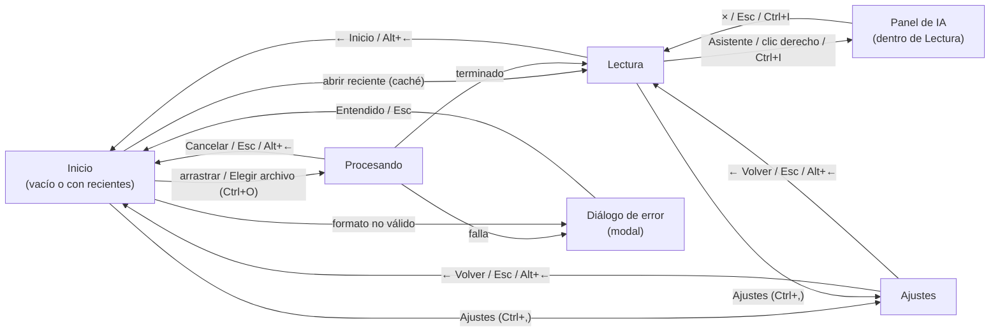

# ClearRead Desktop — Design System

> **Versión:** 1.0 (Día 2 de `document.md` §6.5) · **Fecha:** 2026-10-01
> **Estado:** propuesta **pendiente de aprobación por la usuaria**. Hasta que esté aprobada no se empieza ninguna pantalla en `ui/` (CLAUDE.md §k).
> **Mockups (Claude Design):** <https://claude.ai/artifact/BdJYhsrAJMm1JLjcnSCQCg> (lienzo privado; para que otras personas lo vean hay que compartirlo desde el menú *Share*).
> **Capturas PNG:** [`mockups/`](mockups/) · **Fuentes de los mockups:** [`mockups/source/`](mockups/source/)

Este documento traduce los requisitos de `document.md` (§1.2, §4.4, §4.8, §4.9, §4.10, §5.1 y §5.2) a un sistema visual implementable con widgets y QSS de PySide6. Sigue el **diseño atómico**: fundamentos (tokens) → átomos → moléculas → organismos → plantillas → páginas.

## Índice

- [0. Principios para dislexia](#0-principios-para-dislexia)
- [1. Fundamentos (tokens)](#1-fundamentos-tokens)
  - [1.1 Paleta base y colores derivados](#11-paleta-base-y-colores-derivados)
  - [1.2 Tokens semánticos por tema](#12-tokens-semánticos-por-tema)
  - [1.3 Contraste: salida de contrast.py](#13-contraste-salida-de-contrastpy)
  - [1.4 Tipografía](#14-tipografía)
  - [1.5 Espaciado](#15-espaciado)
  - [1.6 Radios, bordes y elevación](#16-radios-bordes-y-elevación)
  - [1.7 Iconografía](#17-iconografía)
  - [1.8 Movimiento](#18-movimiento)
- [2. Átomos](#2-átomos)
- [3. Moléculas](#3-moléculas)
- [4. Organismos](#4-organismos)
- [5. Plantillas](#5-plantillas)
- [6. Páginas](#6-páginas)
- [7. Navegación](#7-navegación)
- [8. Checklist de accesibilidad](#8-checklist-de-accesibilidad)
- [9. Voz y tono](#9-voz-y-tono)
- [10. Traspaso a Qt](#10-traspaso-a-qt)
- [11. Decisiones abiertas y tareas pendientes](#11-decisiones-abiertas-y-tareas-pendientes)

---

## 0. Principios para dislexia

| # | Principio | Cómo se aplica en ClearRead |
|:--|:--|:--|
| P1 | **Sin cursivas** | Ningún estilo usa `font-style: italic`, ni en la interfaz ni en el lector. El énfasis se hace con **negrita**. |
| P2 | **Sin texto justificado** | Todo el texto se alinea a la izquierda (`Qt.AlignLeft`). El justificado crea "ríos" de espacio que rompen el seguimiento de la línea. |
| P3 | **Líneas de ≤ 70 caracteres** | La columna de lectura mide como máximo 820 px (§4.8) con 40 px de margen interior: 740 px útiles. Con OpenDyslexic a 16 pt y 1,5 px de espaciado salen ≈ 47 caracteres por línea (*estimación de diseño, hay que comprobarla con la fuente real en el Día 5*). Los textos de la interfaz (diálogos, panel de IA) tienen ancho máximo de 520 px. |
| P4 | **Espaciado generoso** | Interlineado 1,8, espacio entre letras 1,5 px y entre palabras 4 px por defecto (§4.4), todos ajustables. 14 px entre párrafos. |
| P5 | **Sin mayúsculas sostenidas** | Ningún botón, título ni etiqueta va en MAYÚSCULAS. Se escribe en tipo oración: "Elegir archivo", no "ELEGIR ARCHIVO" ni "Elegir Archivo". |
| P6 | **Baja carga cognitiva** | Una acción principal por pantalla (un solo botón primario), pocas opciones visibles, textos cortos, sin jerga técnica y sin animaciones que distraigan. |
| P7 | **Nunca solo color** | Todo estado que se comunica con color tiene una segunda señal: forma, borde, icono, peso de letra o texto. |
| P8 | **Fondos suaves** | Ningún tema usa blanco puro como fondo de lectura salvo Alto Contraste, que lo pide expresamente quien lo elige. |

---

## 1. Fundamentos (tokens)

### 1.1 Paleta base y colores derivados

**Paleta base obligatoria:**

| Nombre | Hex | Uso principal |
|:--|:--|:--|
| Crema | `#FFF8F0` | Fondo del tema Claro; texto del tema Oscuro |
| Amarillo | `#F4D06F` | Resaltado de palabra (los 3 temas); sílaba par del Oscuro; botón primario del Oscuro |
| Naranja | `#FF8811` | Error en Oscuro y Alto Contraste. **Nunca como color de texto** (5,08:1 sobre morado y 2,27:1 sobre crema) |
| Turquesa | `#9DD9D2` | Sílaba impar del Oscuro y del Alto Contraste; foco en Oscuro y Alto Contraste |
| Morado | `#392F5A` | Texto del Claro; fondo del Oscuro; botón primario del Claro |

**Colores derivados.** Se crearon solo donde los 5 originales no cumplían un rol. "HSL L" significa: mismo tono y saturación del color base, solo cambia la luminosidad. "Mezcla" significa promedio canal a canal (`a·t + b·(1−t)`).

| Token de paleta | Hex | Sale de | Cómo | Por qué |
|:--|:--|:--|:--|:--|
| `cream-200` | `#F5EEE8` | Crema | Mezcla 95 % crema + 5 % morado | Superficie (barras, paneles) del Claro: se distingue del fondo sin bajar el texto de 10,58:1 |
| `purple-600` | `#4A3D75` | Morado | HSL L 35 % | Botón primario en *hover* (Claro) |
| `purple-500` | `#4F417C` | Morado | HSL L 37 % | Texto secundario (Claro): más suave que el texto pero ≥ 7:1 en fondo, superficie y regleta |
| `purple-400` | `#7968B0` | Morado | HSL L 55 % | Bordes del Claro (≥ 3:1). El morado puro como borde pesaba demasiado |
| `purple-800` | `#261F3C` | Morado | HSL L 18 % | Botón primario presionado (Claro) |
| `purple-900` | `#2B2344` | Morado | Mezcla 75 % morado + 25 % negro | Superficie y regleta del Oscuro: más oscuro que el fondo para que el texto suba de contraste (crema 13,98:1, turquesa 9,32:1) |
| `teal-100` | `#E2EFE7` | Turquesa | Mezcla 30 % turquesa sobre crema (equivale a turquesa con alfa 0,3) | Regleta y *hover* secundario del Claro. El turquesa puro sobre crema daba 1,50:1 y tapaba el texto si se usaba de fondo fuerte |
| `teal-600` | `#2E766D` | Turquesa | HSL L 32 % | Anillo de foco y éxito en Claro: el turquesa original no llega a 3:1 sobre crema (1,50:1) |
| `orange-700` | `#A85400` | Naranja | HSL L 33 % | Error en Claro (icono y borde, nunca texto): el naranja original da 2,27:1 sobre crema |
| `orange-900` | `#703800` | Naranja | HSL L 22 % | **Sílaba impar del Claro.** Ver la nota siguiente |
| `cream-300` | `#D7D0D2` | Crema | Mezcla 80 % crema + 20 % morado | Texto secundario del Oscuro |
| `purple-300` | `#9C94A5` | Crema/Morado | Mezcla 50 % crema + 50 % morado | Bordes del Oscuro (≥ 3:1) |
| `yellow-200` | `#F8E3A9` | Amarillo | Mezcla 60 % amarillo + 40 % blanco | Botón primario en *hover* (Oscuro) |
| `gray-800` | `#333333` | Negro | Negro aclarado al 20 % | Regleta y *hover* del Alto Contraste |

> **Nota sobre `orange-900` (segunda sílaba del Claro).** Las dos sílabas deben superar 7:1 sobre crema, así que las dos tienen que ser oscuras y se parecen mucho. Primero se probó un turquesa oscuro (`#1A423D`, 10,55:1): pasaba el contraste, pero en la captura renderizada **no se distinguía del morado** (diferencia perceptual ΔE76 ≈ 39). El marrón derivado del naranja (`#703800`, 8,84:1) separa cálido de frío y sube la diferencia a ΔE76 ≈ 66. Es un **tono derivado**, no el naranja `#FF8811`: la regla "el naranja nunca es texto" se mantiene para el color base. Si prefieres no usar la familia naranja en texto, la alternativa medida es `#0E4E47` (turquesa HSL L 18 % con saturación 70 %, 9,06:1 sobre crema, ΔE76 ≈ 44), con menos diferencia visible. **Decidido (2026-10-01): `#703800`.** Queda una validación para el Día 5 (ver [§11](#11-decisiones-abiertas-y-tareas-pendientes)).

### 1.2 Tokens semánticos por tema

Los nombres de token están en inglés (irán así en `theme.py`); los nombres de tema que ve el usuario están en español (`strings.py`).

| Token | Claro | Oscuro | Alto Contraste | Uso |
|:--|:--|:--|:--|:--|
| `bg` | `#FFF8F0` crema | `#392F5A` morado | `#000000` | Fondo de ventana y del lector |
| `surface` | `#F5EEE8` cream-200 | `#2B2344` purple-900 | `#000000` | Barra superior, barra de reproducción, panel de IA, tarjetas |
| `text` | `#392F5A` morado | `#FFF8F0` crema | `#FFFFFF` | Texto principal de la interfaz |
| `text-muted` | `#4F417C` purple-500 | `#D7D0D2` cream-300 | `#FFFFFF` | Texto secundario (metadatos, ayudas). En AC no se atenúa |
| `syllable-even` | `#392F5A` morado | `#F4D06F` amarillo | `#FFFFFF` | Sílabas 1.ª, 3.ª, … y palabras de ≤ 2 letras (§4.4) |
| `syllable-odd` | `#703800` orange-900 | `#9DD9D2` turquesa | `#9DD9D2` turquesa | Sílabas 2.ª, 4.ª, … |
| `word-highlight-bg` | `#F4D06F` amarillo | `#F4D06F` amarillo | `#F4D06F` amarillo | Fondo de la palabra que suena (§4.8) |
| `word-highlight-fg` | `#392F5A` morado | `#392F5A` morado | `#000000` | Texto de la palabra que suena: **sustituye** el color de sílaba |
| `ruler-bg` | `#E2EFE7` teal-100 | `#2B2344` purple-900 | `#333333` gray-800 | Regleta de la línea activa (color opaco, sin alfa) |
| `focus-ring` | `#2E766D` teal-600 | `#9DD9D2` turquesa | `#9DD9D2` turquesa | Borde de 3 px del control con foco |
| `primary-bg` | `#392F5A` morado | `#F4D06F` amarillo | `#FFFFFF` | Botón primario, relleno de sliders y progreso |
| `primary-fg` | `#FFF8F0` crema | `#392F5A` morado | `#000000` | Texto/icono del botón primario |
| `primary-bg-hover` | `#4A3D75` purple-600 | `#F8E3A9` yellow-200 | `#F4D06F` amarillo | Primario en *hover* |
| `primary-bg-pressed` | `#261F3C` purple-800 | `#FFF8F0` crema | `#9DD9D2` turquesa | Primario presionado |
| `secondary` | `#392F5A` morado | `#FFF8F0` crema | `#FFFFFF` | Texto y borde del botón secundario |
| `secondary-bg-hover` | `#E2EFE7` teal-100 | `#2B2344` purple-900 | `#333333` gray-800 | Fondo del secundario en *hover* y del ítem reciente en *hover* |
| `border` | `#7968B0` purple-400 | `#9C94A5` purple-300 | `#FFFFFF` | Bordes de campos, tarjetas, zona de arrastre, separadores |
| `error` | `#A85400` orange-700 | `#FF8811` naranja | `#FF8811` naranja | Icono y borde de error (nunca texto) |
| `success` | `#2E766D` teal-600 | `#9DD9D2` turquesa | `#9DD9D2` turquesa | Marca ✓ de pasos completados (nunca texto) |
| `disabled-fg` | `#4F417C` purple-500 | `#D7D0D2` cream-300 | `#FFFFFF` | Texto de control deshabilitado (≥ 7:1, ver [Botón](#21-botón)) |
| `disabled-bg` | `#F5EEE8` cream-200 | `#2B2344` purple-900 | `#000000` | Fondo de control deshabilitado (borde **discontinuo** con `border`) |

Tema por defecto: **Claro**. Captura de los tres temas: [`mockups/tokens_temas.png`](mockups/tokens_temas.png).

### 1.3 Contraste: salida de contrast.py

**Método.** Todas las cifras salen de `.claude/skills/contrast-check/contrast.py` (fórmula W3C), ejecutado con `py -3` (Python 3.13 del sistema; el script solo usa la biblioteca estándar) el 2026-10-01. Antes se validó con los tres pares de referencia de la skill (`21.00`, `5.75`, `4.44`): coincidieron.

**Umbrales.** Texto ≥ **7,0:1** (AAA, NFR-A11Y01). Componentes, bordes y anillo de foco ≥ **3,0:1** (WCAG 1.4.11). El script solo conoce el umbral 7,0, así que en los bloques "no texto" su `FAIL` significa "< 7"; el veredicto real frente a 3,0 está en la tabla resumen.

#### Resumen por tema

| Tema | Par (primer plano / fondo) | Ratio | Umbral | Veredicto |
|:--|:--|--:|--:|:--|
| Claro | `text` / `bg` | 11,54 | 7 | PASS |
| Claro | `text` / `surface` | 10,58 | 7 | PASS |
| Claro | `text` (= `syllable-even`) / `ruler-bg` | 10,26 | 7 | PASS |
| Claro | `text-muted` / `bg` · `surface` · `ruler-bg` | 8,38 · 7,68 · 7,45 | 7 | PASS |
| Claro | `syllable-odd` / `bg` · `surface` · `ruler-bg` | 8,84 · 8,11 · 7,87 | 7 | PASS |
| Claro | `word-highlight-fg` / `word-highlight-bg` | 8,16 | 7 | PASS |
| Claro | `primary-fg` / `primary-bg` · hover · pressed | 11,54 · 9,00 · 14,84 | 7 | PASS |
| Claro | `syllable-odd` / `word-highlight-bg` | 6,25 | 7 | **FAIL → no se pinta nunca**: la palabra resaltada usa `word-highlight-fg` (ver §4.2) |
| Claro | `border` / `bg` · `surface` | 4,51 · 4,14 | 3 | PASS |
| Claro | `focus-ring` (= `success`) / `bg` · `surface` | 5,08 · 4,65 | 3 | PASS |
| Claro | `error` / `bg` · `surface` | 5,07 · 4,65 | 3 | PASS |
| Claro | `primary-bg` / `bg` · `surface` | 11,54 · 10,58 | 3 | PASS |
| Claro | `word-highlight-bg` / `bg` | 1,41 | 3 | **< 3** → compensado: negrita + subrayado de 2 px en `word-highlight-fg` (11,54:1 sobre `bg`) |
| Claro | `ruler-bg` / `bg` | 1,12 | — | Apoyo visual, no es la única señal (ver §4.2) |
| Oscuro | `text` / `bg` · `surface` | 11,54 · 13,98 | 7 | PASS |
| Oscuro | `text-muted` / `bg` · `surface` | 8,01 · 9,70 | 7 | PASS |
| Oscuro | `syllable-even` / `bg` · `ruler-bg` | 8,16 · 9,88 | 7 | PASS |
| Oscuro | `syllable-odd` / `bg` · `ruler-bg` | 7,69 · 9,32 | 7 | PASS |
| Oscuro | `word-highlight-fg` / `word-highlight-bg` | 8,16 | 7 | PASS |
| Oscuro | `primary-fg` / `primary-bg` · hover · pressed | 8,16 · 9,58 · 11,54 | 7 | PASS |
| Oscuro | `border` / `bg` · `surface` | 4,16 · 5,04 | 3 | PASS |
| Oscuro | `focus-ring` / `bg` · `surface` | 7,69 · 9,32 | 3 | PASS |
| Oscuro | `error` / `bg` · `surface` | 5,08 · 6,16 | 3 | PASS |
| Oscuro | `primary-bg` (= `word-highlight-bg`) / `bg` · `surface` | 8,16 · 9,88 | 3 | PASS |
| Oscuro | `ruler-bg` / `bg` | 1,21 | — | Apoyo visual (ver §4.2) |
| Alto Contraste | `text` / `bg` · `ruler-bg` | 21,00 · 12,63 | 7 | PASS |
| Alto Contraste | `syllable-odd` / `bg` · `ruler-bg` | 13,29 · 8,00 | 7 | PASS |
| Alto Contraste | `word-highlight-fg` / `word-highlight-bg` | 14,10 | 7 | PASS |
| Alto Contraste | `primary-fg` / `primary-bg` · pressed | 21,00 · 13,29 | 7 | PASS |
| Alto Contraste | `border`, `focus-ring`, `error`, `word-highlight-bg` / `bg` | 21,00 · 13,29 · 8,78 · 14,10 | 3 | PASS |
| Alto Contraste | `ruler-bg` / `bg` | 1,66 | — | Apoyo visual (ver §4.2) |

Pares repetidos que no aparecen como fila propia: el *tooltip* invierte `text`/`bg` (mismo ratio que `text`/`bg`); el texto de `secondary` sobre `secondary-bg-hover` es el par `text`/`ruler-bg` (Claro), `text`/`surface` (Oscuro) y `text`/`ruler-bg` (AC); el `primary-fg` del AC sobre `primary-bg-hover` amarillo es `#000000/#F4D06F` (14,10).

#### Salida literal

```text
### CLARO texto
#392F5A / #FFF8F0  11.54  PASS
#392F5A / #F5EEE8  10.58  PASS
#392F5A / #E2EFE7  10.26  PASS
#4F417C / #FFF8F0  8.38  PASS
#4F417C / #F5EEE8  7.68  PASS
#4F417C / #E2EFE7  7.45  PASS
#703800 / #FFF8F0  8.84  PASS
#703800 / #E2EFE7  7.87  PASS
#703800 / #F5EEE8  8.11  PASS
#392F5A / #F4D06F  8.16  PASS
#FFF8F0 / #392F5A  11.54  PASS
#FFF8F0 / #4A3D75  9.00  PASS
#FFF8F0 / #261F3C  14.84  PASS
#703800 / #F4D06F  6.25  FAIL
### CLARO no texto
#7968B0 / #FFF8F0  4.51  FAIL
#7968B0 / #F5EEE8  4.14  FAIL
#2E766D / #FFF8F0  5.08  FAIL
#2E766D / #F5EEE8  4.65  FAIL
#A85400 / #FFF8F0  5.07  FAIL
#A85400 / #F5EEE8  4.65  FAIL
#392F5A / #FFF8F0  11.54  PASS
#392F5A / #F5EEE8  10.58  PASS
#F4D06F / #FFF8F0  1.41  FAIL
#E2EFE7 / #FFF8F0  1.12  FAIL
### OSCURO texto
#FFF8F0 / #392F5A  11.54  PASS
#FFF8F0 / #2B2344  13.98  PASS
#D7D0D2 / #392F5A  8.01  PASS
#D7D0D2 / #2B2344  9.70  PASS
#F4D06F / #392F5A  8.16  PASS
#F4D06F / #2B2344  9.88  PASS
#9DD9D2 / #392F5A  7.69  PASS
#9DD9D2 / #2B2344  9.32  PASS
#392F5A / #F4D06F  8.16  PASS
#392F5A / #F8E3A9  9.58  PASS
#392F5A / #FFF8F0  11.54  PASS
### OSCURO no texto
#9C94A5 / #392F5A  4.16  FAIL
#9C94A5 / #2B2344  5.04  FAIL
#9DD9D2 / #392F5A  7.69  PASS
#9DD9D2 / #2B2344  9.32  PASS
#FF8811 / #392F5A  5.08  FAIL
#FF8811 / #2B2344  6.16  FAIL
#F4D06F / #392F5A  8.16  PASS
#F4D06F / #2B2344  9.88  PASS
#2B2344 / #392F5A  1.21  FAIL
### AC texto
#FFFFFF / #000000  21.00  PASS
#FFFFFF / #333333  12.63  PASS
#9DD9D2 / #000000  13.29  PASS
#9DD9D2 / #333333  8.00  PASS
#000000 / #F4D06F  14.10  PASS
#000000 / #FFFFFF  21.00  PASS
#000000 / #9DD9D2  13.29  PASS
### AC no texto
#FFFFFF / #000000  21.00  PASS
#9DD9D2 / #000000  13.29  PASS
#FF8811 / #000000  8.78  PASS
#F4D06F / #000000  14.10  PASS
#333333 / #000000  1.66  FAIL
```

Para repetir la medición: `py -3 .claude\skills\contrast-check\contrast.py "<texto>/<fondo>" ...` con los pares de arriba. **Cualquier cambio de color obliga a volver a medir y a actualizar esta sección.**

### 1.4 Tipografía

| Rol | Fuente | Justificación |
|:--|:--|:--|
| **Lectura** (ReaderWidget, respuesta de IA, vista previa) | **OpenDyslexic** Regular y Bold, empaquetada en `resources/fonts` | Requisito de §1.2 y CLAUDE.md §o. Se carga con `QFontDatabase.addApplicationFont` al arrancar. |
| **Interfaz** (botones, etiquetas, títulos, diálogos) | **Segoe UI** (fuente del sistema) | Es la fuente de Windows 10/11: ya está en todos los equipos objetivo, tiene *hinting* para pantalla (nítida a 13–16 px), letras diferenciadas (`I l 1`), soporte completo de español y **no añade bytes ni licencias al `.exe`**. Usar OpenDyslexic también en la interfaz restaría espacio (es muy ancha) y quitaría a la lectura su "voz" diferenciada. |

> En los mockups, OpenDyslexic se sustituye por **Verdana** porque la fuente aún no está en `resources/fonts` y el lienzo no puede cargar fuentes locales. Los anchos reales son algo mayores; se verificó en el Día 5 con la fuente real (ver [§11](#11-decisiones-abiertas-y-tareas-pendientes)).

**Escala de la interfaz** (px a 100 % de escala de Windows; Qt escala solo con `Qt.HighDpiScaleFactorRoundingPolicy.PassThrough`):

| Token | Tamaño | Peso | Interlineado | Uso |
|:--|--:|:--|:--|:--|
| `font-ui-title` | 28 px | Bold (700) | 1,3 | Título de pantalla ("Ajustes", "Abre un documento para empezar") |
| `font-ui-heading` | 20 px | Bold | 1,35 | Títulos de tarjeta, panel y diálogo |
| `font-ui-subheading` | 16 px | Bold | 1,5 | Títulos de sección, nombre de documento reciente |
| `font-ui-body` | 15 px | Regular (400) / Semibold (600) en botones | 1,5 | Texto general y botones |
| `font-ui-small` | 13 px | Regular / Semibold | 1,5 | Metadatos, ayudas, *tooltips*, *badges* |

Nunca por debajo de 13 px. Sin cursivas ni mayúsculas sostenidas.

**Lectura (OpenDyslexic)** — valores de `AppConfig` y su control en Ajustes:

| Parámetro | Mínimo | Por defecto | Máximo | Paso | Fuente del valor por defecto |
|:--|--:|--:|--:|--:|:--|
| Tamaño de letra | 12 pt | **16 pt** | 28 pt | 1 pt | `AppConfig.font_size_pt` (§4.6) y §4.4 |
| Espacio entre líneas | 1,4 | **1,8** | 2,6 | 0,1 | `AppConfig.line_spacing`; §4.4 (`line-height: 1.8`) |
| Espacio entre letras | 0 px | **1,5 px** | 4 px | 0,5 px | `AppConfig.letter_spacing`; §4.4 (`letter-spacing: 1.5px`) |
| Espacio entre palabras | 0 px | **4 px** | 12 px | 1 px | `AppConfig.word_spacing`; §4.4 (`word-spacing: 4px`) |
| Entre párrafos | — | **14 px** | — | — | §4.4 (`margin-bottom: 14px`), fijo |
| Respuesta de IA | — | 17 px, interlineado 1,7, letras 1 px | — | — | Fijo (el panel es estrecho) |

### 1.5 Espaciado

Base de **4 px**; todos los márgenes y separaciones son múltiplos de 4 y casi siempre de 8.

| Token | Valor | Uso típico |
|:--|--:|:--|
| `space-1` | 4 px | Icono ↔ texto pequeño |
| `space-2` | 8 px | Icono ↔ texto en botón; botones contiguos |
| `space-3` | 12 px | Ítems de lista; filas de ajuste |
| `space-4` | 16 px | Relleno de tarjetas pequeñas; bloques del panel de IA |
| `space-5` | 20 px | Relleno del panel de IA |
| `space-6` | 24 px | Margen lateral de barras; relleno de diálogo |
| `space-8` | 32 px | Relleno de pantalla; separación entre secciones grandes |
| `space-10` | 40 px | Margen interior horizontal de la columna de lectura |

### 1.6 Radios, bordes y elevación

- **Sin sombras ni desenfoques.** QSS no los soporta bien y añaden ruido visual. La jerarquía se marca con **bordes** y con el cambio `bg` → `surface`.
- **Grosores:** 1 px para separadores y tarjetas; 2 px para campos, botones y zona de arrastre (discontinuo); **3 px solo para el foco** y la opción elegida.
- **Radios:**

| Token | Valor | Uso |
|:--|--:|:--|
| `radius-sm` | 4 px | Teclas (`kbd`), *swatches* |
| `radius-md` | 8 px | Botones, campos, *combobox*, diálogo, *chip* |
| `radius-lg` | 12 px | Tarjetas, ítem reciente, tarjeta de respuesta |
| `radius-xl` | 16 px | Zona de arrastre |
| `radius-pill` | mitad de la altura | *Badge*, *toggle*, ranura y tirador del slider |

### 1.7 Iconografía

- Iconos de **línea**, rejilla de 24 px, trazo de 2 px, extremos redondeados; se muestran a **20 px** (16 px en *badges*). Se guardan como SVG en `resources/icons/` (dibujos propios; nada descargado en tiempo de ejecución).
- **Siempre con texto al lado**, salvo el botón de cerrar (×), que lleva `setToolTip` y `setAccessibleName`.
- Color: el del texto del control (`currentColor` en el SVG). En Qt se recolorea al cargar: se sustituye `currentColor` por el hex del token antes de pasarlo a `QSvgRenderer`/`QIcon`, y se regeneran al cambiar de tema.
- **Sin emojis** (§4.9 usa 📄 💡 y §4.8 usa ▶ ⏹ en el código de referencia): se cambian por iconos SVG porque los emojis se ven distinto en cada versión de Windows y no se recolorean con el tema.
- Juego mínimo: libro (marca), flecha atrás, ajustes (deslizadores), subir archivo, carpeta, documento, foto, reproducir, pausa, detener, asistente (globo), cerrar, ✓, "!", bombilla, candado, reloj, recargar, sin internet, chevron.

### 1.8 Movimiento

- **Mínimo:** cambios de estado instantáneos (sin transiciones de color ni de tamaño). El resaltado de palabra salta de palabra en palabra sin fundidos (UI-F01).
- El desplazamiento del lector usa `ensureCursorVisible()` (salto, sin animación suave).
- Única animación: barra de progreso **indeterminada** (`QProgressBar` con rango 0–0) en el panel de IA mientras carga o despierta.
- **Reducción de movimiento:** si Windows tiene desactivado "Mostrar animaciones en Windows" (`SystemParametersInfo(SPI_GETCLIENTAREAANIMATION)` vía `pywin32`), la barra indeterminada se sustituye por una barra quieta y el texto de estado ("Buscando una explicación…") hace todo el trabajo.

---

## 2. Átomos

Todos los átomos usan solo propiedades soportadas por QSS (`background`, `color`, `border`, `border-radius`, `padding`, `min-height`) y los pseudoestados `:hover`, `:focus`, `:pressed`, `:disabled`, `:checked`.

### 2.1 Botón

| Variante | Alto | Relleno | Fondo / texto / borde |
|:--|--:|:--|:--|
| **Primario** | 40 px (48 px en "Elegir archivo" y Reproducir) | 0 18 px (0 24 px) | `primary-bg` / `primary-fg` / borde 2 px `primary-bg` |
| **Secundario** | 40 px | 0 18 px | transparente / `secondary` / borde 2 px `secondary` |
| **Fantasma** (barra superior) | 40 px | 0 18 px | transparente / `text` / borde 2 px transparente |
| **Solo icono** | 40 × 40 px | 0 | como fantasma; icono 20 px; `setToolTip` + `setAccessibleName` obligatorios |

| Estado | Cambio | Señal no cromática |
|:--|:--|:--|
| Normal | — | — |
| *Hover* | Primario → `primary-bg-hover`; secundario/fantasma → fondo `secondary-bg-hover` | Cursor de mano |
| **Foco** | Borde de **3 px** `focus-ring` (el relleno se reduce 1 px para no mover el contenido) | El grosor cambia de 2 a 3 px |
| Presionado | Primario → `primary-bg-pressed`; secundario → fondo `secondary-bg-hover` | — |
| Deshabilitado | Fondo `disabled-bg`, texto `disabled-fg`, **borde 2 px discontinuo** `border` | Borde discontinuo + *tooltip* que explica por qué |

> **Deshabilitado con texto ≥ 7:1.** WCAG exime a los controles deshabilitados, pero la regla del proyecto es "todo texto ≥ 7:1". Por eso el texto deshabilitado se mantiene legible y el estado se comunica con el **borde discontinuo**, la ausencia de relleno y un *tooltip* ("El asistente necesita internet…").

- Un solo botón primario visible por zona.
- Área mínima de clic: **32 × 32 px** (todos los botones miden ≥ 40 px de alto).

### 2.2 Slider

- `QSlider` horizontal, alto de control 24 px.
- Ranura (`::groove`): 6 px, `radius-pill`, color `border`.
- Parte recorrida (`::sub-page`): `primary-bg`.
- Tirador (`::handle`): 20 × 20 px, círculo `primary-bg` con aro de 2 px del color de fondo.
- Foco: borde de 3 px `focus-ring` alrededor del control.
- **Siempre con su valor en texto** a la derecha ("16 puntos", "150 palabras/min"). Flechas ← → cambian un paso; Re Pág / Av Pág, cinco pasos.

### 2.3 Toggle (interruptor)

- `QCheckBox` con indicador de 44 × 24 px (imágenes SVG por tema en `::indicator:checked` / `::indicator:unchecked`).
- Encendido: pista `primary-bg`, perilla `primary-fg` a la derecha. Apagado: pista transparente con borde 2 px `border`, perilla `border` a la izquierda.
- **Siempre con la palabra "Sí" / "No"** al lado: el estado no depende del color ni de la posición.

### 2.4 Etiqueta

`QLabel` con `font-ui-body` y color `text`; `text-muted` solo para información secundaria. Las etiquetas de formularios usan `setBuddy()` para que el lector de pantalla asocie etiqueta y control. Nunca en cursiva ni en mayúsculas.

### 2.5 Campo de texto y combobox

- Alto 40 px, borde 2 px `border`, `radius-md`, fondo `bg`, relleno 0 12 px.
- Foco: borde 3 px `focus-ring`.
- Error de validación: borde 2 px `error` + mensaje debajo con icono "!" en `text` (no en color de error).
- El *combobox* de voz muestra el nombre y el idioma ("Sabina · español (México)") y un chevron.

### 2.6 Barra de progreso

- `QProgressBar` de 12 px (8 px dentro del panel de IA), borde 1 px `border`, fondo `bg`, `::chunk` en `primary-bg`, `radius-pill`.
- Sin texto dentro de la barra (`setTextVisible(False)`): el progreso se escribe encima en texto ("Leyendo la página 5 de 12" + "42 %").

### 2.7 Tooltip

- `QToolTip`: fondo `text`, texto `bg` (colores invertidos, 11,54:1 en Claro y Oscuro, 21:1 en AC), `font-ui-small`, relleno 8 × 12 px, ancho máximo 280 px.
- Obligatorio en botones de solo icono y en controles deshabilitados.

### 2.8 Badge

- Alto 24 px, `radius-pill`, borde 1 px `border`, texto `text` en `font-ui-small` semibold, icono opcional de 14 px.
- Usos: "Sin internet". Siempre texto + icono, nunca un punto de color solo.

### 2.9 Chip de palabra

- Alto 32 px, `radius-md`, fondo `word-highlight-bg`, texto `word-highlight-fg` en negrita. Muestra la palabra elegida en el panel de IA (mismo par de colores que el resaltado: 8,16:1 / 14,10:1).

---

## 3. Moléculas

### 3.1 Zona de arrastre

- `QFrame` con borde **2 px discontinuo** `border`, `radius-xl`. Tamaño: 640 × 320 px sin recientes; 820 × 168 px (fila horizontal) con recientes.
- Contenido: icono de subir (48 px), título "Arrastra aquí tu PDF o tu foto", "o, si lo prefieres,", botón primario "Elegir archivo", ayuda "Sirven archivos PDF, JPG, PNG, BMP y TIFF".
- Al arrastrar un archivo encima (`dragEnterEvent`): borde `focus-ring` y fondo `secondary-bg-hover` (cambio de borde + fondo, no solo color).
- La zona no es un botón: el acceso por teclado es el botón "Elegir archivo" (Ctrl+O).

### 3.2 Control de reproducción

- Botón primario de 48 px, ancho fijo 148 px para que no "salte" al cambiar el texto: "Reproducir" (icono ▷) ↔ "Pausar" (icono ‖) ↔ "Reanudar".
- Botón secundario "Detener" (icono ■).
- Slider "Velocidad" de 200–220 px con su valor "150 palabras/min" (rango 100–280, §4.8).
- Indicador "Palabra 11 de 65" y recordatorio de atajos con teclas dibujadas (`Espacio` pausar · `Esc` detener).

### 3.3 Fila de ajuste con vista previa

- Fila de 44 px: etiqueta (200 px, semibold) · control (flexible) · valor en texto (130 px, alineado a la derecha).
- Cada cambio actualiza al instante la **tarjeta "Vista previa"** de la columna derecha (3 líneas con sílabas, palabra resaltada y regleta) y se guarda en `AppConfig` (CFG-F02, CFG-F01).

### 3.4 Ítem de documento reciente

- Fila de 72 px, `surface`, borde 1 px `border`, `radius-lg`.
- Miniatura-icono de 40 px (documento o foto) · nombre (subheading) + metadatos en `text-muted` ("PDF · 12 páginas · Abierto hoy") · botón "Abrir" · botón × "Quitar de recientes" (con *tooltip*).
- *Hover*: fondo `secondary-bg-hover`. Foco: borde 3 px `focus-ring`; Intro abre, Supr quita.
- Abrir un reciente carga el `FormattedDocument` desde caché, sin pasar por "Procesando" (HOME-F01).

### 3.5 Tarjeta de respuesta de IA

- Fondo `bg` sobre el panel `surface`, borde 1 px `border`, `radius-lg`, relleno 16 px.
- Título en subheading ("Qué significa", "El párrafo, más simple").
- Cuerpo en **OpenDyslexic 17 px** (es texto para leer, no interfaz).
- Pie fijo en `text-muted`: "Respuesta creada con IA. Puede tener errores."
- La región tiene `aria-live` equivalente: al llegar la respuesta se llama a `QAccessible.updateAccessibility` para que el lector de pantalla la anuncie.

### 3.6 Aviso de privacidad

- **Primer uso** (NFR-SEC01): tarjeta con borde **2 px** `text` dentro del panel, icono de candado, título "Antes de usar el asistente", dos frases y botones "Ahora no" (secundario) / "Entendido" (primario con foco). Hasta pulsar "Entendido" no se envía nada. La aceptación se guarda en `AppConfig.ai_privacy_accepted` (§4.6 de `document.md`).
- **Recordatorio permanente** al pie del panel: candado + "Solo enviamos a internet la palabra o el párrafo que elegiste. El resto del documento no sale de tu equipo."

---

## 4. Organismos

### 4.1 Barra superior de navegación

- Alto **56 px**, fondo `surface`, borde inferior 1 px `border`, relleno lateral 24 px.
- **Inicio:** marca "ClearRead" a la izquierda · "Ajustes" (fantasma) a la derecha.
- **Lectura:** "← Inicio" · título del documento centrado (truncado con "…") · "Asistente" (secundario; marcado con fondo `secondary-bg-hover` cuando el panel está abierto, y `setChecked(True)`) · "Ajustes".
- **Ajustes:** "← Volver" · título "Ajustes" centrado.
- **Procesando:** "Ajustes" deshabilitado (no se cambia el tema a mitad del procesado).

### 4.2 Lector (`ReaderWidget`)

- `QTextEdit` de solo lectura sin marco, fondo `bg`, columna de **550–820 px** centrada (§4.8), margen interior 40 px a los lados y 32 px arriba.
- Sílabas: el HTML de `TextFormatter` con `syllable-even` / `syllable-odd` del tema (§4.4).
- **Palabra que suena** (`ExtraSelection` `word_fmt`): fondo `word-highlight-bg`, **primer plano `word-highlight-fg` (obligatorio)**, negrita (700) y **subrayado** con color `word-highlight-fg` (`setFontUnderline(True)`, `setUnderlineColor`). El primer plano fijo es lo que garantiza ≥ 7:1: sin él, la sílaba impar del Claro quedaría a 6,25:1 sobre el amarillo y la sílaba par del Oscuro sería amarillo sobre amarillo.
- **Regleta** (`ruler_fmt`, `FullWidthSelection`): color **opaco** `ruler-bg` (sustituye al `QColor(240, 230, 214, 160)` con alfa de §4.8). Cubre todo el ancho de la columna.
- **Por qué la regleta no llega a 3:1 con el fondo:** un fondo que contraste 3:1 con el crema dejaría el texto encima por debajo de 7:1. La regleta es un **apoyo** para no perder la línea; la señal principal de "dónde voy" es la palabra resaltada, que sí tiene señales ≥ 3:1 (negrita + subrayado). **Decidido (2026-10-01):** la regleta por debajo de 3:1 se acepta como apoyo visual en los tres temas.
- Clic en una palabra → empieza a leer desde ahí (UI-F02): cursor de mano sobre el texto.
- Foco del lector: borde 3 px `focus-ring` alrededor de la columna. Con el foco aquí funcionan Espacio y Esc (UI-F03).

### 4.3 Barra de reproducción

- Alto **80 px**, fondo `surface`, borde superior 1 px `border`, contenido alineado con la columna de lectura (820 px).
- Contiene el [control de reproducción](#32-control-de-reproducción). Visible siempre en Lectura.

### 4.4 Panel lateral de IA

- `QFrame` de **360 px** a la derecha, alto completo bajo la barra superior, fondo `surface`, borde izquierdo 1 px `border`, relleno 20 px, separación 16 px.
- Se abre con el botón "Asistente", con clic derecho sobre una palabra o párrafo (menú contextual "Explicar esta palabra" / "Simplificar este párrafo", D11) o con Ctrl+I. Al abrirse la lectura se **pausa**.
- Orden: cabecera ("Asistente" + ×) · palabra elegida ([chip](#29-chip-de-palabra)) · botones "Explicar palabra" / "Simplificar párrafo" (el activo es primario) · zona de estado · pie con privacidad y "Consultas en esta sesión: N de 30".
- **Estados** (mockup [`panel-ia-estados_*.png`](mockups/panel-ia-estados_claro.png)):

| Estado | Contenido | Origen |
|:--|:--|:--|
| A · Primer uso | [Aviso de privacidad](#36-aviso-de-privacidad) | NFR-SEC01 |
| B · Cargando | "Buscando una explicación…", barra indeterminada, "Suele tardar unos segundos.", botón "Cancelar" | AI-F04 |
| C · Despertando | Icono reloj, "Despertando el asistente…", "Estaba descansando porque nadie lo usó en un rato. Puede tardar hasta un minuto; puedes seguir leyendo mientras tanto.", barra indeterminada, "Cancelar" | AI-F03, señal `waking` |
| D · Respuesta | [Tarjeta de respuesta](#35-tarjeta-de-respuesta-de-ia) | AI-F01/F02 |
| E · Error | Icono "!" en círculo `error`, mensaje de `strings.py` según `AIErrorKind`, frase de tranquilidad, botón "Reintentar" (no se muestra con `SESSION_LIMIT`, `DAILY_LIMIT` ni `INPUT_TOO_LONG`) | §4.10 |
| F · Sin internet | El botón "Asistente" de la barra está **deshabilitado** (borde discontinuo) con *tooltip* "El asistente necesita internet. Lo demás funciona igual." y *badge* "Sin internet" | AI-F03 (`QNetworkInformation`) |

- Los errores del asistente se muestran **dentro del panel**, no con `AccessibleErrorDialog`, para no interrumpir la lectura con una ventana modal (decidido el 2026-10-01; recogido en §4.10 de `document.md`).
- "Cancelar" deja de esperar en la interfaz; el *worker* termina solo y su resultado se ignora (no se pueden abortar `QRunnable` en curso).

### 4.5 Panel de ajustes

- Pantalla completa (no diálogo) con dos columnas dentro de 1120 px: controles (flexible) y "Vista previa" (420 px).
- Secciones: **Tema** (3 tarjetas-radio de 84 px con muestra "Aa": la elegida lleva borde 3 px `text` y punto relleno en el radio), **Texto** (tamaño, espacio entre líneas, entre letras, entre palabras, sílabas de colores), **Voz** (velocidad, voz), **Idioma** (fila "Idioma de la interfaz" / "Interface language"), **Ajustes avanzados** (plegado por defecto).
- **Idioma de la interfaz** (I18N-F01): fila de ajuste (molécula [3.3](#33-fila-de-ajuste-con-vista-previa)) con un selector (combobox, [2.5](#25-campo-de-texto-y-combobox)) de dos opciones, "Español" y "English", cada una escrita en su propio idioma. No actualiza la vista previa. Al cambiarla se guarda en `AppConfig.ui_language` y aparece un diálogo, **ya en el idioma nuevo**, que explica que se verá al reiniciar ClearRead (claves `settings.language.restart_*`). Los documentos no cambian: solo la interfaz.
- **Textos más largos o más cortos:** el inglés puede ocupar ~20–30 % menos o más que el español según el texto. Los botones, etiquetas y filas **no tienen ancho fijo**: se ajustan al contenido con un ancho mínimo y relleno constante, y los textos largos pasan a dos líneas en vez de cortarse.
- **Ajustes avanzados** (desplegado): campo "Dirección del asistente" con el valor de `AppConfig.backend_url`, botón "Usar la dirección original" (restaura `DEFAULT_BACKEND_URL`) y la ayuda "Solo cámbiala si te lo pide quien mantiene ClearRead." **Sin campo de API key** (CFG-F02).
- Botón "Restablecer valores" (secundario) bajo la vista previa.
- Los cambios se guardan solos y se aplican al momento (no hay botón "Guardar").

### 4.6 Diálogo de error (`AccessibleErrorDialog`)

- `QDialog` modal propio (no `QMessageBox` con HTML incrustado como en §4.9), ancho 540 px, fondo `bg`, borde **2 px `text`**, `radius-md`.
- Barra de título nativa de Windows con "ClearRead" (no se puede tematizar con QSS).
- Contenido: icono "!" en círculo de 48 px con borde 3 px `error` · título (heading) con **qué pasó** · una frase de detalle · caja "Qué puedes hacer" (bombilla + texto, fondo `surface`, borde 1 px) · botones.
- Botones: "Entendido" (primario, **foco inicial**, Intro) y, cuando ayuda, una acción secundaria ("Elegir otro archivo"). Esc cierra igual que "Entendido".
- Nunca muestra trazas, códigos ni nombres de excepción.

---

## 5. Plantillas

Ventana de referencia **1280 × 800 px**; mínima **1024 × 700 px** (`setMinimumSize(1024, 700)`).

### 5.1 Inicio

```text
┌──────────────────────────── 1280 ────────────────────────────┐
│ Barra superior 56                                            │
├──────────────────────────────────────────────────────────────┤
│                    relleno 32–40                              │
│        ┌──────── zona de arrastre 640×320 (vacío) ────────┐  │
│        │        o 820×168 en fila (con recientes)          │  │
│        └───────────────────────────────────────────────────┘  │
│                       separación 24–32                        │
│        ┌──────── Documentos recientes, ancho 820 ──────────┐  │
│        │ ítem 72 · separación 12 · ítem 72 · …             │  │
│        └───────────────────────────────────────────────────┘  │
└──────────────────────────────────────────────────────────────┘
```

Todo centrado horizontalmente. Con más de 5 recientes, la lista tiene `QScrollArea` propia.

### 5.2 Lectura (+ panel de IA)

```text
┌────────────────────────────── 1280 ──────────────────────────────┐
│ Barra superior 56                                                │
├───────────────────────────────────────────┬──────────────────────┤
│  área de lectura (flexible)               │ panel IA 360         │
│   ┌──── columna 550–820, centrada ────┐   │ (solo si está        │
│   │ margen 40 │ texto │ margen 40     │   │  abierto)            │
│   └───────────────────────────────────┘   │                      │
├───────────────────────────────────────────┤                      │
│ Barra de reproducción 80 (ancho del área) │                      │
└───────────────────────────────────────────┴──────────────────────┘
```

- Sin panel: área de lectura = 1280 px; columna 820 px.
- Con panel a 1280 px: área = 920 px; columna 820 px.
- Con panel a la ventana mínima (1024 px): área = 664 px; columna = 664 px (≥ 550 px de §4.8). Altura útil del lector a 700 px: 700 − 56 − 80 = 564 px.

### 5.3 Ajustes

```text
┌────────────────────────────── 1280 ──────────────────────────────┐
│ Barra superior 56 (← Volver · Ajustes)                           │
├──────────────────────────────────────────────────────────────────┤
│ relleno 24/32 · contenedor 1120 centrado                         │
│ ┌──── controles (flexible, ≈660) ────┐ 40 ┌─ Vista previa 420 ─┐ │
│ │ Título 28 · Tema · Texto · Voz ·   │    │ tarjeta + Restablecer│ │
│ │ Ajustes avanzados                  │    └─────────────────────┘ │
│ └────────────────────────────────────┘                            │
└──────────────────────────────────────────────────────────────────┘
```

A 1024 px el contenedor se reduce a 960 px (controles ≈ 500 px). La columna de controles va en `QScrollArea` para cuando "Ajustes avanzados" está desplegado o la ventana es baja.

---

## 6. Páginas

| # | Pantalla | Claro | Oscuro | Notas |
|:--|:--|:--|:--|:--|
| 1 | Inicio vacío con zona de arrastre | [inicio-vacio_claro.png](mockups/inicio-vacio_claro.png) | [inicio-vacio_oscuro.png](mockups/inicio-vacio_oscuro.png) | Foco inicial en "Elegir archivo" (se ve el anillo) |
| 2 | Inicio con documentos recientes | [inicio-recientes_claro.png](mockups/inicio-recientes_claro.png) | [inicio-recientes_oscuro.png](mockups/inicio-recientes_oscuro.png) | 1.er ítem con foco, 2.º en *hover* |
| 3 | Procesando, con progreso y Cancelar | [procesando_claro.png](mockups/procesando_claro.png) | [procesando_oscuro.png](mockups/procesando_oscuro.png) | Pasos con ✓ / borde grueso / vacío; "Ajustes" deshabilitado |
| 4 | Lectura reproduciendo | [lectura_claro.png](mockups/lectura_claro.png) | [lectura_oscuro.png](mockups/lectura_oscuro.png) | Sílabas, palabra resaltada, regleta, barra de reproducción. Además: [lectura_alto-contraste.png](mockups/lectura_alto-contraste.png) |
| 5 | Lectura con el panel de IA | [lectura-ia_claro.png](mockups/lectura-ia_claro.png) | [lectura-ia_oscuro.png](mockups/lectura-ia_oscuro.png) | Estado "respuesta" |
| 5b | Estados del panel de IA | [panel-ia-estados_claro.png](mockups/panel-ia-estados_claro.png) | [panel-ia-estados_oscuro.png](mockups/panel-ia-estados_oscuro.png) | Privacidad, cargando, despertando, respuesta, error, sin internet |
| 6 | Ajustes | [ajustes_claro.png](mockups/ajustes_claro.png) | [ajustes_oscuro.png](mockups/ajustes_oscuro.png) | Foco en el slider de tamaño; avanzados plegado |
| 7 | Diálogo de error accesible | [error-dialogo_claro.png](mockups/error-dialogo_claro.png) | [error-dialogo_oscuro.png](mockups/error-dialogo_oscuro.png) | PDF con contraseña; foco en "Entendido" |
| — | Tokens de los 3 temas | [tokens_temas.png](mockups/tokens_temas.png) | | Muestra de lectura, botones y tokens |

Lienzo editable con todas las pantallas: <https://claude.ai/artifact/BdJYhsrAJMm1JLjcnSCQCg>. Las capturas se generaron desde las fuentes de [`mockups/source/`](mockups/source/) con Microsoft Edge en modo *headless* (1280 × 800, escala 1), sin conexión.

---

## 7. Navegación

### 7.1 Mapa de pantallas



Las vistas viven en un `QStackedWidget`; el diálogo de error es un `QDialog` modal; el panel de IA es parte de la vista de Lectura.

### 7.2 Orden de foco (Tab)

| Pantalla | Orden |
|:--|:--|
| Inicio vacío | Ajustes → **Elegir archivo** (foco inicial) |
| Inicio con recientes | Ajustes → **Elegir archivo** (foco inicial) → reciente 1 (Abrir → Quitar) → reciente 2 … |
| Procesando | **Cancelar** (único control activo, foco inicial) |
| Lectura | ← Inicio → Asistente → Ajustes → **lector** (foco inicial) → Reproducir/Pausar → Detener → Velocidad |
| Lectura + panel | … → Velocidad → panel: × → Explicar palabra → Simplificar párrafo → Reintentar/Cancelar (si existen). F6 salta entre lector y panel |
| Ajustes | ← Volver → Tema (flechas eligen entre las 3 tarjetas) → Tamaño → Espacio entre líneas → Espacio entre letras → Espacio entre palabras → Sílabas → Velocidad → Voz → Idioma de la interfaz → Ajustes avanzados → (campos avanzados) → Restablecer |
| Diálogo de error | **Entendido** (foco inicial) ↔ acción secundaria |

Se fija con `QWidget.setTabOrder` en cada vista; el anillo de foco es siempre visible (no solo al usar teclado).

### 7.3 Atajos de teclado

| Atajo | Acción | Dónde | Origen |
|:--|:--|:--|:--|
| **Espacio** | Reproducir / pausar / reanudar | Lectura (foco en lector o barra) | UI-F03 |
| **Esc** | Detener la lectura | Lectura | UI-F03 |
| Esc | Cerrar diálogo / cerrar panel de IA / cancelar procesado / salir de Ajustes | Según contexto (prioridad: diálogo → panel → procesado → Ajustes → detener lectura) | UI-F03 (aprobado) |
| Ctrl+O | Elegir archivo | Inicio | UI-F03 (aprobado) |
| Ctrl+, | Abrir Ajustes | Inicio, Lectura | UI-F03 (aprobado) |
| Alt+← | Atrás | Lectura, Ajustes, Procesando | UI-F03 (aprobado) |
| Ctrl+I | Abrir / cerrar el asistente con la palabra bajo el cursor | Lectura | UI-F03 (aprobado) |
| F6 | Mover el foco entre lector y panel de IA | Lectura + panel | UI-F03 (aprobado) |
| Ctrl++ / Ctrl+− | Agrandar / achicar la letra un paso | Lectura | UI-F03 (aprobado) |

Los atajos se registran con `QShortcut` (contexto `Qt.WidgetWithChildrenShortcut` en cada vista) y aparecen en los *tooltips* de sus botones ("Pausar (Espacio)").

### 7.4 Qué hace "Atrás" en cada pantalla

| Pantalla | Atrás (botón ← o Alt+←) |
|:--|:--|
| Inicio | No hay atrás (no se muestra el botón). |
| Procesando | Equivale a **Cancelar**: detiene el *worker*, vuelve a Inicio sin pedir confirmación y sin añadir el documento a recientes. |
| Lectura | Detiene la voz, guarda el documento en recientes y vuelve a Inicio. |
| Lectura + panel de IA | El primer Esc cierra el panel; "← Inicio" sale de Lectura directamente. |
| Ajustes | Vuelve a la pantalla de origen (Inicio o Lectura, en el mismo punto). Los cambios ya están guardados. |
| Diálogo de error | No aplica: "Entendido" o Esc cierran el diálogo y se queda en la pantalla de origen. |

---

## 8. Checklist de accesibilidad

Para revisar cada pantalla antes de darla por terminada (Días 5–11):

- [ ] **Contraste:** todo texto ≥ 7:1 y todo borde, icono o indicador ≥ 3:1, medido con `contrast.py` (§1.3). Ningún color nuevo sin medir.
- [ ] **El naranja `#FF8811` no aparece como color de texto.**
- [ ] **Foco visible:** cada control enfocable muestra el borde de 3 px `focus-ring`; ningún `setFocusPolicy(Qt.NoFocus)` en controles interactivos.
- [ ] **Teclado:** todo se puede hacer sin ratón; el orden de Tab coincide con §7.2; Espacio y Esc funcionan en Lectura (UI-F03).
- [ ] **Tamaño de clic ≥ 32 px** en ambas dimensiones (los botones miden 40–48 px; el × del panel, 40 × 40).
- [ ] **Nunca solo color:** estado elegido = borde grueso + radio relleno; deshabilitado = borde discontinuo + *tooltip*; error = icono "!" + texto; paso completado = ✓; palabra que suena = negrita + subrayado; toggle = "Sí/No".
- [ ] **Nombres accesibles:** `setAccessibleName` en botones de solo icono, sliders y el lector; `setBuddy` en etiquetas.
- [ ] **Sin cursivas, sin justificado, sin mayúsculas sostenidas.**
- [ ] **Líneas de lectura ≤ 70 caracteres** con el tamaño de letra mínimo (comprobar con OpenDyslexic real).
- [ ] **Movimiento:** sin transiciones; la barra indeterminada respeta "Mostrar animaciones".
- [ ] **Escalado de Windows** al 125 % y 150 %: nada se corta.
- [ ] **Narrador de Windows:** lee el título y el mensaje del diálogo de error y anuncia la respuesta del panel de IA.

---

## 9. Voz y tono

**Cómo hablamos:** en español neutro, de **tú**, con frases cortas (≤ 20 palabras), en positivo y sin culpar a nadie. Cada mensaje de problema dice **qué pasó** y **qué se puede hacer**. Sin tecnicismos (nada de "OCR", "backend", "API", "timeout", "error 413", "excepción"). Sin signos de exclamación en errores. Sin mayúsculas sostenidas.

| En vez de… | Decimos… |
|:--|:--|
| "Error: PdfPasswordError" | "No pudimos abrir este documento. El PDF tiene contraseña y ClearRead no puede leerlo así." |
| "Procesando OCR página 5/12" | "Leyendo la página 5 de 12" |
| "Backend no disponible (503)" | "El asistente no está disponible en este momento." |
| "Cargando modelo…" | "Preparando tu documento" |
| "ACEPTAR" | "Entendido" |

**Mensajes de error** (vivirán en `ui/strings.py`; los del asistente son los de §4.10 sin cambios):

| Situación | Título | Mensaje | Qué puedes hacer |
|:--|:--|:--|:--|
| PDF con contraseña | No pudimos abrir este documento | El PDF tiene contraseña y ClearRead no puede leerlo así. | Guarda una copia del PDF sin contraseña y ábrela otra vez. |
| Formato no compatible | Este archivo no sirve | ClearRead abre documentos PDF y fotos JPG, PNG, BMP o TIFF. | Elige un archivo de uno de esos tipos. |
| No se encontró texto | No encontramos palabras | No logramos leer texto en este documento. | Prueba con una foto más nítida, con buena luz y sin sombras. |
| Archivo dañado o en uso | No pudimos abrir el archivo | Puede estar dañado o abierto en otro programa. | Cierra el otro programa o prueba con otra copia del archivo. |
| `NO_NETWORK` | — (en el panel) | No pudimos conectar con el asistente. Verifica tu conexión a internet. | Lo demás de ClearRead sigue funcionando sin internet. |
| `SERVER_WAKING` (espera) | — | Despertando el asistente… | Puede tardar hasta un minuto; puedes seguir leyendo mientras tanto. |
| `SERVER_WAKING` (falla) | — | El asistente está tardando en despertar. Inténtalo de nuevo en un minuto. | — |
| `TIMEOUT` | — | El asistente tardó demasiado en responder. Inténtalo de nuevo. | — |
| `SESSION_LIMIT` | — | Alcanzaste el máximo de consultas de IA para esta sesión. | Cierra y vuelve a abrir ClearRead para empezar una sesión nueva. |
| `DAILY_LIMIT` | — | El asistente alcanzó su límite de hoy. Vuelve a intentarlo mañana. | — |
| `INPUT_TOO_LONG` | — | El texto seleccionado es demasiado largo. Selecciona un fragmento más corto. | — |
| `SERVICE_UNAVAILABLE` | — | El asistente no está disponible en este momento. | Inténtalo más tarde. |
| `BAD_RESPONSE` | — | No pudimos entender la respuesta del asistente. | Inténtalo de nuevo. |

**Otros textos de interfaz** usados en los mockups: "Abre un documento para empezar", "Arrastra aquí tu PDF o tu foto", "Elegir archivo", "Documentos recientes", "Preparando tu documento", "Cancelar", "Reproducir / Pausar / Reanudar / Detener", "Velocidad", "Asistente", "Explicar palabra", "Simplificar párrafo", "Buscando una explicación…", "Respuesta creada con IA. Puede tener errores.", "Los cambios se guardan solos y se ven al momento.", "Ajustes avanzados", "Restablecer valores", "Entendido".

---

## 10. Traspaso a Qt

> Esta sección describe la estructura que implementará el Día 5–7; **no se escribe código en `src/` hasta que este documento esté aprobado** (CLAUDE.md §k). Los fragmentos son orientativos (identificadores en inglés, textos en `strings.py`).

### 10.1 Módulo de tema (`src/clearread/ui/theme.py`)

- `ThemeId(Enum)`: `LIGHT = "light"`, `DARK = "dark"`, `HIGH_CONTRAST = "high_contrast"`. Es el valor que se guarda en `AppConfig.theme` (por defecto `"light"`). Los nombres "Claro", "Oscuro", "Alto contraste" están en `strings.py`.
- `ThemeTokens`: `@dataclass(frozen=True)` con un campo `str` (hex) por token de §1.2, en `snake_case` (`bg`, `surface`, `text`, `text_muted`, `syllable_even`, `syllable_odd`, `word_highlight_bg`, `word_highlight_fg`, `ruler_bg`, `focus_ring`, `primary_bg`, `primary_fg`, `primary_bg_hover`, `primary_bg_pressed`, `secondary`, `secondary_bg_hover`, `border`, `error`, `success`, `disabled_fg`, `disabled_bg`).
- `THEMES: dict[ThemeId, ThemeTokens]`: los tres juegos de §1.2, **copiados de esta tabla**. Un test (`tests/test_theme.py`) recalcula cada ratio de §1.3 con la misma fórmula de `contrast.py` y falla si alguno baja del umbral: así un cambio de color no puede romper NFR-A11Y01 sin que se note.
- `build_stylesheet(tokens: ThemeTokens) -> str`: devuelve el QSS de la app a partir de una plantilla. Se aplica con `QApplication.setStyleSheet` al arrancar y al cambiar de tema.
- `syllable_palette(tokens: ThemeTokens) -> SyllablePalette`.

### 10.2 Mapeo de tokens a QSS (extracto de la plantilla)

```css
QWidget            { background: {bg}; color: {text}; font-family: "Segoe UI"; font-size: 15px; }
QFrame#TopBar,
QFrame#PlayBar,
QFrame#AIPanel     { background: {surface}; border-color: {border}; }

QPushButton        { min-height: 40px; padding: 0 18px; border-radius: 8px;
                     border: 2px solid {secondary}; background: transparent; color: {secondary};
                     font-weight: 600; }
QPushButton:hover  { background: {secondary_bg_hover}; }
QPushButton:focus  { border: 3px solid {focus_ring}; padding: 0 17px; }
QPushButton:disabled { border: 2px dashed {border}; background: {disabled_bg}; color: {disabled_fg}; }

QPushButton[variant="primary"]          { background: {primary_bg}; color: {primary_fg}; border-color: {primary_bg}; }
QPushButton[variant="primary"]:hover    { background: {primary_bg_hover}; border-color: {primary_bg_hover}; }
QPushButton[variant="primary"]:pressed  { background: {primary_bg_pressed}; border-color: {primary_bg_pressed}; }
QPushButton[variant="primary"]:focus    { border: 3px solid {focus_ring}; }
QPushButton[variant="ghost"]            { border-color: transparent; color: {text}; }

QLabel[role="muted"] { color: {text_muted}; }

QSlider::groove:horizontal   { height: 6px; border-radius: 3px; background: {border}; }
QSlider::sub-page:horizontal { border-radius: 3px; background: {primary_bg}; }
QSlider::handle:horizontal   { width: 20px; height: 20px; margin: -7px 0; border-radius: 10px;
                               background: {primary_bg}; border: 2px solid {bg}; }

QProgressBar         { max-height: 12px; border: 1px solid {border}; border-radius: 6px; background: {bg}; }
QProgressBar::chunk  { background: {primary_bg}; border-radius: 5px; }

QLineEdit, QComboBox { min-height: 40px; border: 2px solid {border}; border-radius: 8px;
                       background: {bg}; padding: 0 12px; }
QLineEdit:focus, QComboBox:focus { border: 3px solid {focus_ring}; }

QToolTip { background: {text}; color: {bg}; border: none; padding: 8px 12px; font-size: 13px; }

QFrame#DropZone        { border: 2px dashed {border}; border-radius: 16px; }
QFrame#DropZone[dragOver="true"] { border-color: {focus_ring}; background: {secondary_bg_hover}; }
```

Las variantes se marcan con propiedades dinámicas (`button.setProperty("variant", "primary")`) y, tras cambiarlas, se refresca con `style().unpolish()/polish()`.

### 10.3 Lo que no va por QSS

| Elemento | Cómo se tematiza |
|:--|:--|
| Sílabas | `TextFormatter(syllabifier, palette)` con `syllable_palette(tokens)` |
| Palabra resaltada y regleta | `ReaderWidget.apply_theme(tokens)`: `word_fmt` (fondo, primer plano, negrita, subrayado) y `ruler_fmt` (color opaco) |
| Fondo del lector | `QPalette.Base` = `bg` (además del QSS) |
| Iconos | SVG recoloreados al cargar (§1.7) |
| Toggle | Imágenes SVG de indicador por tema |
| Barra de título | Nativa de Windows: no se tematiza (ver [§11](#11-decisiones-abiertas-y-tareas-pendientes)) |

### 10.4 Cómo recibe `TextFormatter` la `SyllablePalette` (§4.4)

```python
def syllable_palette(tokens: ThemeTokens) -> SyllablePalette:
    return SyllablePalette(color_even=tokens.syllable_even, color_odd=tokens.syllable_odd)
```

Flujo al cambiar de tema en Ajustes:

1. `SettingsView` emite `theme_changed(ThemeId)`; se guarda en `AppConfig` (CFG-F01/F02).
2. El controlador de la app aplica `build_stylesheet(THEMES[theme_id])` a la `QApplication`.
3. Crea un `TextFormatter` nuevo con `syllable_palette(THEMES[theme_id])` (inyección por constructor, sin estado global) y **regenera solo el `html_content`** del documento abierto; el `TokenPositionMap` no se recalcula, porque el color no cambia las posiciones (§4.4).
4. `ReaderWidget.apply_theme(tokens)` actualiza `word_fmt` y `ruler_fmt`; si la lectura estaba en marcha, el resaltado sigue en la misma palabra.

### 10.5 Colores del código de referencia que este documento sustituye

| Lugar | Color de referencia | Sustituto |
|:--|:--|:--|
| §4.4 `TextFormatter` | `#1565C0` / `#D84315` (pendientes, no cumplían 7:1) | `syllable-even` / `syllable-odd` del tema |
| §4.8 `word_fmt` | `#FFE082` / `#1A1A1A` | `word-highlight-bg` / `word-highlight-fg` + subrayado |
| §4.8 `ruler_fmt` | `QColor(240, 230, 214, 160)` (con alfa) | `ruler-bg` opaco |
| §4.9 diálogo y botones | `#1565C0`, `#0D47A1`, `#1A1A1A`, `#424242`, emojis | Tokens del tema + iconos SVG |
| §4.9 zona de arrastre | `#1976D2`, `#F8F9FA`, `#E3F2FD` | `border`, `bg`, `secondary-bg-hover` |
| §4.9 progreso | `#2E7D32`, `#CCC` | `primary-bg`, `border` |

---

## 11. Decisiones abiertas y tareas pendientes

Decisiones cerradas por la usuaria el 2026-10-01 y ya aplicadas en este documento y en `document.md`: segunda sílaba del Claro `#703800`; Alto Contraste con sílabas blanco/turquesa y fondo negro; regleta < 3:1 aceptada como apoyo; errores del asistente dentro del panel (§4.10); campos nuevos de `AppConfig` y tema por defecto `"light"` (§4.6); `voice_volume` fijo en 1.0 sin control; atajos de §7.3 (UI-F03); `QtSvg` + `qsvg` en `clearread.spec` (§8, Día 12).

### Tareas pendientes

1. ~~**Día 5 — validar la alternancia de sílabas del Claro.**~~ **HECHA (2026-10-07).** Con OpenDyslexic real (Regular y Bold) en `ReaderWidget`, las capturas de los tres temas están en [`mockups/real/`](mockups/real/) (`lectura_real_light.png`, `lectura_real_dark.png`, `lectura_real_high_contrast.png`). En el tema Claro el morado `#392F5A` y el marrón `#703800` **se distinguen**: a tamaño normal se lee la alternancia sílaba a sílaba (p. ej. `es-tu-dian-tes`) y ampliada al doble es inequívoca; no hace falta el plan B de espaciado. Es una valoración visual sobre las capturas, no una medición nueva (los ratios siguen siendo los de §1.3).
   - **Hallazgo 1: fuente.** La última *release* de OpenDyslexic (v0.91.12) dibuja mal la tilde de la `ó` (aparece a la derecha, como un apóstrofo) y la v0.91.2 pone las tildes *debajo* de la vocal; se empaquetan los archivos de la rama `main` del repositorio oficial, que las dibujan bien (`resources/fonts/README.md`, comparación en [`mockups/real/fuente_comparacion_acentos.png`](mockups/real/fuente_comparacion_acentos.png)).
   - **Hallazgo 2: interlineado.** Con `line-height: 1.8` en el HTML, Qt lo interpreta como 180 % del paso de línea *propio de la fuente*, y OpenDyslexic ya tiene un paso de 1,83 veces su tamaño (39 px a 16 pt): quedaba una separación de 3,3 veces el tamaño, y además Qt solo aplicaba la propiedad al primer párrafo. `ReaderWidget` ahora convierte el valor del diseño (1,8 veces el tamaño de la letra) a porcentaje del paso real y lo aplica a todos los párrafos; `TextFormatter` ya no escribe `line-height`.
   - **Hallazgo 3: negrita.** La negrita de la palabra resaltada (`ExtraSelection`) no se nota con esta fuente; las señales visibles son el fondo amarillo, el color y el subrayado.

### Decisiones abiertas

Cada una con la opción recomendada en **negrita**.

1. **Fuente de la interfaz.** Segoe UI (sistema) o Atkinson Hyperlegible (OFL, habría que empaquetarla y pedir permiso como recurso nuevo). → **Segoe UI**.
2. **Barra de título oscura.** En el tema Oscuro y AC la barra nativa de Windows queda clara. Se puede oscurecer con `DwmSetWindowAttribute(DWMWA_USE_IMMERSIVE_DARK_MODE)` vía `ctypes`. → **Dejarla nativa** en esta entrega (no está en los requisitos).
