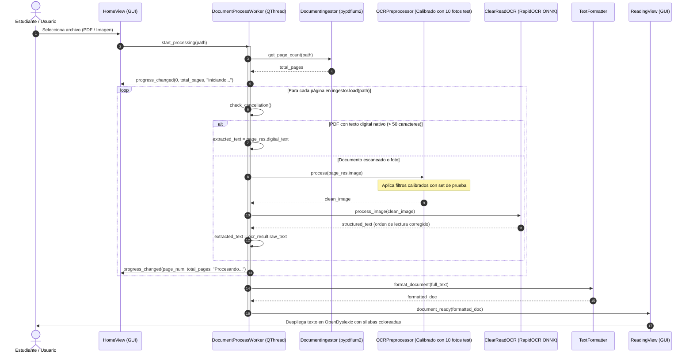
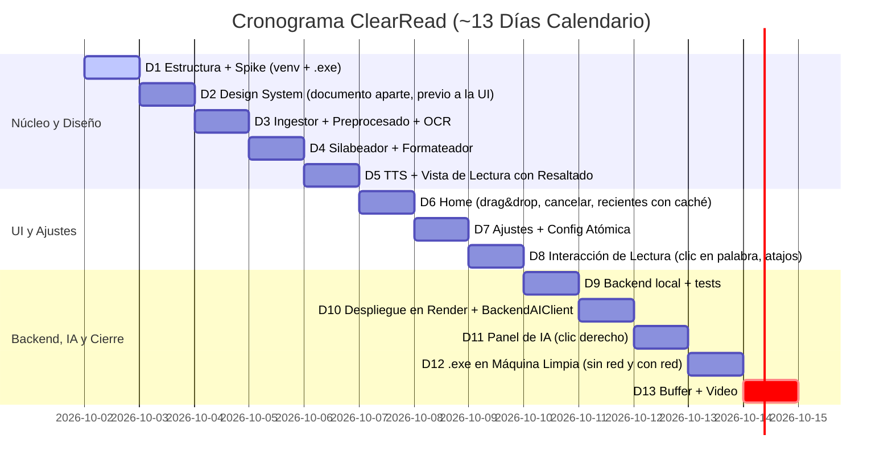

# ClearRead Desktop — Documentación Técnica de Arquitectura, Requisitos y Diseño

> **Versión:** 1.5.0 (Núcleo Offline + Asistente IA vía Backend Propio Desplegado — Entrega Académica / Portafolio)  
> **Fecha de Actualización:** 2026-10-01  
> **Estado:** Aprobado para Implementación con Spikes Técnicos  
> **Contexto:** 1 de 5 proyectos en paralelo | Plazo disponible: ~13 días calendario (2026-10-02 → 2026-10-14) | Distribución: `.exe` standalone Windows (`.zip` en GitHub Releases) + backend FastAPI desplegado en Render  
> **Cambios v1.5.0:** la materia exige el proyecto **desplegado**, por lo que el asistente de IA pasa a llamar a un backend propio (§4.11) en lugar de a DeepSeek directamente; la API key sale de la app.  
> **Idioma UI:** Español | **Idioma de Código y Nombres Técnicos:** Inglés  

---

## 1. Resumen Ejecutivo y Alcance del Sistema

### 1.1 Declaración del Problema Neuroeducativo
Los estudiantes con dislexia o dificultades específicas de decodificación fonológica enfrentan una sobrecarga cognitiva severa al interactuar con materiales de estudio impresos o digitalizados (guías fotocopiadas, exámenes o apuntes). Esta sobrecarga se manifiesta en:
- **Efecto de Hacinamiento Visual (*Visual Crowding*):** Dificultad para aislar grafemas debido a espaciados estrechos y fuentes no adaptadas.
- **Ruptura de Tracking Sacádico:** Pérdida recurrente de la línea activa de lectura en bloques densos o diseños multicolumna no lineales.
- **Déficit de Decodificación Fonológica:** Ausencia de apoyos ortográfico-silábicos que guíen la segmentación de palabras complejas en español.
- **Falta de Refuerzo Bimodal:** Ausencia de sincronización audiovisual estricta que ancle el estímulo fonético con el estímulo grafémico simultáneamente.

### 1.2 Propuesta de Solución: ClearRead Desktop
**ClearRead Desktop** es un sistema de tres piezas:

| Pieza | Qué es | Red |
|:---|:---|:---|
| **`ClearRead.exe`** | Aplicación de escritorio Windows (frontend). Ingesta, OCR, silabeo, lectura en voz alta e interfaz. | **Núcleo 100% offline**: los modelos ONNX y las fuentes viajan dentro del `.exe`. |
| **Backend propio** | API FastAPI (`backend/`, §4.11) desplegada en Render (plan gratuito). Guarda la API key, aplica límites de costo y habla con DeepSeek. | Recibe solo el texto que el usuario selecciona, por HTTPS. |
| **DeepSeek** | Modelo de IA generativa externo. | Solo lo llama el backend. |

Sobre el núcleo offline se ofrece un **asistente de IA generativa opcional con conexión** (explicación de palabras y simplificación de párrafos): `ClearRead.exe` → HTTPS → backend propio → DeepSeek. Sin red, el asistente se deshabilita de forma transparente y el resto de la app funciona igual. El sistema transforma documentos escaneados en una superficie de lectura de alta ergonomía cognitiva con:
1. **OCR con Inteligencia Artificial de Visión:** Núcleo de Deep Learning no negociable para extraer texto legible desde imágenes y PDFs sin intervención de servicios de nube.
2. **Segmentación Silábica Fonética Determinista:** Coloración alternada de sílabas conforme a la normativa ortográfica de la Real Academia Española (RAE).
3. **Lectura Aumentada Bimodal Sincronizada:** Síntesis de voz local vinculada a una regleta visual y resaltado por palabra con tolerancia perceptible mínima, incorporando soporte de pausa y reanudación en la oración activa.
4. **Entorno Visual de Bajo Estrés:** Paletas cromáticas suaves de contraste validado y tipografía OpenDyslexic.
5. **Asistente de IA Opcional vía Backend Propio:** Explicar una palabra en contexto y simplificar un párrafo, a través de nuestro backend desplegado; la app nunca contiene la API key de DeepSeek.

---

## 2. Decisiones Arquitectónicas, Matriz de Tecnologías y Gestión de Riesgos

### 2.1 Justificación del Stack y Viabilidad Operativa
Para un equipo de desarrollo con restricciones severas de tiempo (ver plazo en la cabecera del documento) y múltiples entregas simultáneas, **Python 3.11+ junto a PySide6** constituye la opción de menor costo de desarrollo y mayor integración directa con bibliotecas de IA locales.

> [!IMPORTANT]
> **Honestidad en Estimaciones:** Las cifras de rendimiento (ej. latencia de silabeo $< 0.05\text{ ms}$ por palabra, renderizado a 60 FPS o inferencia de OCR en CPU entre 1.5s y 4s) corresponden a **estimaciones teóricas basadas en benchmarks sintéticos** y deben ser revalidadas empíricamente en el Spike Técnico de la Fase 1.

### 2.2 Stack Tecnológico Oficial y Planes de Contingencia (Plan B)

| Capa / Módulo | Tecnología Principal | Versión | Licencia | Plan B (Contingencia de Riesgo Alto) |
|:---|:---|:---:|:---:|:---|
| **Plataforma Base** | Python | **3.11 x64 (exacto)** | PSF | Versión fija en la app y en el backend por compatibilidad binaria con PyInstaller; venv creado con `py -3.11 -m venv .venv`. |
| **Framework GUI** | PySide6 | ≥ 6.7.0 | LGPL v3 | Si PySide6 presenta problemas de tamaño en el bundle, mantener `--onedir` sin compresión UPX. |
| **Renderizado PDF** | **pypdfium2** | ≥ 4.28.0 | Apache 2.0 / BSD-3 | Renderizado C nativo sin Poppler; libre de riesgos copyleft AGPL. |
| **Visión e IA (OCR Principal)** | **RapidOCR (ONNX Runtime)** | ≥ 1.3.0 | Apache 2.0 | **Plan B IA:** Si la precisión de reconocimiento de RapidOCR es insuficiente en tipografías degradadas del set de calibración, ajustar umbrales de detección (`box_thresh`, `unclip_ratio`) o incorporar preprocesamiento de contraste adaptativo en OpenCV. Mantiene 100% el uso de IA de Deep Learning con inferencia local ágil y huella mínima (~16 MB). |
| **Visión Artificial** | opencv-python + Pillow | (versión que exige rapidocr-onnxruntime) / ≥ 10.0 | Apache 2.0 / HPND | Se usa `opencv-python`, **no** `-headless`: `rapidocr-onnxruntime` exige `opencv-python` y, si se instalan los dos, ambos escriben en la misma carpeta `cv2` y se pisan (comprobado en el Día 1). `opencv-python` no se declara aparte: llega como dependencia de RapidOCR. En el `.exe` se excluye `opencv_videoio_ffmpeg` (~30 MB, sin uso). Calibración empírica con set curado de 10 imágenes reales de smartphones/fotocopias. |
| **Motor TTS** | pyttsx3 + pythoncom (SAPI5) | **== 2.98** | MPL 2.0 / PSF | **Versión fijada:** en el spike del Día 1, pyttsx3 2.99 solo habla en el primer `runAndWait()` de cada motor (la 2.ª frase vuelve en 0.10 s con 1 evento); con 2.98 la 2.ª frase habla completa (9.05 s, 38 eventos). **Plan B Audio:** Si los eventos `started-word` de SAPI5 resultan inestables en ciertas voces de Windows, degradar el resaltado bimodal a nivel de oración completa con temporizador `QTimer` proporcional a las PPM. |
| **Segmentación Fonética** | silabeador | ≥ 1.1.0 | MIT | Algoritmo determinista RAE. Plan B: módulo interno de reglas regex fonológicas. |
| **Tipografía Accesible** | OpenDyslexic | Open Font | SIL OFL | Empaquetada localmente en recursos del proyecto. |
| **Cliente HTTP IA** | httpx | ≥ 0.27.0 | BSD-3 | En la app, solo importable en `services/ai_client.py`; ningún otro módulo del núcleo offline depende de librerías de red. El backend también lo usa para llamar a DeepSeek. |
| **Backend API** *(solo `backend/`)* | FastAPI (incluye pydantic, MIT) | ≥ 0.115.0 | MIT | Proyecto aparte con su propio `pyproject.toml`; nunca entra en el `.exe`. Genera `/docs` (OpenAPI) automáticamente. |
| **Servidor ASGI** *(solo `backend/`)* | uvicorn | ≥ 0.30.0 | BSD-3 | Arranque en Render con `uvicorn ... --host 0.0.0.0 --port $PORT`. |
| **Hosting del backend** | Render — Web Service, plan **Free** | — | Servicio (no es dependencia) | **Condiciones consultadas el 2026-10-01** en https://render.com/docs/free: se duerme tras 15 min sin tráfico y tarda ~1 min en despertar; 750 h de instancia/mes; sin disco persistente; una sola instancia. **Plan B: Hugging Face Spaces** — a la misma fecha (https://huggingface.co/docs/hub/spaces-overview), los Spaces Docker/Gradio requieren plan de pago para crearse (los gratuitos solo admiten Static o hasta 2 Gradio sobre ZeroGPU), así que el Plan B **no es gratuito** para FastAPI; ver §8. |

> [!NOTE]
> **Alternativa Evaluada y Descartada:** Se evaluó formalmente **PaddleOCR / PPStructure** y se resolvió **descartarlo definitivamente** del proyecto debido al alto riesgo comprobado de empaquetado en Windows mediante PyInstaller (conflictos de DLLs de PaddlePaddle, dependencias de MKL/OneDNN y tamaño de bundle > 1.5 GB). Su sustitución por **RapidOCR sobre ONNX Runtime** erradica el principal punto de falla de despliegue preservando al 100% el núcleo de visión artificial por Deep Learning.

---

## 3. Arquitectura del Sistema y Flujo de Datos

### 3.1 Diagrama de Arquitectura Simplificada
Para minimizar el riesgo de sobreingeniería en un proyecto universitario de ~13 días (§6.5), se elimina el bus global `AppState` complejo en favor de **comunicación directa desacoplada por Señales y Slots de Qt** entre vistas y workers. El diagrama muestra las tres piezas del sistema: la app de escritorio (núcleo offline), el backend propio desplegado y DeepSeek:

```mermaid
graph TB
    subgraph UI_Layer["Capa de Presentación (PySide6 - Hilo Principal)"]
        MW["MainWindow"]
        HV["HomeView (Carga & Estado)"]
        RV["ReadingView (Lector Aumentado)"]
        RW["ReaderWidget (QTextEdit + ExtraSelections)"]
        MSG["Diálogos de Error Accesibles (QMessageBox Estilizado)"]
    end

    subgraph Processing_Worker["Capa de Procesamiento Asíncrono (QThread)"]
        ING["DocumentIngestor (pypdfium2)"]
        PRE["OCRPreprocessor (OpenCV Calibrado)"]
        OCR["ClearReadOCR (RapidOCR / ONNX Runtime)"]
        FMT["TextFormatter (HTML Seguro + Token Map)"]
    end

    subgraph Audio_Worker["Capa de Síntesis de Audio (QThread Dedicado + COM STA)"]
        TTS["TTSWorker (SAPI5 Engine)"]
    end

    subgraph AI_Worker["Capa de IA Opcional (QThreadPool dedicado, maxThreadCount=1)"]
        AIW["ExplainWordWorker / SimplifyParagraphWorker"]
        AIC["BackendAIClient (httpx + caché local)"]
    end

    subgraph Backend["Backend propio (FastAPI en Render, backend/)"]
        API["POST /v1/explain · POST /v1/simplify · GET /health"]
        GUARD["Token de cliente + límites de tamaño + tope diario + caché en memoria"]
    end

    DS["DeepSeek API"]

    HV -->|Solicitar Procesamiento| Processing_Worker
    Processing_Worker -->|Error de Archivo / OCR| MSG
    Processing_Worker -->|Documento Formateado| RV
    RV --> RW
    RV -->|speak(script, start_offset)| TTS
    TTS -->|word_spoken(index)| RV
    RV -->|highlight_token()| RW
    RV -->|clic derecho: explicar / simplificar| AIW
    AIW --> AIC
    AIC -->|HTTPS + X-Client-Token| API
    API --> GUARD
    GUARD -->|HTTPS + API key (variable de entorno)| DS
    AIW -->|finished / failed / waking| RV
```

> La flecha `BackendAIClient → backend` es la **única** salida de red de `ClearRead.exe`, y solo ocurre cuando el usuario pide ayuda de IA. Todo el resto del diagrama funciona sin conexión.

### 3.2 Diagrama de Secuencia y Calibración con Datos Reales



---

## 4. Especificación Técnica de Módulos Críticos

---

### 4.1 Módulo Ingestor (`services/ingestor.py`)
**Propósito:** Cargar y convertir documentos garantizando streaming estricto sin materializar arrays completos en memoria, con soporte de desrotación EXIF, licencia compatible y validación de archivos protegidos por contraseña.

#### Requisitos de Ingeniería
- **ING-F01:** Ingestión de PDFs mediante `pypdfium2` (licencia permisiva Apache 2.0 / BSD-3).
- **ING-F02:** Normalización de orientación EXIF automática en imágenes JPG/PNG provenientes de dispositivos móviles.
- **ING-F03:** Detección de texto digital nativo previo al renderizado: si la página contiene texto extraíble íntegro, debe marcarse para omitir el OCR.
- **ING-F04:** Detección y manejo de PDFs protegidos por contraseña, notificando con claridad a la interfaz. **Medido en el spike del Día 1 (pypdfium2 5.13.0, PDFium 153.0.7999.0):** `pypdfium2.PdfPasswordError` **no existe**; un PDF con contraseña lanza `pypdfium2.PdfiumError` con `err_code == 4` (`pypdfium2.raw.FPDF_ERR_PASSWORD`). Comportamiento fijado en `tests/test_samples.py`.
- **ING-NF01 (Memoria):** Meta de diseño estimada a validar empíricamente: consumo de memoria residente proyectado en $\le 450\text{ MB}$ procesando un PDF estándar de 100 páginas (uso estricto de generadores con cierre asegurado mediante `try...finally`).

#### Contrato de Interfaz y Código

```python
"""Document ingestion service using pypdfium2 and Pillow."""

from dataclasses import dataclass
from enum import Enum
from pathlib import Path
from typing import Generator
import numpy as np
import pypdfium2 as pdfium
import pypdfium2.raw as pdfium_raw
from PIL import Image, ImageOps


class DocumentType(Enum):
    PDF = "pdf"
    IMAGE = "image"


@dataclass
class PageResult:
    page_number: int
    total_pages: int
    image: np.ndarray          # Array RGB (H, W, 3) optimizado
    digital_text: str | None   # Texto nativo si existe, sino None
    source_type: DocumentType


class DocumentIngestor:
    SUPPORTED_IMAGE_EXT = {".jpg", ".jpeg", ".png", ".bmp", ".tiff", ".tif"}
    SUPPORTED_PDF_EXT = {".pdf"}
    DEFAULT_DPI = 300
    DIGITAL_TEXT_THRESHOLD = 50

    def __init__(self, dpi: int = DEFAULT_DPI) -> None:
        self._dpi = dpi

    def get_page_count(self, file_path: str | Path) -> int:
        path = Path(file_path)
        if not path.exists():
            raise FileNotFoundError(f"Documento no encontrado: {path}")
        if path.suffix.lower() in self.SUPPORTED_PDF_EXT:
            try:
                doc = pdfium.PdfDocument(str(path))
            except pdfium.PdfiumError as err:
                if err.err_code == pdfium_raw.FPDF_ERR_PASSWORD:
                    raise PermissionError("El archivo PDF está protegido con contraseña.") from err
                raise
            count = len(doc)
            doc.close()
            return count
        elif path.suffix.lower() in self.SUPPORTED_IMAGE_EXT:
            return 1
        raise ValueError(f"Formato de archivo no soportado: {path.suffix}")

    def load(self, file_path: str | Path) -> Generator[PageResult, None, None]:
        path = Path(file_path)
        if path.suffix.lower() in self.SUPPORTED_PDF_EXT:
            yield from self._load_pdf_streaming(path)
        elif path.suffix.lower() in self.SUPPORTED_IMAGE_EXT:
            yield self._load_single_image(path)
        else:
            raise ValueError(f"Formato no soportado: {path.suffix}")

    def _load_pdf_streaming(self, path: Path) -> Generator[PageResult, None, None]:
        try:
            doc = pdfium.PdfDocument(str(path))
        except pdfium.PdfiumError as err:
            if err.err_code == pdfium_raw.FPDF_ERR_PASSWORD:
                raise PermissionError("El archivo PDF está protegido con contraseña.") from err
            raise

        try:
            total_pages = len(doc)
            scale = self._dpi / 72.0
            for page_idx in range(total_pages):
                page = doc[page_idx]
                textpage = page.get_textpage()
                extracted_text = textpage.get_text_range().strip()
                has_digital = len(extracted_text) >= self.DIGITAL_TEXT_THRESHOLD

                # Renderizado directo a bitmap a través de PDFium C-engine
                bitmap = page.render(scale=scale)
                pil_image = bitmap.to_pil()
                img_rgb = np.array(pil_image.convert("RGB"))

                yield PageResult(
                    page_number=page_idx + 1,
                    total_pages=total_pages,
                    image=img_rgb,
                    digital_text=extracted_text if has_digital else None,
                    source_type=DocumentType.PDF,
                )
                del img_rgb
                del pil_image
                del bitmap
        finally:
            doc.close()

    def _load_single_image(self, path: Path) -> PageResult:
        with Image.open(path) as img:
            img = ImageOps.exif_transpose(img)
            if img.mode in ("RGBA", "LA", "P"):
                rgb_img = Image.new("RGB", img.size, (255, 255, 255))
                rgb_img.paste(img, mask=img.split()[-1] if "A" in img.mode else None)
            else:
                rgb_img = img.convert("RGB")
            return PageResult(
                page_number=1,
                total_pages=1,
                image=np.array(rgb_img),
                digital_text=None,
                source_type=DocumentType.IMAGE,
            )
```

---

### 4.2 Módulo de Preprocesamiento (`services/preprocessor.py`)
**Propósito:** Optimizar y estabilizar imágenes de baja calidad (fotocopias o fotos con sombras) previo al reconocimiento de layout y texto.

#### Requisitos de Ingeniería
- **PRE-F01:** Corrección de iluminación por división de fondo (estimación morfológica) para atenuar sombras de flexión de hojas de cuadernos.
- **PRE-F02:** Enderezado geométrico (*deskew*) automático acotado en el rango $[-45^\circ, 45^\circ]$ con umbral de activación mínima en $| \theta | \ge 0.5^\circ$.
- **PRE-NF01:** Consumo de CPU $\le 800\text{ ms}$ por página A4 mediante el uso exclusivo de primitivas vectorizadas de OpenCV (`opencv-python`, ver §2.2).

> [!NOTE]
> **Calibración del Día 3 (estado real).** Implementación en `services/preprocessor.py`: `OCRPreprocessor` recibe un `PreprocessSettings` por constructor y expone cada etapa como método (`remove_shadows`, `denoise`, `deskew`, `enhance_contrast`); `process` devuelve escala de grises. El código de referencia de abajo es la versión inicial: la implementada divide por el fondo estimado (cierre morfológico + mediana sobre una copia reducida, en vez de `absdiff`) y calcula el ángulo del lado largo de cada línea (la convención de `minAreaRect` cambió en OpenCV ≥ 4.5).
>
> **A/B medido (Día 3, `tests/calibrate_ocr.py`).** Equipo verificado el 2026-10-06: Intel Core i5-8300H (4 núcleos), 23.8 GB de RAM, Windows 10 Home, Python 3.11, `perf_counter`. Métricas: CER (con espacios y saltos normalizados), F1 por palabras (bolsa de palabras, insensible al orden de lectura) y caracteres especiales (`ñ`, tildes, `ü`, `¿`, `¡`) conservados.
>
> **a) PDF renderizados a 300 DPI** (`--pdf-render --ablation --limit-pages 3`: 3 primeras páginas de cada una de las 5 fichas = 15 páginas; referencia = texto digital de esa página; `is_camera_photo=False`, así que la eliminación de sombras no aplica):
>
> | Configuración | CER medio | F1 palabras | Especiales | Preproc. medio |
> |:---|:---:|:---:|:---:|:---:|
> | original (color, sin preprocesar) | 59.5 % | 97.0 % | 382/385 | 0 ms |
> | solo `deskew` (**por defecto**) | 58.9 % | 96.7 % | 381/385 | 25 ms |
> | solo mediana | 59.4 % | 96.4 % | 380/385 | 9 ms |
> | solo CLAHE | 59.6 % | 96.4 % | 379/385 | 31 ms |
> | mediana + `deskew` + CLAHE | 58.9 % | 96.4 % | 379/385 | 50 ms |
>
> El CER alto (~59 %) **no es error de lectura**: las fichas tienen columnas y recuadros y el texto digital sigue otro orden; por eso se usa el F1 por palabras (~97 %). Ninguna etapa mejora el resultado sobre PDF limpios: las diferencias (≤ 0.6 puntos de F1) están dentro del ruido de 15 páginas y, si algo, las etapas empeoran ligeramente (la conversión a grises ya cuesta ~0.3 puntos). La corrección de sombras no se evaluó aquí.
>
> **Sintético** (6 variantes degradadas de `sample_page_scanned.pdf`: limpia, giro 3°, giro 10°, sombra, ruido, giro 4° + sombra + ruido; `--synthetic --ablation`, medido antes del cambio a F1/especiales por multiconjunto): original CER 9.8 % y 118/126 especiales; con las 4 etapas o solo `deskew`, 0.0 % y 126/126. El único caso en que el preprocesado ayuda es el giro de 10° (CER 58.8 % → 0.0 %), y lo logra solo `deskew`; con giros de 3° RapidOCR ya acierta sin preprocesar. Sombras, mediana y CLAHE no cambiaron ningún resultado.
>
> **Valores finales de esta fase: solo `deskew` activo; sombras, mediana y CLAHE desactivadas** (el `deskew` cuesta ~20 ms y es imprescindible con páginas giradas ≥ 10°; PRE-NF01 ≤ 800 ms se cumple de sobra, también con las 4 etapas: ~50 ms sobre PDF y ~150 ms con sombras). **Pendiente (§8):** el modo `--photos` está implementado pero **no se ha ejecutado**, porque aún no hay fotos de móvil con el nombre `<Ficha>_p<N>_<condición>.jpg` en `tests/samples/private/`. La eliminación de sombras y el resto de etapas solo se activarán si ese A/B con fotos reales demuestra mejora.

```python
"""Image preprocessing pipeline using OpenCV headless."""

import cv2
import numpy as np


class OCRPreprocessor:
    """Prepares raw images for optimal OCR and layout detection."""

    @staticmethod
    def process(image_rgb: np.ndarray, is_camera_photo: bool = True) -> np.ndarray:
        if len(image_rgb.shape) == 3:
            gray = cv2.cvtColor(image_rgb, cv2.COLOR_RGB2GRAY)
        else:
            gray = image_rgb.copy()

        if is_camera_photo:
            # Eliminación de sombras morfológica
            kernel = cv2.getStructuringElement(cv2.MORPH_RECT, (25, 25))
            background = cv2.morphologyEx(gray, cv2.MORPH_DILATE, kernel)
            diff = cv2.absdiff(gray, background)
            gray = cv2.normalize(255 - diff, None, alpha=0, beta=255, norm_type=cv2.NORM_MINMAX)

        # Denoise bilateral liviano (preserva bordes de caracteres finos)
        denoised = cv2.medianBlur(gray, 3)

        # Deskew por análisis de contornos
        deskewed = OCRPreprocessor._deskew(denoised)

        # Realce de contraste adaptativo local (CLAHE)
        clahe = cv2.createCLAHE(clipLimit=2.0, tileGridSize=(8, 8))
        enhanced = clahe.apply(deskewed)

        return enhanced

    @staticmethod
    def _deskew(image_gray: np.ndarray) -> np.ndarray:
        thresh = cv2.threshold(image_gray, 0, 255, cv2.THRESH_BINARY_INV + cv2.THRESH_OTSU)[1]
        kernel = cv2.getStructuringElement(cv2.MORPH_RECT, (30, 3))
        dilated = cv2.dilate(thresh, kernel, iterations=2)
        contours, _ = cv2.findContours(dilated, cv2.RETR_LIST, cv2.CHAIN_APPROX_SIMPLE)

        angles = []
        for c in contours:
            if cv2.contourArea(c) < 120:
                continue
            rect = cv2.minAreaRect(c)
            angle = rect[-1]
            if angle < -45:
                angle = -(90 + angle)
            elif angle > 45:
                angle = 90 - angle
            else:
                angle = -angle
            if abs(angle) <= 45.0:
                angles.append(angle)

        if not angles:
            return image_gray

        median_angle = float(np.median(angles))
        if abs(median_angle) < 0.5:
            return image_gray

        h, w = image_gray.shape[:2]
        rot_matrix = cv2.getRotationMatrix2D((w // 2, h // 2), median_angle, 1.0)
        return cv2.warpAffine(
            image_gray, rot_matrix, (w, h),
            flags=cv2.INTER_CUBIC,
            borderMode=cv2.BORDER_CONSTANT,
            borderValue=255
        )
```

---

### 4.3 Módulo OCR y Reconocimiento de Visión (`services/ocr_engine.py`)
**Propósito:** Extracción estructurada del texto utilizando modelos de Deep Learning ejecutados sobre **ONNX Runtime** (100% offline y altamente portable en Windows), con ordenación espacial de líneas/párrafos y des-hifenización en español.

#### Requisitos de Ingeniería
- **OCR-F01:** Inferencia de OCR mediante modelos Deep Learning ONNX (`RapidOCR`), 100% offline y local.
- **OCR-F02:** Des-hifenización en español para fusionar palabras partidas al final de línea (`cons-` + `trucción` $\rightarrow$ `construcción`).
- **OCR-F03:** Filtrado de detecciones espurias y reconstrucción topológica de líneas y párrafos respetando el orden natural de lectura.
- **OCR-NF01:** Tiempo de inferencia por página en CPU, sin dependencias de compiladores externos. **Valores medidos** (no estimados) con `time.perf_counter()` sobre una página A4 a 300 DPI, Intel Core i5-8300H (4 núcleos), 23.8 GB RAM, Windows 10 Home: **primera inferencia de cada proceso ~4.0 s** (3964–6268 ms en 4 ejecuciones del spike del Día 1, venv y `.exe`; la 1.ª ejecución del `.exe` tras compilar, 10.3 s), porque incluye la preparación del modelo; **inferencias siguientes ~1.9 s** (mediana 1.86–1.95 s en 3 ejecuciones, `tests/spike_ocr_latin.py`, con `ch_PP-OCRv4_rec` y con `latin_PP-OCRv5_rec_mobile`). La estimación previa de 2.5 s solo se cumple a partir de la segunda página procesada en el mismo proceso. *(Ver protocolo en §5.2. Se retiró la meta separada de memoria $\le 250\text{ MB}$ del OCR: queda cubierta por la meta general NFR-MEM01 de §5.2, evitando duplicar el mismo consumo bajo dos metas distintas.)*

> [!NOTE]
> **Implementación y parámetros del Día 3 (estado real).** `services/ocr_engine.py`: detección `ch_PP-OCRv4_det` y clasificador de ángulo del paquete `rapidocr_onnxruntime`, reconocimiento `latin_PP-OCRv5_rec_mobile` desde `resources/models` vía `get_resource_path`; el motor se crea una vez en el constructor. `process_image(image, page_number)` recibe el número de página (antes valía siempre 1) y mide también el tiempo de páginas sin texto. Reconstrucción topológica y des-hifenización son funciones puras (`build_paragraphs`, `merge_lines`): el guion solo se elimina al final de línea y la línea siguiente empieza en minúscula (`cons-`/`trucción` → `construcción`); `hispano-americano` dentro de la línea y `Madrid-`/`Barcelona` se conservan. Se descartan detecciones con confianza < 0.45 o sin ningún carácter alfanumérico. Nuevo salto de párrafo: hueco vertical entre líneas > 1.0 × altura mediana.
>
> **Parámetros finales:** `min_confidence=0.45`, `box_thresh=0.5`, `unclip_ratio=1.6`. **Barrido** (`calibrate_ocr.py --sweep --pdf-render --limit-pages 2`, 10 páginas en color, 18 combinaciones de `box_thresh` {0.4, 0.5, 0.6} × `unclip_ratio` {1.6, 2.0} × confianza {0.30, 0.45, 0.60}; mismo equipo): F1 entre 96.6 % y 97.3 %. La combinación elegida (0.5 / 1.6 / 0.45) empata con la mejor (F1 97.3 %, 287/289 especiales). `unclip_ratio=2.0` empeora ~0.5 puntos de F1 en todas las combinaciones; `box_thresh=0.6` pierde caracteres especiales (285/289); `box_thresh=0.4` solo recupera 1 carácter especial más a cambio de 0.1 puntos de F1: no justifica salirse del valor por defecto. La confianza entre 0.30 y 0.60 casi no cambia nada (≤ 0.2 puntos). **Se mantienen los valores por defecto**; el barrido sobre fotos de móvil sigue pendiente (§8). Verificado: `sample_page_scanned.pdf` a 300 DPI → 21/21 caracteres especiales (`tests/test_ocr_engine.py`); fichas reales: 382/385 (99.2 %).
>
> **Tiempo (corrige la expectativa de OCR-NF01):** en las 15 páginas de fichas a 300 DPI el OCR tarda de media **~7 s por página (4.3–12.8 s)**, no 1.9 s: esa cifra era de una página con 6 líneas; el coste crece con el número de líneas. La barra de progreso de §4.7 debe contar con 5–10 s por página escaneada densa (las páginas con texto digital no pasan por OCR, §4.1).

```python
"""OCR and layout analysis engine using RapidOCR (ONNX Runtime)."""

import os
import re
import time
from dataclasses import dataclass
import numpy as np
from rapidocr_onnxruntime import RapidOCR


@dataclass
class OCRResult:
    page_number: int
    raw_text: str = ""
    processing_time_ms: float = 0.0


class ClearReadOCR:
    """Offline Deep Learning OCR engine powered by ONNX Runtime."""

    def __init__(self, model_dir: str | None = None) -> None:
        params = {}
        if model_dir and os.path.exists(model_dir):
            det_path = os.path.join(model_dir, "ch_PP-OCRv4_det_infer.onnx")
            rec_path = os.path.join(model_dir, "ch_PP-OCRv4_rec_infer.onnx")
            cls_path = os.path.join(model_dir, "ch_ppocr_mobile_v2.0_cls_infer.onnx")
            if os.path.exists(det_path):
                params["det_model_path"] = det_path
            if os.path.exists(rec_path):
                params["rec_model_path"] = rec_path
            if os.path.exists(cls_path):
                params["cls_model_path"] = cls_path

        # Inicialización del motor ONNX Runtime (rápido, liviano y sin fricción de empaquetado)
        self._engine = RapidOCR(**params)

    def process_image(self, image_gray_or_rgb: np.ndarray) -> OCRResult:
        t_start = time.perf_counter()

        if len(image_gray_or_rgb.shape) == 2:
            import cv2
            img_input = cv2.cvtColor(image_gray_or_rgb, cv2.COLOR_GRAY2BGR)
        else:
            img_input = image_gray_or_rgb

        ocr_results, _ = self._engine(img_input)

        if not ocr_results:
            return OCRResult(page_number=1, raw_text="", processing_time_ms=0.0)

        # Ordenamiento topológico: filtrar por umbral de confianza y extraer cajas
        valid_boxes = []
        for box, text, score in ocr_results:
            text_clean = text.strip()
            if score >= 0.45 and text_clean:
                # box tiene 4 vértices [[x0,y0], [x1,y1], [x2,y2], [x3,y3]]
                y_top = min(pt[1] for pt in box)
                x_left = min(pt[0] for pt in box)
                height = max(pt[1] for pt in box) - y_top
                valid_boxes.append({
                    "box": box,
                    "text": text_clean,
                    "y": y_top,
                    "x": x_left,
                    "h": max(height, 10),
                    "score": score
                })

        if not valid_boxes:
            return OCRResult(page_number=1, raw_text="", processing_time_ms=0.0)

        # Agrupación topológica en líneas y párrafos respetando la jerarquía visual
        paragraphs = self._reconstruct_paragraphs(valid_boxes)
        elapsed_ms = (time.perf_counter() - t_start) * 1000.0

        return OCRResult(page_number=1, raw_text="\n\n".join(paragraphs), processing_time_ms=elapsed_ms)

    def _reconstruct_paragraphs(self, boxes: list[dict]) -> list[str]:
        # Altura promedio de línea para fijar la tolerancia vertical de agrupamiento
        avg_h = sum(b["h"] for b in boxes) / len(boxes)
        line_tolerance = max(avg_h * 0.6, 8.0)

        # Orden vertical inicial
        sorted_boxes = sorted(boxes, key=lambda b: (b["y"], b["x"]))

        # Agrupar en líneas horizontales
        lines: list[list[dict]] = []
        for b in sorted_boxes:
            placed = False
            for line in lines:
                ref_y = sum(item["y"] for item in line) / len(line)
                if abs(b["y"] - ref_y) <= line_tolerance:
                    line.append(b)
                    placed = True
                    break
            if not placed:
                lines.append([b])

        # Ordenar horizontalmente (izquierda a derecha) dentro de cada línea
        formatted_lines: list[tuple[float, str]] = []
        for line in lines:
            line.sort(key=lambda item: item["x"])
            avg_y = sum(item["y"] for item in line) / len(line)
            line_text = " ".join(item["text"] for item in line)
            formatted_lines.append((avg_y, line_text))

        # Ordenar líneas de arriba hacia abajo
        formatted_lines.sort(key=lambda t: t[0])

        # Unir en párrafos detectando saltos interlineales amplios
        paragraphs: list[str] = []
        current_para_lines: list[str] = []
        prev_y = None

        for y, text in formatted_lines:
            if prev_y is not None and (y - prev_y) > (avg_h * 2.2):
                if current_para_lines:
                    merged = self.dehyphenate(" ".join(current_para_lines))
                    paragraphs.append(merged)
                    current_para_lines = []
            current_para_lines.append(text)
            prev_y = y

        if current_para_lines:
            merged = self.dehyphenate(" ".join(current_para_lines))
            paragraphs.append(merged)

        return paragraphs

    @staticmethod
    def dehyphenate(text: str) -> str:
        """Remueve guiones de separación silábica tipográfica de fin de línea."""
        return re.sub(r'(\b\w+)-\s+(\w+\b)', r'\1\2', text)
```

---

### 4.4 Sincronización Bimodal: Token Position Map y Formateador (`services/text_formatter.py`)
**Solución al Problema Crítico #1:** Se erradica la dependencia de índices de caracteres brutos entre SAPI5 y `QTextEdit`. Se establece una **tabla de correspondencia de tokens (*Token Map*)** generada durante el formateo. Cada token sabe exactamente cuál es su orden ordinal, su forma fonética normalizada para el motor TTS y sus coordenadas exactas de cursor `(start_char, end_char)` dentro del documento de Qt.

> [!NOTE]
> **Colores de sílabas (NFR-A11Y01):** la paleta de cada tema (Claro, Oscuro y Alto Contraste), con sus ratios medidos, está definida en el design system: [`docs/design-system/README.md`](docs/design-system/README.md) (§1.2 tokens, §10.4 `SyllablePalette`). Los colores `#1565C0` y `#D84315` del código de referencia no cumplían 7.0:1 y quedan sustituidos por esos tokens.

`TextFormatter` **no fija colores propios**: recibe la paleta de sílabas del tema activo por inyección de dependencia (ver `SyllablePalette` abajo), definida y validada en el design system. Al cambiar de tema, la app regenera el `html_content` con la nueva paleta; el `TokenPositionMap` **no se recalcula**, porque el color no altera las posiciones `(doc_start_pos, doc_end_pos)` de cada `WordToken`.

> [!NOTE]
> **Implementación del Día 4 (`services/syllabifier.py`, `services/text_formatter.py`).** Las posiciones se calculan sobre `QTextDocument.toPlainText()` tras `setHtml`, no sobre el HTML: un carácter por letra y un `\n` entre párrafos (el `<div>` envolvente no añade bloque). Antes de calcular nada, `normalise_paragraphs` parte por líneas en blanco y colapsa todo espacio (dobles, tabuladores, saltos sueltos) a uno solo. Cambios respecto al código de referencia: la tokenización usa una expresión regular sobre el párrafo (la del código de referencia descartaba la palabra en tokens como `a,b`); los números (`3,5`, `12.345,67`) son un solo token; los signos y símbolos se escapan con `html.escape` y no se hablan; `FormattedDocument` es un `dataclass(frozen=True)`. **Verificado con `QTextDocument` real (pytest-qt):** párrafos múltiples, `¿Qué?`, `«comillas»`, paréntesis, `<`, `&`, `"`, `<script>`, espacios dobles, saltos sueltos, Unicode combinado y emoji → 100 % de los tokens en su posición; y las 5 fichas reales (5 482 tokens) → 100 % (`tests/test_private_pdfs.py`, sin imprimir texto).
>
> **Silabeador (SYL-F01, NFR-FON01): criterio FONÉTICO.** La división silábica sigue cómo se pronuncia la palabra (es lo que ayuda a decodificar), no la división morfológica que la RAE usa al partir palabras a final de línea. Por eso `desahucio` → `de-sahu-cio`, `inactivo` → `i-nac-ti-vo`, `desestimar` → `de-ses-ti-mar` y `suburbano` → `su-bur-ba-no`. Con el criterio morfológico original, `silabeador` acertaba 45/50 (90 %); la usuaria aprobó cambiar esas 4 respuestas del banco el 2026-10-07. Excepción fonética con regla propia en `services/syllabifier.py`: si la palabra empieza por `sub` + `r`, la `b` se queda con la sílaba anterior porque la `r` es vibrante múltiple (`sub-ra-yar`, `sub-ro-gar`; la librería daba `su-bra-yar`). **Resultado del banco: 51/51 (100 %)**, 50 palabras más `subrogar` como control del mismo caso; umbral ≥ 98 %. Las demás categorías (hiatos acentuales y simples, diptongos, triptongos, dígrafos, grupos consonánticos, `x`/`h` intercalada) pasaban ya al 100 %. Dos observaciones sobre la librería: en palabras que terminan en `-um/-em/-at/-it/-am` (`álbum`, `item`) su rama latina lanza `TypeError` (se reintenta con `exceptions=0`), y relee su archivo de excepciones en cada llamada (se memoriza el resultado por palabra con `lru_cache`).
>
> **Tiempo de `format_document` (`perf_counter`, i5-8300H, venv):** ficha más larga (8 173 caracteres, 1 185 tokens) **619 ms en frío** (proceso nuevo, caché de sílabas vacía) y **12 ms** con la caché caliente; sin la caché, ~1.1 s por ficha. Una sola medición por situación, no un promedio estadístico.

```python
"""Linguistic text formatter and Token Position Map for bimodal reading."""

import html
import re
from dataclasses import dataclass
from clearread.services.syllabifier import SpanishSyllabifier


@dataclass(frozen=True)
class WordToken:
    word_index: int
    spoken_text: str          # Texto limpio entregado a la síntesis de voz
    doc_start_pos: int        # Índice exacto de inicio de carácter en el QTextDocument
    doc_end_pos: int          # Índice exacto de fin de carácter en el QTextDocument


@dataclass(frozen=True)
class SyllablePalette:
    """Injected by the active theme; colors and contrast ratios are owned by
    the design system, not hardcoded here."""
    color_even: str
    color_odd: str


class FormattedDocument:
    def __init__(self, html_content: str, token_map: list[WordToken], tts_script: str) -> None:
        self.html_content = html_content
        self.token_map = token_map
        self.tts_script = tts_script


class TextFormatter:
    """Segments Spanish text into colored syllables and creates the TTS alignment index."""

    def __init__(self, syllabifier: SpanishSyllabifier, palette: SyllablePalette) -> None:
        self.syllabifier = syllabifier
        self.color_even = palette.color_even
        self.color_odd = palette.color_odd

    def format_document(self, raw_text: str, enable_syllables: bool = True) -> FormattedDocument:
        paragraphs = raw_text.split("\n\n")
        html_paragraphs: list[str] = []
        token_map: list[WordToken] = []
        spoken_words: list[str] = []

        current_doc_pos = 0
        word_counter = 0

        for p_idx, para in enumerate(paragraphs):
            para_clean = para.strip()
            if not para_clean:
                continue

            tokens = re.split(r'(\s+)', para_clean)
            p_html: list[str] = []

            for token in tokens:
                if not token:
                    continue

                if token.isspace():
                    p_html.append(token)
                    current_doc_pos += len(token)
                    continue

                # Separar signos de puntuación iniciales y finales de la palabra núcleo
                match = re.match(r'^([^\w]*)([\w\'-]+)([^\w]*)$', token, re.UNICODE)
                if match:
                    prefix, word_core, suffix = match.groups()
                    if prefix:
                        p_html.append(html.escape(prefix))
                        current_doc_pos += len(prefix)

                    start_idx = current_doc_pos
                    end_idx = start_idx + len(word_core)

                    # Registrar mapeo de palabra exacto en el espacio del documento Qt
                    token_map.append(WordToken(
                        word_index=word_counter,
                        spoken_text=word_core,
                        doc_start_pos=start_idx,
                        doc_end_pos=end_idx
                    ))
                    spoken_words.append(word_core)
                    word_counter += 1

                    # Generar HTML coloreado por sílabas con escape de seguridad
                    if enable_syllables and len(word_core) > 2:
                        sylls = self.syllabifier.syllabify_word(word_core).syllables
                        word_spans = []
                        for s_idx, s in enumerate(sylls):
                            color = self.color_even if (s_idx % 2 == 0) else self.color_odd
                            safe_s = html.escape(s)
                            word_spans.append(f'<span style="color: {color};">{safe_s}</span>')
                        p_html.append("".join(word_spans))
                    else:
                        safe_word = html.escape(word_core)
                        p_html.append(f'<span style="color: {self.color_even};">{safe_word}</span>')

                    current_doc_pos += len(word_core)

                    if suffix:
                        p_html.append(html.escape(suffix))
                        current_doc_pos += len(suffix)
                else:
                    # Token no alfanumérico (ej. símbolos matemáticos, llaves) con escape HTML
                    p_html.append(html.escape(token))
                    current_doc_pos += len(token)

            html_paragraphs.append(f'<p style="margin-bottom: 14px;">{"".join(p_html)}</p>')
            # El salto de bloque en QTextDocument añade 1 carácter separator (0x2029)
            current_doc_pos += 1

        full_html = (
            f'<div style="font-family: \'OpenDyslexic\'; font-size: 16pt; '
            f'line-height: 1.8; letter-spacing: 1.5px; word-spacing: 4px;">'
            f'{"".join(html_paragraphs)}</div>'
        )
        tts_script = " ".join(spoken_words)

        return FormattedDocument(full_html, token_map, tts_script)
```

---

### 4.5 Módulo de Síntesis de Voz Robusto (`services/tts_controller.py`)
**Solución al Problema Crítico #2:** Eliminación de `threading.Thread(daemon=True)` arbitrario. El motor SAPI5 se aísla en un **`QThread` dedicado permanente** que inicializa su propio apartamento COM STA (`pythoncom.CoInitialize()`). Las comunicaciones entre la interfaz y el motor se canalizan exclusivamente a través de colas de eventos y señales asíncronas con `Qt.ConnectionType.QueuedConnection`.

**Hallazgos del spike del Día 1 (`tests/spike_tts_stop.py`, cada escenario en un proceso nuevo, voz Microsoft Helena):**
- **(a) pyttsx3 fijado a `==2.98`** (§2.2): con 2.99 solo habla el primer `runAndWait()` de cada motor; la 2.ª frase vuelve en 0.10 s con 1 evento. Con 2.98, la 2.ª frase habla completa (9.05 s, 38 eventos), y este diseño reutiliza el mismo motor en cada lectura.
- **(b) Evento de palabra extra al iniciar cada frase:** pyttsx3 emite un `started-word` adicional al empezar el *stream*, con `name=None`, `location` = número de *stream* y `length` = posición del *stream*. Los eventos reales traen la palabra y su **offset de carácter** en el texto enviado (p. ej. "Prueba de integración exitosa" → `location` 0, 7, 10, 22). Por eso el resaltado **se alinea por el offset de carácter (`location`) del evento contra el texto enviado, no contando eventos** (contar daría un desfase de una palabra).
- **Pausa:** `engine.stop()` llamado desde **otro hilo** mientras `runAndWait()` habla detiene la voz: `runAndWait()` vuelve a 1.60–1.61 s con la parada pedida a 1.5 s, SAPI queda en estado *done*, con y sin `CoInitialize` en el hilo que para. **Resultado del Día 5 (prueba real con la voz SAPI5, `tests/manual/check_tts_real.py`, i5-8300H, cada escenario en un proceso nuevo):** la hipótesis **no se confirmó**. Una señal `sig_stop` en cola **sí** se procesa durante `runAndWait()` (el bucle de pyttsx3 bombea mensajes de Windows y con ellos los eventos de Qt de ese hilo): la voz terminó 0.76 s después de pedir la parada con la señal en cola y 0.78 s con `engine.stop()` directo. `TTSController.stop()` conserva la llamada directa, pero por otra razón: invalida en el acto la *generación* del enunciado (los eventos tardíos y los `speak` aún en cola se descartan) sin depender del orden de la cola. **Hallazgos nuevos del Día 5:** (1) pyttsx3 llama al callback de `started-word` con argumentos con nombre (`name=`, `location=`, `length=`): un parámetro llamado `_length`, como en el código de referencia, hace que pyttsx3 descarte todos los eventos en silencio. (2) `say()` debe llamarse **sin** `name`: con él, el evento de inicio de flujo trae ese nombre en vez de `None` y el filtro `name is None` deja de valer. (3) Tras `engine.stop()` a mitad de frase, pyttsx3 2.98 **no vuelve a hablar** con el mismo motor (el siguiente `runAndWait()` vuelve en ~0.1 s sin palabras; SAPI entrega el fin de flujo de la purga durante el nuevo enunciado), así que reanudar fallaba sin ruido. Se resuelve creando un motor nuevo (~0.1 s medidos) tras cada enunciado interrumpido. **Pausa y reanudación reales** (36 palabras de la muestra sintética): pausó tras el evento de la palabra 9 (`estudiará`) a los 4.17 s; 0 eventos durante 1.2 s de pausa; reanudó desde la palabra 9 (`estudiará`) y los eventos fueron consecutivos hasta la 35 (36 palabras), con una sola señal de fin. El código de arriba es la versión inicial; el implementado en `services/tts_controller.py` añade el contador de generación, el motor inyectable (`engine_factory`) y la reconstrucción del motor.

**Calibración de la velocidad y clic en palabra (Día 8, medido con la voz real).**
- **Un `speak` anidado terminaba en silencio.** El bucle de `runAndWait()` bombea los eventos de Qt del hilo del worker: si el `speak` del enunciado nuevo llega mientras se cancela el viejo (clic en una palabra durante la reproducción), el slot se ejecuta *dentro* del `runAndWait()` del motor que se está parando y vuelve sin hablar ni emitir palabras (la prueba real devolvió solo `playback_ended`). `SAPI5Worker.speak` detecta que ya habla, guarda la petición como pendiente y la ejecuta cuando el enunciado viejo termina y el motor se ha reconstruido. Tras el arreglo, el clic con la lectura en curso empezó en la palabra pulsada y los eventos fueron consecutivos.
- **Conversión "palabras/min mostradas → rate de SAPI5".** El `rate` de pyttsx3 no son palabras por minuto: para una voz que pyttsx3 no conoce (Helena) lo convierte en un paso entero de SAPI con `int(log(rate / 156.63, 1.11))`, así que la velocidad real es una escalera de 16 pasos entre 80 y 320. `sapi_rate_for()` (`services/tts_controller.py`) elige el paso cuya velocidad medida se acerca más a la mostrada (conversión por tramos).
- **Cómo se midió** (`tests/manual/measure_tts_rate.py`, `time.perf_counter()` sobre los eventos de palabra, ≥ 12 s de escucha por punto, voz Microsoft Helena, texto sintético de 144 palabras con longitud media de 4,9 letras, i5-8300H con Windows 10, un proceso nuevo por punto; una sola pasada por punto):

| Paso SAPI | rate enviado | palabras/min medidas |
|:---:|:---:|:---:|
| −8 | 64 | 68,6 |
| −7 | 72 | 76,5 |
| −6 | 80 | 77,5 |
| −5 | 88 | 86,8 |
| −4 | 98 | 104,7 |
| −3 | 109 | 107,9 |
| −2 | 121 | 122,0 |
| −1 | 134 | 127,3 |
| 0 | 157 | 142,1 |
| +1 | 183 | 164,4 |
| +2 | 203 | 179,3 |
| +3 | 226 | 205,3 |
| +4 | 251 | 227,9 |
| +5 | 278 | 258,6 |
| +6 | 309 | 288,3 |
| +7 | 343 | 306,5 |

| Mostrado | Antes (rate = mostrado) | Error antes | Después (`sapi_rate_for`) | Error después |
|:---:|:---:|:---:|:---:|:---:|
| 80 | 77,4 | −3,3 % | 77,3 | −3,4 % |
| 120 | 122,0 | +1,7 % | 122,0 | +1,7 % |
| 150 | 142,0 | −5,3 % | 142,1 | −5,3 % |
| 200 | 179,2 | −10,4 % | 205,3 | +2,6 % |
| 280 | 258,7 | −7,6 % | 287,2 | +2,6 % |

- **Límites de la calibración:** la tabla **depende de la voz** (otra voz instalada habla a otro ritmo; no se mide en tiempo de ejecución) y **del texto**: "palabras por minuto" cambia con la longitud de las palabras (una prueba con palabras de 1 a 3 letras dio 354 palabras/min con el control en 120 y 855 con el control en 300). Los valores son de un texto con la longitud media de palabra del español corriente; con otro texto el error puede superar el 10 %. Por la escalera de pasos enteros, el error mínimo posible entre dos pasos vecinos es de ~5–7 %.

```python
"""Thread-safe SAPI5 TTS Controller with isolated STA COM lifecycle."""

import bisect
import re

import pyttsx3
import pythoncom
from PySide6.QtCore import QObject, QThread, Signal, Slot


class SAPI5Worker(QObject):
    """Worker object living strictly inside a dedicated QThread."""

    word_started = Signal(int)  # Emite el índice ordinal global de la palabra (0, 1, 2...)
    speech_finished = Signal()
    error_occurred = Signal(str)

    def __init__(self) -> None:
        super().__init__()
        self._engine = None
        self._is_speaking = False
        self._base_word_offset = 0
        self._word_starts: list[int] = []  # char offset of each word in the sent text

    @Slot()
    def initialize(self) -> None:
        """Executed inside the target QThread context."""
        try:
            pythoncom.CoInitialize()
            self._engine = pyttsx3.init("sapi5")
            self._configure_voice()
            self._engine.connect("started-word", self._on_word_boundary)
        except Exception as e:
            self.error_occurred.emit(f"Fallo inicializando SAPI5: {e}")

    def _configure_voice(self) -> None:
        voices = self._engine.getProperty("voices")
        for v in voices:
            name = v.name.lower()
            if any(k in name for k in ["spanish", "español", "helena", "sabina", "es-es", "es-mx"]):
                self._engine.setProperty("voice", v.id)
                break
        self._engine.setProperty("rate", 150)
        self._engine.setProperty("volume", 1.0)

    @Slot(str, int)
    def speak(self, text: str, start_offset: int = 0) -> None:
        if not self._engine:
            return
        if self._is_speaking:
            self.stop()

        self._is_speaking = True
        self._base_word_offset = start_offset
        self._word_starts = [match.start() for match in re.finditer(r"\S+", text)]
        try:
            self._engine.say(text, name="doc_playback")
            self._engine.runAndWait()
        except Exception as err:
            self.error_occurred.emit(f"Error durante la reproducción: {err}")
        finally:
            self._is_speaking = False
            self.speech_finished.emit()

    @Slot()
    def stop(self) -> None:
        if self._engine and self._is_speaking:
            self._engine.stop()
            self._is_speaking = False

    @Slot(int)
    def set_rate(self, wpm: int) -> None:
        if self._engine:
            self._engine.setProperty("rate", max(80, min(320, wpm)))

    def _on_word_boundary(self, name: str | None, location: int, _length: int) -> None:
        # pyttsx3 also reports the stream start as a "started-word" with name=None and
        # location=stream number; only real word events carry a char offset (Day 1 spike).
        if name is None:
            return
        local_index = bisect.bisect_right(self._word_starts, location) - 1
        if local_index >= 0:
            self.word_started.emit(self._base_word_offset + local_index)

    @Slot()
    def cleanup(self) -> None:
        if self._engine:
            self.stop()
        pythoncom.CoUninitialize()


class TTSController(QObject):
    """Public interface for thread-safe audio synthesis management."""

    sig_speak = Signal(str, int)
    sig_stop = Signal()
    sig_set_rate = Signal(int)

    word_spoken = Signal(int)       # Índice global de palabra hacia la UI
    playback_ended = Signal()

    def __init__(self) -> None:
        super().__init__()
        self._thread = QThread()
        self._worker = SAPI5Worker()
        self._worker.moveToThread(self._thread)

        # Conexiones de ciclo de vida
        self._thread.started.connect(self._worker.initialize)
        self._thread.finished.connect(self._worker.cleanup)

        # Conexiones de control
        self.sig_speak.connect(self._worker.speak)
        self.sig_stop.connect(self._worker.stop)
        self.sig_set_rate.connect(self._worker.set_rate)

        # Retransmisión de señales a la GUI
        self._worker.word_started.connect(self.word_spoken)
        self._worker.speech_finished.connect(self.playback_ended)

        self._thread.start()

    def speak_text(self, text: str, start_offset: int = 0) -> None:
        self.sig_speak.emit(text, start_offset)

    def stop(self) -> None:
        self.sig_stop.emit()

    def set_speed(self, wpm: int) -> None:
        self.sig_set_rate.emit(wpm)

    def shutdown(self) -> None:
        self.stop()
        self._thread.quit()
        self._thread.wait(2000)
```

---

### 4.6 Módulo de Persistencia Robusta (`core/config.py`)
**Solución al Problema #7:** Escritura atómica a disco para blindar las configuraciones ante cortes súbitos o terminaciones forzadas.

```python
"""Atomic configuration manager with crash-resilience."""

import json
import os
import tempfile
from dataclasses import dataclass, asdict
from pathlib import Path
from clearread.core.paths import get_user_data_dir

# The only URL allowed outside services/ai_client.py (NFR-OFF01 audit).
# Placeholder until the real Render URL exists (Day 10, §6.5).
DEFAULT_BACKEND_URL = "https://clearread-api.onrender.com"


@dataclass
class AppConfig:
    theme: str = "light"  # ThemeId value: "light" | "dark" | "high_contrast"
    font_size_pt: int = 16
    line_spacing: float = 1.8
    letter_spacing: float = 1.5  # px
    word_spacing: int = 4  # px
    syllables_enabled: bool = True
    reading_speed_wpm: int = 150
    voice_id: str = ""  # SAPI5 voice id; empty means the system default voice
    voice_volume: float = 1.0  # fixed: no UI control, the Windows volume applies
    ai_privacy_accepted: bool = False  # privacy notice before the first AI call (NFR-SEC01)
    backend_url: str = DEFAULT_BACKEND_URL  # editable in "Ajustes avanzados" (CFG-F02)
    ui_language: str = "es"  # "es" | "en": interface language only, applied on restart (I18N-F01)

    @classmethod
    def load(cls) -> "AppConfig":
        config_path = get_user_data_dir() / "config.json"
        if not config_path.exists():
            return cls()
        try:
            with open(config_path, "r", encoding="utf-8") as f:
                data = json.load(f)
            return cls(**{k: v for k, v in data.items() if k in cls.__dataclass_fields__})
        except Exception:
            return cls()

    def save(self) -> None:
        target_path = get_user_data_dir() / "config.json"
        target_path.parent.mkdir(parents=True, exist_ok=True)

        # Patrón Atomic Write: escribir a temporal y renombrar atómicamente a nivel de SO
        temp_fd, temp_file = tempfile.mkstemp(
            dir=str(target_path.parent),
            prefix="cfg_",
            suffix=".tmp"
        )
        try:
            with os.fdopen(temp_fd, "w", encoding="utf-8") as f:
                json.dump(asdict(self), f, indent=2, ensure_ascii=False)
            os.replace(temp_file, str(target_path))
        except Exception:
            if os.path.exists(temp_file):
                os.remove(temp_file)
            raise
```

---

### 4.7 Módulo Worker y Orquestador de Procesamiento (`workers/ocr_worker.py`)
**Solución a Problemas Críticos #3, #4 y #6:** Inyección de dependencias, bypass de OCR ante texto digital preexistente y streaming estricto página a página.

```python
"""Orchestrator worker for streaming document ingestion and OCR."""

from PySide6.QtCore import QThread, Signal
from clearread.services.ingestor import DocumentIngestor
from clearread.services.preprocessor import OCRPreprocessor
from clearread.services.ocr_engine import ClearReadOCR
from clearread.services.text_formatter import TextFormatter, FormattedDocument


class DocumentProcessWorker(QThread):
    progress_changed = Signal(int, int, str)
    document_ready = Signal(FormattedDocument)
    error_occurred = Signal(str)

    def __init__(
        self,
        file_path: str,
        ingestor: DocumentIngestor,
        preprocessor: OCRPreprocessor,
        ocr_engine: ClearReadOCR,
        formatter: TextFormatter
    ) -> None:
        super().__init__()
        self.file_path = file_path
        self.ingestor = ingestor
        self.preprocessor = preprocessor
        self.ocr_engine = ocr_engine
        self.formatter = formatter
        self._is_cancelled = False

    def cancel(self) -> None:
        self._is_cancelled = True

    def run(self) -> None:
        try:
            total_pages = self.ingestor.get_page_count(self.file_path)
            collected_paragraphs: list[str] = []

            # Streaming página por página: la memoria no acumula arrays en bucle
            for page_res in self.ingestor.load(self.file_path):
                if self._is_cancelled:
                    return

                page_num = page_res.page_number
                self.progress_changed.emit(
                    page_num, total_pages,
                    f"Analizando página {page_num} de {total_pages}..."
                )

                # BYPASS DE OCR: Si el documento ya cuenta con texto nativo de alta calidad
                if page_res.digital_text and len(page_res.digital_text.strip()) > 50:
                    collected_paragraphs.append(page_res.digital_text.strip())
                else:
                    # Inferencia de imagen
                    clean_image = self.preprocessor.process(page_res.image)
                    ocr_res = self.ocr_engine.process_image(clean_image)
                    if ocr_res.raw_text.strip():
                        collected_paragraphs.append(ocr_res.raw_text.strip())

            if self._is_cancelled:
                return

            self.progress_changed.emit(total_pages, total_pages, "Generando estructura fonética y regleta...")
            merged_text = "\n\n".join(collected_paragraphs)
            formatted_doc = self.formatter.format_document(merged_text)

            self.document_ready.emit(formatted_doc)

        except (FileNotFoundError, ValueError) as client_err:
            self.error_occurred.emit(f"Error de documento: {client_err}")
        except Exception as unhandled:
            self.error_occurred.emit(f"Fallo inesperado durante el procesamiento: {unhandled}")
```

---

### 4.8 Módulo de Interfaz Gráfica (`ui/views/reading_view.py`)
**Implementación del resaltado bimodal por mapa de tokens:**

```python
"""Reading view using token map addressing to prevent cursor drifting."""

from PySide6.QtWidgets import QWidget, QVBoxLayout, QHBoxLayout, QTextEdit, QPushButton, QSlider, QLabel, QFrame
from PySide6.QtGui import QTextCharFormat, QTextFormat, QTextCursor, QColor
from PySide6.QtCore import Qt, Slot
from clearread.services.text_formatter import FormattedDocument, WordToken
from clearread.services.tts_controller import TTSController


class ReaderWidget(QTextEdit):
    def __init__(self) -> None:
        super().__init__()
        self.setReadOnly(True)
        self.setFrameShape(QFrame.Shape.NoFrame)
        self.setHorizontalScrollBarPolicy(Qt.ScrollBarPolicy.ScrollBarAlwaysOff)

        # Resaltado de palabra ámbar suave
        self.word_fmt = QTextCharFormat()
        self.word_fmt.setBackground(QColor("#FFE082"))
        self.word_fmt.setForeground(QColor("#1A1A1A"))
        self.word_fmt.setFontWeight(700)

        # Regleta de lectura de línea completa
        self.ruler_fmt = QTextCharFormat()
        self.ruler_fmt.setBackground(QColor(240, 230, 214, 160))
        self.ruler_fmt.setProperty(QTextFormat.Property.FullWidthSelection, True)

    def highlight_token(self, token: WordToken) -> None:
        word_cursor = self.textCursor()
        word_cursor.setPosition(token.doc_start_pos)
        word_cursor.setPosition(token.doc_end_pos, QTextCursor.MoveMode.KeepAnchor)

        word_sel = QTextEdit.ExtraSelection()
        word_sel.cursor = word_cursor
        word_sel.format = self.word_fmt

        ruler_cursor = self.textCursor()
        ruler_cursor.setPosition(token.doc_start_pos)
        ruler_sel = QTextEdit.ExtraSelection()
        ruler_sel.cursor = ruler_cursor
        ruler_sel.format = self.ruler_fmt

        self.setExtraSelections([ruler_sel, word_sel])
        self.setTextCursor(word_cursor)
        self.ensureCursorVisible()

    def clear_highlights(self) -> None:
        self.setExtraSelections([])


class ReadingView(QWidget):
    def __init__(self, tts_controller: TTSController) -> None:
        super().__init__()
        self.tts = tts_controller
        self.token_map: list[WordToken] = []
        self.tts_script: str = ""
        self.current_word_idx: int = 0
        self.is_paused: bool = False
        self._init_ui()
        self._connect_signals()

    def _init_ui(self) -> None:
        main_layout = QHBoxLayout(self)
        main_layout.setContentsMargins(0, 0, 0, 0)
        main_layout.addStretch(1)

        self.reading_frame = QFrame()
        self.reading_frame.setMaximumWidth(820)
        self.reading_frame.setMinimumWidth(550)

        col_layout = QVBoxLayout(self.reading_frame)
        col_layout.setContentsMargins(25, 20, 25, 20)

        self.editor = ReaderWidget()
        col_layout.addWidget(self.editor)

        controls = QFrame()
        c_layout = QHBoxLayout(controls)
        self.btn_play = QPushButton("▶ Reproducir")
        self.btn_stop = QPushButton("⏹ Detener")
        self.lbl_speed = QLabel("Velocidad: 150 PPM")
        self.slider_speed = QSlider(Qt.Orientation.Horizontal)
        self.slider_speed.setRange(100, 280)
        self.slider_speed.setValue(150)

        c_layout.addWidget(self.btn_play)
        c_layout.addWidget(self.btn_stop)
        c_layout.addSpacing(15)
        c_layout.addWidget(self.lbl_speed)
        c_layout.addWidget(self.slider_speed)

        col_layout.addWidget(controls)
        main_layout.addWidget(self.reading_frame, stretch=3)
        main_layout.addStretch(1)

    def _connect_signals(self) -> None:
        self.btn_play.clicked.connect(self.toggle_play)
        self.btn_stop.clicked.connect(self.stop_reading)
        self.slider_speed.valueChanged.connect(self._on_speed_change)

        self.tts.word_spoken.connect(self._on_word_spoken)
        self.tts.playback_ended.connect(self._on_playback_ended)

    @Slot(FormattedDocument)
    def load_document(self, doc: FormattedDocument) -> None:
        self.token_map = doc.token_map
        self.tts_script = doc.tts_script
        self.current_word_idx = 0
        self.is_paused = False
        self.editor.setHtml(doc.html_content)

    def toggle_play(self) -> None:
        if self.btn_play.text() == "⏸ Pausar":
            # Pausar: detener reproducción activa sin resetear el índice de palabra
            self.tts.stop()
            self.is_paused = True
            self.btn_play.setText("▶ Reanudar")
        else:
            if not self.token_map:
                return

            self.btn_play.setText("⏸ Pausar")
            if self.is_paused and self.current_word_idx < len(self.token_map):
                # Reanudación precisa desde la palabra actual
                remaining_tokens = self.token_map[self.current_word_idx:]
                remaining_script = " ".join([t.spoken_text for t in remaining_tokens])
                self.tts.speak_text(remaining_script, start_offset=self.current_word_idx)
            else:
                # Inicio desde el comienzo
                self.current_word_idx = 0
                self.tts.speak_text(self.tts_script, start_offset=0)
            self.is_paused = False

    def stop_reading(self) -> None:
        self.tts.stop()
        self.is_paused = False
        self.current_word_idx = 0
        self.editor.clear_highlights()
        self.btn_play.setText("▶ Reproducir")

    def _on_speed_change(self, value: int) -> None:
        self.lbl_speed.setText(f"Velocidad: {value} PPM")
        self.tts.set_speed(value)

    @Slot(int)
    def _on_word_spoken(self, word_index: int) -> None:
        self.current_word_idx = word_index
        if 0 <= word_index < len(self.token_map):
            token = self.token_map[word_index]
            self.editor.highlight_token(token)

    @Slot()
    def _on_playback_ended(self) -> None:
        if not self.is_paused:
            self.btn_play.setText("▶ Reproducir")
            self.editor.clear_highlights()
            self.current_word_idx = 0
```

---

### 4.9 Módulo de Vista Principal y Manejo de Errores Accesibles (`ui/views/home_view.py` y `ui/dialogs.py`)
**Propósito:** Ingestión intuitiva mediante *drag-and-drop* y diálogo de archivos, barra de progreso con etapas comprensibles y diálogos de error de **baja carga cognitiva**: sin cuadros de diálogo estándar de Windows con texto técnico incomprensible ni stack traces, sino mensajes en español con tipografía clara y recomendaciones de acción inmediata.

```python
"""Home view with drag-and-drop ingestion, progress feedback, and accessible dialogs."""

from pathlib import Path
from PySide6.QtWidgets import (
    QWidget, QVBoxLayout, QPushButton, QLabel, QFileDialog,
    QProgressBar, QMessageBox, QFrame
)
from PySide6.QtCore import Qt, Signal, Slot
from clearread.services.text_formatter import FormattedDocument


class AccessibleErrorDialog:
    """Accessible, low-cognitive-load error modal dialog."""

    @staticmethod
    def show_error(parent: QWidget, title: str, user_message: str, suggestion: str) -> None:
        msg_box = QMessageBox(parent)
        msg_box.setWindowTitle(title)
        msg_box.setIcon(QMessageBox.Icon.Warning)

        # Diseño accesible: alto contraste, fuente grande y lenguaje empático sin tecnicismos
        styled_text = (
            f"<div style='font-family: Arial, sans-serif; font-size: 13pt; color: #1A1A1A; line-height: 1.5;'>"
            f"<p style='margin-bottom: 8px;'><b>{user_message}</b></p>"
            f"<p style='color: #424242; font-size: 11.5pt;'>💡 <b>Qué puedes hacer:</b> {suggestion}</p>"
            f"</div>"
        )
        msg_box.setText(styled_text)
        btn_ok = msg_box.addButton("Entendido", QMessageBox.ButtonRole.AcceptRole)
        btn_ok.setStyleSheet(
            "QPushButton { font-size: 12pt; font-weight: bold; background-color: #1565C0; "
            "color: white; border-radius: 6px; padding: 8px 20px; min-width: 110px; }"
            "QPushButton:hover { background-color: #0D47A1; }"
        )
        msg_box.exec()


class HomeView(QWidget):
    """Initial landing view with drag-and-drop ingestion and progress feedback."""

    request_open_document = Signal(str)

    def __init__(self) -> None:
        super().__init__()
        self.setAcceptDrops(True)
        self._init_ui()

    def _init_ui(self) -> None:
        layout = QVBoxLayout(self)
        layout.setAlignment(Qt.AlignmentFlag.AlignCenter)

        # Contenedor con borde discontinuo amigable
        self.drop_frame = QFrame()
        self.drop_frame.setFixedSize(540, 340)
        self.drop_frame.setStyleSheet(
            "QFrame { border: 3px dashed #1976D2; border-radius: 16px; background-color: #F8F9FA; }"
            "QFrame:hover { background-color: #E3F2FD; border-color: #0D47A1; }"
        )
        frame_layout = QVBoxLayout(self.drop_frame)
        frame_layout.setAlignment(Qt.AlignmentFlag.AlignCenter)

        self.lbl_icon = QLabel("📄")
        self.lbl_icon.setStyleSheet("font-size: 40pt; border: none; background: transparent;")
        self.lbl_icon.setAlignment(Qt.AlignmentFlag.AlignCenter)

        self.lbl_title = QLabel("Arrastra tu documento aquí\n(PDF o foto de libro)")
        self.lbl_title.setAlignment(Qt.AlignmentFlag.AlignCenter)
        self.lbl_title.setStyleSheet("font-size: 15pt; font-weight: bold; color: #1A1A1A; border: none; background: transparent;")

        self.btn_browse = QPushButton("📁 Seleccionar archivo...")
        self.btn_browse.setStyleSheet(
            "QPushButton { font-size: 12pt; font-weight: bold; background-color: #1565C0; "
            "color: white; border-radius: 8px; padding: 10px 24px; border: none; }"
            "QPushButton:hover { background-color: #0D47A1; }"
        )
        self.btn_browse.clicked.connect(self._on_browse_clicked)

        self.progress_bar = QProgressBar()
        self.progress_bar.setVisible(False)
        self.progress_bar.setStyleSheet(
            "QProgressBar { height: 20px; border-radius: 10px; text-align: center; border: 1px solid #CCC; }"
            "QProgressBar::chunk { background-color: #2E7D32; border-radius: 9px; }"
        )

        self.lbl_status = QLabel("")
        self.lbl_status.setAlignment(Qt.AlignmentFlag.AlignCenter)
        self.lbl_status.setStyleSheet("font-size: 11pt; color: #424242; border: none; background: transparent;")
        self.lbl_status.setVisible(False)

        frame_layout.addWidget(self.lbl_icon)
        frame_layout.addWidget(self.lbl_title)
        frame_layout.addSpacing(10)
        frame_layout.addWidget(self.btn_browse)
        frame_layout.addSpacing(15)
        frame_layout.addWidget(self.progress_bar)
        frame_layout.addWidget(self.lbl_status)

        layout.addWidget(self.drop_frame)

    def _on_browse_clicked(self) -> None:
        file_path, _ = QFileDialog.getOpenFileName(
            self, "Seleccionar documento", "",
            "Documentos soportados (*.pdf *.png *.jpg *.jpeg *.bmp *.tiff)"
        )
        if file_path:
            self.request_open_document.emit(file_path)

    def dragEnterEvent(self, event) -> None:
        if event.mimeData().hasUrls():
            event.acceptProposedAction()

    def dropEvent(self, event) -> None:
        urls = event.mimeData().urls()
        if urls:
            file_path = urls[0].toLocalFile()
            ext = Path(file_path).suffix.lower()
            if ext in [".pdf", ".png", ".jpg", ".jpeg", ".bmp", ".tiff", ".tif"]:
                self.request_open_document.emit(file_path)
            else:
                AccessibleErrorDialog.show_error(
                    self, "Formato no compatible",
                    "El archivo que arrastraste no es un documento PDF ni una imagen soportada.",
                    "Por favor selecciona un archivo con formato .pdf, .jpg o .png."
                )

    @Slot(int, int, str)
    def update_progress(self, current: int, total: int, message: str) -> None:
        self.progress_bar.setVisible(True)
        self.lbl_status.setVisible(True)
        self.btn_browse.setEnabled(False)
        self.progress_bar.setMaximum(total)
        self.progress_bar.setValue(current)
        self.lbl_status.setText(message)

    @Slot(str)
    def handle_processing_error(self, error_message: str) -> None:
        self.progress_bar.setVisible(False)
        self.lbl_status.setVisible(False)
        self.btn_browse.setEnabled(True)

        err_lower = error_message.lower()
        if "protegido con contraseña" in err_lower:
            AccessibleErrorDialog.show_error(
                self, "Documento con Contraseña",
                "Este documento PDF está protegido por una contraseña.",
                "Por favor guarda una versión libre de contraseña antes de abrirlo."
            )
        elif "no se detectó texto" in err_lower or "vacío" in err_lower:
            AccessibleErrorDialog.show_error(
                self, "Texto no Reconocido",
                "No logramos identificar palabras legibles en el documento.",
                "Verifica que la foto no esté borrosa y tenga buena iluminación."
            )
        else:
            AccessibleErrorDialog.show_error(
                self, "Aviso de Lectura",
                "No fue posible abrir el archivo seleccionado.",
                "Comprueba que el archivo no esté dañado ni abierto en otro programa."
            )
```

---

### 4.10 Asistente IA en la App (`services/ai_client.py`)
**Propósito:** Ofrecer dos capacidades de asistencia con IA generativa (explicar una palabra en contexto y simplificar un párrafo) como capa **opcional** sobre el núcleo 100% offline (§1.2, NFR-OFF01). Desde v1.5.0 la app **no habla con DeepSeek**: llama a **nuestro backend** (§4.11), que guarda la API key, aplica los límites de costo y reenvía la petición a DeepSeek. Las llamadas de red se ejecutan fuera del hilo de UI (AI-F04) y todo el código de este módulo está en inglés; los textos en español al usuario viven en `ui/strings.py`.

**Qué cambia respecto a v1.4.0:**
- `DeepSeekClient` se reemplaza por `BackendAIClient(AIClient)`, que llama a `POST /v1/explain` y `POST /v1/simplify` del backend.
- La app ya no contiene API key, `model_id` ni `base_url` de DeepSeek, ni los *system prompts* (pasan al backend).
- Se mantienen `AIClient`, `AIErrorKind`, el `QThreadPool` dedicado con `maxThreadCount=1`, la caché local en disco y el tope de 30 llamadas por sesión.
- `BackendAIClient` recibe por inyección la URL del backend (`AppConfig.backend_url`, valor por defecto `DEFAULT_BACKEND_URL` de `core/config.py`, §4.6) y el token de cliente (constante en `core/config.py`).

#### Requisitos de Ingeniería
- **AI-F01:** `explain_word(word, context_sentence)` — explica el significado de una palabra usando la oración como contexto, vía `POST /v1/explain`.
- **Idioma (I18N-F01):** `BackendAIClient` recibe por inyección el idioma de la interfaz (`AppConfig.ui_language`) y lo envía como campo `"lang"` (`"es"` o `"en"`) en `/v1/explain` y `/v1/simplify`; la respuesta sale en ese idioma. La palabra y la oración siguen siendo texto del documento (español).
- **AI-F02:** `simplify_paragraph(text)` — reescribe un párrafo en lenguaje más simple, vía `POST /v1/simplify`.
- **AI-F03:** Degradación elegante sin red y con el backend dormido:
  - Sin red: la app detecta conectividad **sin generar tráfico de red** mediante `QNetworkInformation` (Qt ≥ 6.1, backend de *reachability* del sistema operativo) y deshabilita el botón de IA. Si `QNetworkInformation` no está disponible en el SO, el botón permanece habilitado y, ante el primer fallo real de la llamada, se informa con un mensaje amable en vez de deshabilitarse preventivamente.
  - Backend dormido (arranque en frío): el plan gratuito de Render duerme el backend tras 15 min sin tráfico (§2.2). Antes de cada llamada, el worker comprueba `GET /health` con un *timeout* corto; si no responde a tiempo, emite `waking` (la UI muestra "Despertando el asistente…") y espera hasta **60 s**. Si no despierta en ese plazo, falla con `AIErrorKind.SERVER_WAKING`.
- **AI-F04:** Toda llamada a `AIClient` se ejecuta en un worker (`QRunnable`) del `QThreadPool` dedicado; la UI nunca invoca `httpx` en el hilo principal y solo recibe el resultado (texto, error o aviso de "despertando") a través de señales Qt.
- **NFR-SEC01:** La API key de DeepSeek **no existe en la app**: solo vive en las variables de entorno del hosting (y en `backend/.env`, ignorado por git, para desarrollo). Solo se envía el texto explícitamente seleccionado por el usuario, con aviso de privacidad visible antes del primer uso.

#### Control de Costo en la App
| Control | Valor |
|:---|:---|
| Alcance del texto enviado | Solo el texto seleccionado por el usuario, nunca el documento completo |
| Caché local | En disco, por clave `(función, texto normalizado)`; evita reconsultar el backend |
| Tope por sesión | 30 llamadas por sesión de la aplicación (`AIErrorKind.SESSION_LIMIT`) |
| Timeout de petición al backend | 30 s (mayor que los 20 s del backend hacia DeepSeek, §4.11) |
| Espera máxima de arranque en frío | 60 s (`AIErrorKind.SERVER_WAKING`) |
| Topes globales | Los aplica el backend: límites de tamaño (413) y tope diario (429), §4.11 |

#### Mapeo de Respuestas del Backend a `AIErrorKind`
| Situación | `AIErrorKind` | Mensaje en `ui/strings.py` (ejemplo) |
|:---|:---|:---|
| Sin conexión (`httpx.ConnectError` y similares) | `NO_NETWORK` | "No pudimos conectar con el asistente. Verifica tu conexión a internet." |
| `/health` no responde en 60 s | `SERVER_WAKING` | Aviso mientras espera: "Despertando el asistente…"; si falla: "El asistente está tardando en despertar. Inténtalo de nuevo en un minuto." |
| Timeout de la petición | `TIMEOUT` | "El asistente tardó demasiado en responder. Inténtalo de nuevo." |
| Tope por sesión alcanzado (local) | `SESSION_LIMIT` | "Alcanzaste el máximo de consultas de IA para esta sesión." |
| `429 daily_limit_reached` | `DAILY_LIMIT` | "El asistente alcanzó su límite de hoy. Vuelve a intentarlo mañana." |
| `413 input_too_long` | `INPUT_TOO_LONG` | "El texto seleccionado es demasiado largo. Selecciona un fragmento más corto." |
| `401 invalid_client_token`, `502 upstream_*` | `SERVICE_UNAVAILABLE` | "El asistente no está disponible en este momento." |
| `504 upstream_timeout` | `TIMEOUT` | (mismo mensaje que `TIMEOUT`) |
| Cualquier otra respuesta o JSON inesperado | `BAD_RESPONSE` | "No pudimos entender la respuesta del asistente." |

El mapeo `AIErrorKind → texto en español` vive **únicamente** en `ui/strings.py` (junto con el resto de textos de la UI). Los errores del asistente se muestran **dentro del panel de IA** (estado de error del panel, `docs/design-system/README.md` §4.4), **no** con `AccessibleErrorDialog`, para no cortar la lectura con una ventana modal; `AccessibleErrorDialog` queda para los errores de ingesta y procesamiento (§4.9). `INVALID_KEY` y `NO_BALANCE` de v1.4.0 desaparecen de la app: esos fallos ocurren entre el backend y DeepSeek y llegan como `502 upstream_*`.

#### Contrato de Interfaz y Código
```python
"""Optional generative-AI assistant client. Talks only to the ClearRead
backend (§4.11), never to DeepSeek. The only app module allowed to import
httpx (NFR-OFF01). Must run inside a worker, never on the UI thread (AI-F04)."""

from abc import ABC, abstractmethod
from collections.abc import Callable
from dataclasses import dataclass
from enum import Enum
import time

import httpx


class AIErrorKind(Enum):
    """Machine-readable error kind; Spanish messages live in ui/strings.py."""
    NO_NETWORK = "no_network"
    SERVER_WAKING = "server_waking"
    TIMEOUT = "timeout"
    SESSION_LIMIT = "session_limit"
    DAILY_LIMIT = "daily_limit"
    INPUT_TOO_LONG = "input_too_long"
    SERVICE_UNAVAILABLE = "service_unavailable"
    BAD_RESPONSE = "bad_response"


class AIUnavailableError(Exception):
    def __init__(self, kind: AIErrorKind) -> None:
        self.kind = kind
        super().__init__(kind.value)


@dataclass(frozen=True)
class AIResponse:
    text: str
    from_cache: bool = False


class AIClient(ABC):
    """Abstract interface so the UI never depends on a concrete transport."""

    @abstractmethod
    def ensure_awake(self, on_waking: Callable[[], None]) -> None: ...

    @abstractmethod
    def explain_word(self, word: str, context_sentence: str) -> AIResponse: ...

    @abstractmethod
    def simplify_paragraph(self, text: str) -> AIResponse: ...


_STATUS_TO_KIND = {
    401: AIErrorKind.SERVICE_UNAVAILABLE,
    413: AIErrorKind.INPUT_TOO_LONG,
    429: AIErrorKind.DAILY_LIMIT,
    502: AIErrorKind.SERVICE_UNAVAILABLE,
    503: AIErrorKind.SERVICE_UNAVAILABLE,
    504: AIErrorKind.TIMEOUT,
}


class BackendAIClient(AIClient):
    MAX_CALLS_PER_SESSION = 30
    REQUEST_TIMEOUT_SECONDS = 30.0
    HEALTH_PROBE_SECONDS = 5.0
    WAKE_TIMEOUT_SECONDS = 60.0
    WAKE_POLL_SECONDS = 2.0

    def __init__(self, base_url: str, client_token: str, cache, lang: str) -> None:
        self._base_url = base_url.rstrip("/")
        self._lang = lang  # "es" | "en", the interface language (I18N-F01)
        self._headers = {"X-Client-Token": client_token}
        self._cache = cache
        self._calls_this_session = 0

    def ensure_awake(self, on_waking: Callable[[], None]) -> None:
        if self._health_ok(self.HEALTH_PROBE_SECONDS):
            return
        on_waking()
        deadline = time.monotonic() + self.WAKE_TIMEOUT_SECONDS
        while time.monotonic() < deadline:
            if self._health_ok(self.HEALTH_PROBE_SECONDS):
                return
            time.sleep(self.WAKE_POLL_SECONDS)
        raise AIUnavailableError(AIErrorKind.SERVER_WAKING)

    def explain_word(self, word: str, context_sentence: str) -> AIResponse:
        payload = {"word": word, "context_sentence": context_sentence, "lang": self._lang}
        return self._call_or_cache("/v1/explain", payload)

    def simplify_paragraph(self, text: str) -> AIResponse:
        return self._call_or_cache("/v1/simplify", {"text": text, "lang": self._lang})

    def _health_ok(self, timeout: float) -> bool:
        try:
            return httpx.get(f"{self._base_url}/health", timeout=timeout).status_code == 200
        except httpx.TimeoutException:
            return False  # A sleeping Render service holds the request open.
        except httpx.RequestError as exc:
            raise AIUnavailableError(AIErrorKind.NO_NETWORK) from exc

    def _call_or_cache(self, path: str, payload: dict[str, str]) -> AIResponse:
        cache_key = (path, *(v.strip().lower() for v in payload.values()))
        cached = self._cache.get(cache_key)
        if cached is not None:
            return AIResponse(text=cached, from_cache=True)
        if self._calls_this_session >= self.MAX_CALLS_PER_SESSION:
            raise AIUnavailableError(AIErrorKind.SESSION_LIMIT)

        try:
            response = httpx.post(
                f"{self._base_url}{path}", json=payload,
                headers=self._headers, timeout=self.REQUEST_TIMEOUT_SECONDS,
            )
        except httpx.TimeoutException as exc:
            raise AIUnavailableError(AIErrorKind.TIMEOUT) from exc
        except httpx.RequestError as exc:
            raise AIUnavailableError(AIErrorKind.NO_NETWORK) from exc

        self._calls_this_session += 1
        if response.status_code != 200:
            kind = _STATUS_TO_KIND.get(response.status_code, AIErrorKind.BAD_RESPONSE)
            raise AIUnavailableError(kind)
        try:
            text = str(response.json()["text"]).strip()
        except (KeyError, ValueError, TypeError) as exc:
            raise AIUnavailableError(AIErrorKind.BAD_RESPONSE) from exc
        if not text:
            raise AIUnavailableError(AIErrorKind.BAD_RESPONSE)

        self._cache.set(cache_key, text)
        return AIResponse(text=text)
```

```python
"""Workers that run AIClient calls off the UI thread (AI-F04).

Both workers are dispatched onto a dedicated QThreadPool with
maxThreadCount=1 (owned by the AI panel controller), so calls are serialized
and never race on _calls_this_session or the on-disk cache.
"""

from PySide6.QtCore import QObject, QRunnable, Signal
from clearread.services.ai_client import AIClient, AIErrorKind, AIUnavailableError


class AIWorkerSignals(QObject):
    waking = Signal()           # UI shows the cold-start notice (AI-F03)
    finished = Signal(str)      # AIResponse.text
    # object, not AIErrorKind: PySide6 signal typing does not handle
    # plain Python Enum members reliably across threads.
    failed = Signal(object)


class ExplainWordWorker(QRunnable):
    def __init__(self, client: AIClient, word: str, context_sentence: str) -> None:
        super().__init__()
        self.signals = AIWorkerSignals()
        self._client = client
        self._word = word
        self._context = context_sentence

    def run(self) -> None:
        try:
            self._client.ensure_awake(self.signals.waking.emit)
            response = self._client.explain_word(self._word, self._context)
            self.signals.finished.emit(response.text)
        except AIUnavailableError as exc:
            self.signals.failed.emit(exc.kind)
        except Exception:
            # Guarantees the UI never waits forever on an unexpected failure.
            self.signals.failed.emit(AIErrorKind.BAD_RESPONSE)


# SimplifyParagraphWorker follows the exact same pattern
# (calls client.simplify_paragraph).
```

> **Hipótesis a verificar (§8):** que un servicio dormido de Render mantenga abierta la petición a `/health` hasta despertar (y por eso se manifieste como *timeout* y no como error de conexión). Se comprueba en el Día 10 midiendo el arranque en frío real (BE-NF01).

---

### 4.11 Backend Propio (`backend/`)
**Propósito:** Ser la pieza **desplegada** del sistema (requisito de la materia): recibir las peticiones de IA de `ClearRead.exe`, protegerlas con límites de tamaño y un tope diario de costo, guardar la API key de DeepSeek fuera de la app y traducir los errores de DeepSeek a códigos propios estables. Es un **proyecto aparte**: tiene su propio `backend/pyproject.toml` y su venv `backend\.venv`, y **nada del backend entra en el `pyproject.toml` de la app ni en el `.exe`**.

#### Estructura y Dependencias
```
backend/
  pyproject.toml          # fastapi, uvicorn, pydantic, httpx; dev: pytest, ruff
  .env                    # solo desarrollo, ignorado por git (regla ".env" de .gitignore)
  src/clearread_backend/
    main.py               # app FastAPI, endpoints y manejadores de error
    prompts.py            # system prompts por idioma (entrada del modelo)
    settings.py           # lectura de variables de entorno
    deepseek.py           # llamada a DeepSeek y traducción de errores
    quota.py              # tope diario global
  tests/                  # pytest + TestClient, DeepSeek simulado
```

```toml
[build-system]
requires = ["hatchling"]
build-backend = "hatchling.build"

[project]
name = "clearread-backend"
version = "1.5.0"
requires-python = ">=3.11,<3.12"
dependencies = [
    "fastapi>=0.115.0",
    "uvicorn>=0.30.0",
    "pydantic>=2.7.0",
    "httpx>=0.27.0",
]

[project.optional-dependencies]
dev = ["pytest>=7.4.0", "ruff>=0.1.9"]

[tool.hatch.build.targets.wheel]
packages = ["src/clearread_backend"]
```

#### Endpoints
| Método y ruta | Cuerpo | Respuesta 200 | Errores propios |
|:---|:---|:---|:---|
| `POST /v1/explain` | `{"word": str ≤ 40, "context_sentence": str ≤ 300, "lang": "es" \| "en"}` | `{"text": str}` (máx. 2 frases) | 401, 413, 422, 429, 502, 504 |
| `POST /v1/simplify` | `{"text": str ≤ 1500, "lang": "es" \| "en"}` | `{"text": str}` (máx. 4 frases) | 401, 413, 422, 429, 502, 504 |
| `GET /health` | — | `{"status": "ok"}` | — |
| `GET /docs` | — | Documentación OpenAPI automática de FastAPI | — |

Todas las respuestas de error tienen la forma `{"error": "<código>"}` con estos **códigos propios estables** (la app depende de ellos, no del texto de DeepSeek):

| HTTP | Código | Causa |
|:---:|:---|:---|
| 401 | `invalid_client_token` | Falta la cabecera `X-Client-Token` o no coincide |
| 413 | `input_too_long` | Palabra > 40, contexto > 300 o párrafo > 1500 caracteres |
| 422 | `invalid_request` | Cuerpo mal formado, campos vacíos o `lang` distinto de `es`/`en` |
| 429 | `daily_limit_reached` | Se alcanzó el tope global diario de llamadas a DeepSeek |
| 502 | `upstream_auth_failed` | DeepSeek respondió 401 (key inválida) |
| 502 | `upstream_no_balance` | DeepSeek respondió 402 (saldo agotado) |
| 502 | `upstream_bad_response` | Otro error de DeepSeek, JSON inesperado o respuesta vacía |
| 504 | `upstream_timeout` | DeepSeek no respondió en 20 s |

#### Configuración (variables de entorno)
| Variable | Contenido | Dónde vive |
|:---|:---|:---|
| `DEEPSEEK_API_KEY` | API key de DeepSeek | Solo en el panel de Render y en `backend/.env` (desarrollo) |
| `DEEPSEEK_MODEL` | Nombre del modelo; por defecto `deepseek-flash` | Render / `.env` |
| `DEEPSEEK_BASE_URL` | URL base de la API; por defecto `https://api.deepseek.com` | Render / `.env` |
| `CLIENT_TOKEN` | Token que envía la app en `X-Client-Token`. Sin él configurado, todas las peticiones reciben 401 | Render / `.env`. En la app **no** se versiona: en desarrollo, variable de entorno `CLEARREAD_CLIENT_TOKEN`; en el build, un archivo generado e ignorado por git (§6.6) |
| `DAILY_CALL_LIMIT` | `45` (ver cálculo abajo); por defecto 45 | Render / `.env` |

**Fuente del proveedor (consultada el 2026-10-01, https://api-docs.deepseek.com/):** API compatible con el formato OpenAI; *base URL* `https://api.deepseek.com`, ruta `POST /chat/completions`; nombre de modelo indicado por la documentación: `deepseek-flash` (los nombres heredados `deepseek-v4-flash` siguen aceptándose, pero sus modelos fueron retirados). El modelo y el *base URL* se leen de `DEEPSEEK_MODEL` y `DEEPSEEK_BASE_URL` (con esos valores por defecto) para poder cambiarlos desde el panel de Render sin tocar código si DeepSeek renombra modelos o cambia de dirección.

**«Thinking» desactivado:** cada petición a DeepSeek envía `"thinking": {"type": "disabled"}`. Con el razonamiento activado (el valor por defecto del modelo), sus *tokens* de razonamiento consumen el `max_tokens` (80 u 250) y la respuesta llega vacía o cortada; se comprobó con una llamada real. Desactivarlo también evita pagar tokens de razonamiento, que se cobran como salida.

#### Control de Costo y Límites
| Control | Valor |
|:---|:---|
| `max_tokens` en `/v1/explain` | 80 |
| `max_tokens` en `/v1/simplify` | 250 |
| Límites de entrada | Palabra ≤ 40, contexto ≤ 300, párrafo ≤ 1500 caracteres → si se superan, `413` |
| Tope global diario | `DAILY_CALL_LIMIT = 45` llamadas a DeepSeek por día UTC → si se alcanza, `429` |
| Caché | En memoria, por `(endpoint, texto normalizado)`, máx. 500 entradas; un acierto de caché no consume tope |
| Timeout hacia DeepSeek | 20 s |
| Longitud de respuesta | Si `finish_reason == "length"`, se recorta a la última frase completa |
| Razonamiento (`thinking`) | Desactivado en cada petición (ver arriba) |

**Cálculo del tope diario** (precios de https://api-docs.deepseek.com/quick_start/pricing, consultados el 2026-10-01, USD por 1M de tokens para `deepseek-flash` en horario pico, el caso más caro: entrada sin caché $0.30, salida $1.20; fuera de pico cuestan la mitad):

| Paso | Valor |
|:---|:---|
| Supuesto conservador de tokens | 1 token cada 2 caracteres de entrada + ~120 tokens de *system prompt* y formato |
| Peor caso `/v1/simplify` | 1500 car. → ~870 tokens de entrada + 250 de salida = 870 × 0.30/10⁶ + 250 × 1.20/10⁶ ≈ **$0.00056** |
| Peor caso `/v1/explain` | 340 car. → ~305 tokens de entrada + 80 de salida ≈ **$0.00019** |
| Presupuesto | $1.99 → ≈ 3 547 llamadas en el peor caso (todas `simplify` en hora pico) |
| Horizonte supuesto | 60 días de servicio (desde el despliegue hasta la evaluación; **supuesto a confirmar**, §8) |
| Tope sin margen | 3 547 / 60 ≈ 59 llamadas/día |
| **Tope elegido** | **45 llamadas/día** (~24 % de margen): 45 × 60 × $0.00056 ≈ **$1.51** en el peor caso |

> [!WARNING]
> **Límite honesto de esta protección:**
> - **El token no es un secreto.** `X-Client-Token` viaja dentro del `.exe` (y en el repositorio si este es público); cualquiera puede extraerlo. Solo filtra el tráfico casual o los escáneres automáticos. La protección real del presupuesto son los **límites de tamaño** y el **tope diario**.
> - **El contador diario vive en memoria.** El plan gratuito de Render no tiene disco persistente y duerme el servicio tras 15 min sin tráfico (§2.2): al dormirse o redesplegar, el contador vuelve a 0. Un abuso deliberado podría superar 45 llamadas en un día. El **tope duro final** es el saldo prepagado de DeepSeek ($1.99, sin recarga automática): al agotarse, DeepSeek responde 402 y el backend devuelve `502 upstream_no_balance`; la app sigue funcionando sin IA.

#### Privacidad y Logs (BE-F03)
- El backend **nunca registra** los textos recibidos ni las respuestas de DeepSeek: no hay `print` ni `logger` con el cuerpo de las peticiones o respuestas.
- El *access log* de uvicorn solo registra método, ruta y código HTTP. Los errores se registran por su código propio (`upstream_timeout`), nunca con el texto.
- La API key nunca aparece en logs, respuestas de error ni en `/docs`.

#### Código de Referencia (breve)
```python
"""ClearRead backend: proxies AI requests to DeepSeek with cost guards.
Never logs request or response texts (BE-F03)."""

import secrets

from fastapi import Depends, FastAPI, Header, Request
from fastapi.exceptions import RequestValidationError
from fastapi.responses import JSONResponse
from typing import Literal

from pydantic import BaseModel, Field

from clearread_backend.deepseek import DeepSeekGateway, UpstreamError
from clearread_backend.quota import DailyQuota
from clearread_backend.settings import Settings

EXPLAIN_SYSTEM_PROMPTS = {
    "es": "Explica en español simple, en máximo 2 frases cortas, para una persona con dislexia.",
    "en": "Explain in simple English, in at most 2 short sentences, for a person with dyslexia.",
}
SIMPLIFY_SYSTEM_PROMPTS = {
    "es": "Reescribe en español simple, en máximo 4 frases cortas, para una persona con dislexia.",
    "en": "Rewrite in simple English, in at most 4 short sentences, for a person with dyslexia.",
}

settings = Settings.from_env()
gateway = DeepSeekGateway(
    settings.deepseek_api_key, settings.deepseek_model, settings.deepseek_base_url
)
quota = DailyQuota(settings.daily_call_limit)
app = FastAPI(title="ClearRead API", version="1.5.0")


class ApiError(Exception):
    def __init__(self, status_code: int, code: str) -> None:
        self.status_code = status_code
        self.code = code


class ExplainRequest(BaseModel):
    word: str = Field(min_length=1, max_length=40)
    context_sentence: str = Field(min_length=1, max_length=300)
    lang: Literal["es", "en"]  # any other value fails validation -> 422


class SimplifyRequest(BaseModel):
    text: str = Field(min_length=1, max_length=1500)
    lang: Literal["es", "en"]


class AIText(BaseModel):
    text: str


@app.exception_handler(ApiError)
async def api_error_handler(_: Request, exc: ApiError) -> JSONResponse:
    return JSONResponse(status_code=exc.status_code, content={"error": exc.code})


@app.exception_handler(RequestValidationError)
async def validation_handler(_: Request, exc: RequestValidationError) -> JSONResponse:
    # Over-length input maps to 413 per BE-F02; anything else is a malformed request.
    too_long = any(err["type"] == "string_too_long" for err in exc.errors())
    if too_long:
        return JSONResponse(status_code=413, content={"error": "input_too_long"})
    return JSONResponse(status_code=422, content={"error": "invalid_request"})


def require_client_token(x_client_token: str = Header(default="")) -> None:
    if not secrets.compare_digest(x_client_token, settings.client_token):
        raise ApiError(401, "invalid_client_token")


@app.get("/health")
async def health() -> dict[str, str]:
    return {"status": "ok"}


@app.post("/v1/explain", dependencies=[Depends(require_client_token)])
async def explain(body: ExplainRequest) -> AIText:
    user_prompt = f"Palabra: '{body.word}'. Oración: {body.context_sentence}"
    system_prompt = EXPLAIN_SYSTEM_PROMPTS[body.lang]
    return AIText(text=await _complete(system_prompt, user_prompt, max_tokens=80))


@app.post("/v1/simplify", dependencies=[Depends(require_client_token)])
async def simplify(body: SimplifyRequest) -> AIText:
    system_prompt = SIMPLIFY_SYSTEM_PROMPTS[body.lang]
    return AIText(text=await _complete(system_prompt, body.text, max_tokens=250))


async def _complete(system_prompt: str, user_prompt: str, max_tokens: int) -> str:
    cache_key = (system_prompt, user_prompt.strip().lower())
    cached = gateway.cache.get(cache_key)
    if cached is not None:
        return cached
    # Reserve before awaiting: asyncio cannot interleave between check and increment.
    if not quota.try_consume():
        raise ApiError(429, "daily_limit_reached")
    try:
        text = await gateway.complete(system_prompt, user_prompt, max_tokens)
    except UpstreamError as exc:
        raise ApiError(exc.status_code, exc.code) from None  # never chain upstream text
    gateway.cache.put(cache_key, text)
    return text
```

`DeepSeekGateway.complete()` usa `httpx.AsyncClient` con *timeout* de 20 s contra `https://api.deepseek.com/chat/completions` y traduce: `httpx.TimeoutException` → `UpstreamError(504, "upstream_timeout")`; 401 → `(502, "upstream_auth_failed")`; 402 → `(502, "upstream_no_balance")`; cualquier otro error, JSON inesperado o texto vacío → `(502, "upstream_bad_response")`; si `finish_reason == "length"`, recorta a la última frase completa. `DailyQuota.try_consume()` reinicia el contador cuando cambia la fecha UTC. La caché es un diccionario acotado a 500 entradas (descarta la más antigua).

#### Pruebas
- **Automáticas** (`backend/tests/`, pytest + `TestClient` de FastAPI, **DeepSeek simulado**, sin red ni key real): 200 en `/health`; respuesta correcta de `/v1/explain` y `/v1/simplify`; 401 sin token; 413 con 41/301/1501 caracteres; 422 con cuerpo inválido, con `lang` ausente y con `lang` fuera de `es`/`en`; el system prompt enviado a DeepSeek cambia según `lang`; 429 al superar `DAILY_CALL_LIMIT` (configurado a un valor bajo en el test) y reinicio al cambiar de día; acierto de caché sin consumir tope; traducción 401/402/timeout/JSON roto de DeepSeek a los códigos propios; ningún texto de entrada aparece en los logs capturados (`caplog`).
- **Manual real** contra el despliegue (skill `deploy-backend`): `/health`, `/docs`, una petición real a `/v1/explain` que responde en español, 429 con un tope temporal de 1, y medición del arranque en frío (BE-NF01).

---

## 5. Matriz de Requisitos Verificables (RTM Actualizada)

### 5.1 Requisitos Funcionales

| ID | Módulo | Descripción Técnica Verificable | Criterio de Aceptación |
|:---|:---|:---|:---|
| **ING-F01** | Ingestor | Soporte de PDF mediante `pypdfium2` sin Poppler ni dependencias C externas. | Carga de PDFs estándar sin requerir variables de entorno `PATH`. |
| **ING-F02** | Ingestor | Auto-rotación de fotos JPG/PNG según cabecera `EXIF 0x0112`. | La imagen se carga vertical independientemente de la orientación del teléfono. |
| **ING-F03** | Ingestor | Extracción directa de texto embebido si cuenta con más de 50 caracteres. | Omite el pipeline de OCR reduciendo el tiempo de procesamiento a $< 200\text{ ms}$. **Medido (Día 3):** las 30 páginas de las 5 fichas tienen texto digital y toman el bypass; render a 300 DPI + extracción de texto = 167–208 ms de media por página (máx. 277 ms) según la ficha: el objetivo se cumple en promedio solo en parte, porque el render domina el tiempo. |
| **ING-F04** | Ingestor | Detección y manejo de PDFs protegidos con contraseña mediante captura de `pypdfium2.PdfiumError` con `err_code == 4` (`FPDF_ERR_PASSWORD`). | Emite mensaje descriptivo impidiendo crashes silenciosos de la app. |
| **PRE-F01** | Preprocessor | Eliminación de sombras de curvatura mediante división morfológica de fondo. | Desvanece gradientes oscuros en lomos de libros preservando caracteres legibles. |
| **PRE-F02** | Preprocessor | Enderezado geométrico (*deskew*) automático mediante análisis de contornos con `cv2.minAreaRect`. | Corrige inclinaciones en el rango $[-45^\circ, 45^\circ]$ si $| \theta | \ge 0.5^\circ$. |
| **OCR-F01** | OCR Engine | Inferencia Deep Learning mediante RapidOCR (ONNX), 100% offline y local. | Detección robusta de texto en imágenes degradadas del set de calibración. |
| **OCR-F02** | OCR Engine | Supresión de guiones de corte de palabra al final de línea (*dehyphenation*). | Palabras como `ar- / quitectura` se emiten al buffer como `arquitectura`. |
| **OCR-F03** | OCR Engine | Reconstrucción topológica de líneas y párrafos respetando el orden natural de lectura. | Ordenación geométrica de líneas en secuencia natural de lectura, filtrando detecciones espurias. |
| **SYL-F01** | Syllabifier | Segmentación fonética conforme a normativas de hiatos y diptongos RAE. | Palabras con hiato acentual (`dí-a`) se separan; diptongos (`puer-ta`) permanecen unidos. Criterio fonético (ver nota de §4.4): `de-sahu-cio`, `sub-ra-yar`. |
| **FMT-F01** | Formatter | Generación de tabla de correspondencia `TokenPositionMap` y escape HTML riguroso. | Cero inyecciones o etiquetas rotas; cada palabra tiene coordenadas `(start, end)` exactas en Qt. |
| **TTS-F01** | TTS | Aislamiento de SAPI5 en hilo permanente STA con soporte de reanudación por `start_offset`. | Pausa y reanudación sin reiniciar desde el inicio ni lanzar excepciones COM. |
| **UI-F01** | ReaderWidget | Resaltado superpuesto mediante `QTextEdit.ExtraSelection` a 60 FPS. | Ausencia total de parpadeos (*flicker*) durante la lectura a 200 WPM. *(Meta de FPS fuera de alcance de medición en esta entrega, ver §6.5.)* |
| **UI-F02** | ReaderWidget | Clic en una palabra del `ReaderWidget` inicia la lectura desde el `WordToken` correspondiente (`start_offset`). | Al hacer clic en la palabra N, la síntesis de voz y el resaltado arrancan exactamente en N, no desde el inicio del documento. |
| **UI-F03** | ReadingView y vistas | Atajos de teclado: `Espacio` alterna reproducir/pausar y `Esc` detiene la lectura. `Esc` además cierra, por prioridad, el diálogo abierto, el panel de IA, el procesado en curso (lo cancela) o Ajustes. `Ctrl+O` elige archivo (Inicio), `Ctrl+,` abre Ajustes, `Alt+←` vuelve atrás, `Ctrl+I` abre/cierra el asistente, `F6` mueve el foco entre el lector y el panel de IA y `Ctrl++`/`Ctrl+−` agranda/achica la letra un paso (`docs/design-system/README.md` §7.3). | `Espacio` y `Esc` funcionan con el foco en la vista de lectura, sin requerir clic previo en los botones; cada atajo hace lo indicado en su pantalla y aparece en el *tooltip* de su botón. |
| **CFG-F01** | Config | Escritura atómica a disco para persistencia de configuraciones de usuario. | El archivo `config.json` no se corrompe ante terminaciones forzadas del proceso. |
| **CFG-F02** | Settings View | Pantalla de Ajustes: 3 temas (Claro, Oscuro y Alto Contraste), tamaño de fuente, interlineado, espaciado, velocidad de lectura y voz TTS, más el selector "Idioma de la interfaz" / "Interface language" (`es` o `en`, valor en `AppConfig.ui_language`). **Sin campo de API key** (la key vive solo en el backend). La URL del backend es un valor por defecto en `AppConfig` (`DEFAULT_BACKEND_URL`), editable en "Ajustes avanzados". | Cada control persiste en `AppConfig` y se refleja de inmediato en `ReadingView` sin reiniciar la app, **salvo el idioma, que se aplica al reiniciar** y muestra un aviso en el idioma nuevo que lo explica; no existe ningún campo para introducir una API key. |
| **I18N-F01** | Interfaz (`ui/strings.py`) | Soporte de idioma de interfaz español (`es`, por defecto) e inglés (`en`). Solo cambia la interfaz (botones, etiquetas, diálogos, progreso, errores, aviso de privacidad); el contenido de los documentos se sigue tratando como español (OCR latino, silabeo RAE, voz española). Todos los textos visibles viven en un catálogo con claves en inglés y traducciones `es`/`en`; las respuestas del asistente de IA salen en el idioma de la interfaz (`lang`, §4.10). | Todos los textos visibles salen del catálogo; con `en`, ninguna pantalla muestra texto en español salvo el contenido del documento. `tests/test_strings.py` lo verifica: toda clave tiene `es` y `en` no vacíos con los mismos `{parámetros}`, y no hay caracteres `áéíóúñ¿¡` en `src/` fuera de `strings.py`. |
| **HOME-F01** | HomeView | Lista de documentos recientes con caché local del `FormattedDocument` ya procesado. | Reabrir un documento reciente evita reprocesar OCR/formateo; carga desde caché en $< 500\text{ ms}$ *(estimación a medir)*. |
| **AI-F01** | AI Assistant | `explain_word(word, context_sentence)` explica el significado de una palabra vía `POST /v1/explain` de nuestro backend (§4.11). | Respuesta en el idioma de la interfaz, ≤ 80 tokens (máx. 2 frases); solo disponible con conexión; la app no contiene API key. |
| **AI-F02** | AI Assistant | `simplify_paragraph(text)` reescribe un párrafo en lenguaje más simple vía `POST /v1/simplify` de nuestro backend. | Respuesta en el idioma de la interfaz, ≤ 250 tokens (máx. 4 frases); opera solo sobre el texto seleccionado por el usuario (≤ 1500 caracteres). |
| **AI-F03** | AI Assistant | Degradación sin red (detectada sin tráfico mediante `QNetworkInformation`, Qt ≥ 6.1) y con el backend dormido (`GET /health` + espera de hasta 60 s). | Sin red, el botón de IA aparece deshabilitado (o, si `QNetworkInformation` no está disponible, el primer fallo real se informa con un mensaje amable). Con el backend dormido, la UI muestra "Despertando el asistente…" y, si no despierta en 60 s, un mensaje amable (`SERVER_WAKING`). |
| **AI-F04** | AI Assistant | Las llamadas a `BackendAIClient` corren en un `QRunnable` del `QThreadPool` dedicado (`maxThreadCount=1`); la UI solo recibe resultados por señales Qt. | Inspección de código (skill `offline-audit`): ningún módulo de `ui/` importa `httpx` ni llama directamente a `explain_word`/`simplify_paragraph`. |
| **BE-F01** | Backend | Endpoints `POST /v1/explain`, `POST /v1/simplify`, `GET /health` y `/docs` automático (§4.11). | Tests con `TestClient` (DeepSeek simulado) en verde; en el despliegue, `/health` → 200, `/docs` accesible y una petición real a `/v1/explain` responde en español. |
| **BE-F02** | Backend | Token de cliente, límites de tamaño y tope global diario de llamadas a DeepSeek. | Palabra > 40, contexto > 300 o párrafo > 1500 caracteres → 413; superar `DAILY_CALL_LIMIT` → 429; sin `X-Client-Token` válido → 401. Verificado por tests y por la checklist de `deploy-backend`. |
| **BE-F03** | Backend | Sin logs de textos: el backend nunca registra los textos recibidos ni las respuestas de DeepSeek. | Test con `caplog` sin el texto de entrada en los logs; revisión de los logs de Render tras una petición real. |

### 5.2 Requisitos No Funcionales (NFRs Calibrados)

| ID | Categoría | Métrica Objetivo Cuantificable | Protocolo de Validación |
|:---|:---|:---|:---|
| **NFR-MEM01** | Consumo RAM | Meta de diseño estimada: Residencia $\le 450\text{ MB}$ procesando un PDF estándar de 100 páginas a 300 DPI. | Medición de `WorkingSet` en Windows Resource Monitor durante el procesamiento en streaming. |
| **NFR-LAT01** | Latencia Ingesta | Meta estimada: Renderizado de página $\le 1.2\text{ s}$ en Intel Core i5-8250U / 8GB RAM (o equivalente). | Benchmark interno mediante `time.perf_counter()` en pruebas de carga controlada. |
| **NFR-A11Y01** | Contraste | Relación de contraste $\ge 7.0:1$ (WCAG AAA) en todos los temas visuales (Claro, Oscuro y Alto Contraste). | Verificación algorítmica de ratios con la fórmula oficial W3C de luminancia relativa. *(Tokens y ratios medidos en `docs/design-system/README.md`.)* |
| **NFR-OFF01** | Dependencia de Red | Todas las funciones principales (ingesta, OCR, silabeo, lectura en voz alta, resaltado, temas y configuración) operan con 0 conexiones de red. Las funciones de asistencia con IA generativa (vía nuestro backend, §4.11) son opcionales: solo se habilitan con conexión a internet; sin red, la interfaz las deshabilita con un mensaje claro y el resto de la app funciona igual. | Prueba del `.exe` en máquina sin Python con WiFi/Ethernet deshabilitados: flujo completo PDF/foto → lectura con voz funciona; el botón de IA aparece deshabilitado sin errores. Auditoría (skill `offline-audit`, solo `src/`): en la app, solo `services/ai_client.py` importa librerías de red y la única URL fuera de él es `DEFAULT_BACKEND_URL` en `core/config.py`. `backend/` es un proyecto aparte que no entra en el `.exe`. |
| **NFR-FON01** | Precisión Silábica | Tasa de acierto $\ge 98.0\%$ en banco curado de 50 palabras complejas en español (hiatos acentuales, diptongos, triptongos, prefijos y dígrafos ch/ll/rr). | Suite automatizada de pruebas unitarias ejecutadas mediante `pytest tests/test_syllabifier.py`. |
| **OCR-NF01** | Latencia OCR | **Medido** (A4 a 300 DPI, Intel Core i5-8300H, 23.8 GB, Windows 10, `perf_counter`): 1.ª inferencia de cada proceso ~4.0 s (3964–6268 ms; 1.ª ejecución del `.exe` 10.3 s); inferencias siguientes ~1.9 s (mediana 1.86–1.95 s). La meta previa ($\le 2.5\text{ s}$) se cumple desde la 2.ª página en el mismo proceso, no en la primera. | Benchmark interno mediante `time.perf_counter()`; se vuelve a medir con el modelo y DPI definitivos del Día 3 y con el set de calibración de 10 imágenes reales. **Día 3, fichas reales densas (A4, 300 DPI, 15 páginas):** media ~7 s por página (4.3–12.8 s); la meta de 2.5 s solo vale para páginas con poco texto. |
| **NFR-SEC01** | Seguridad de Credenciales | La API key de DeepSeek existe **solo** en las variables de entorno del hosting (y en `backend/.env`, ignorado por git, para desarrollo): nunca en el repositorio, en la app ni en el `.exe`. Solo se envía el texto seleccionado por el usuario, con aviso de privacidad visible. El `X-Client-Token` **no** se considera secreto (§4.11). | Auditoría: grep de la key en el repositorio (incluido el historial de git) y en `dist/` da 0 resultados; revisión manual del aviso de privacidad antes del primer uso de IA. |
| **BE-NF01** | Arranque en Frío | *Estimación a medir:* tras ≥ 15 min sin tráfico, el backend en Render Free responde a `/health` en ~1 min (cifra de la documentación de Render, consultada el 2026-10-01). | Medición real con `curl.exe -w "%{time_total}"` o cronómetro desde el `.exe`, anotando fecha, hora y equipo (Días 10 y 12). |

---

## 6. Procedimiento de Ejecución y Validación Local

### 6.1 Dependencias del Proyecto (`pyproject.toml`)
`pyproject.toml` de la **app** (raíz del repo). El backend tiene el suyo en `backend/pyproject.toml` (§4.11); fastapi y uvicorn **nunca** aparecen aquí.

```toml
[build-system]
requires = ["hatchling"]
build-backend = "hatchling.build"

[project]
name = "clearread-desktop"
version = "1.5.0"
description = "Neuroeducational augmented reading assistant for dyslexia"
requires-python = ">=3.11,<3.12"
dependencies = [
    "PySide6>=6.7.0",
    "pypdfium2>=4.28.0",
    "rapidocr-onnxruntime>=1.3.0",
    "onnxruntime>=1.16.0",
    "Pillow>=10.0.0",
    "numpy>=1.24.0",
    "pyttsx3==2.98",   # 2.99 only speaks on the first runAndWait() (Day 1 spike)
    "pywin32>=306",
    "silabeador>=1.1.0",
    "httpx>=0.27.0",
]

[project.optional-dependencies]
dev = [
    "pytest>=7.4.0",
    "pytest-qt>=4.2.0",
    "ruff>=0.1.9",
]
build = [
    "pyinstaller>=6.0",   # packaging only (§6.3); never imported by the app
]

[project.scripts]
clearread = "clearread.__main__:main"

[tool.hatch.build.targets.wheel]
packages = ["src/clearread"]
```

### 6.2 Despliegue y Ejecución desde Código Fuente

Requisito: **Python 3.11 x64 exacto** instalado (`py -3.11 --version` debe responder). Todos los comandos usan el Python del venv, sin activar el entorno:

```powershell
# 1. Creación del entorno virtual aislado (Python 3.11 x64)
py -3.11 -m venv .venv

# 2. Instalación de dependencias en modo editable
.\.venv\Scripts\python -m pip install --upgrade pip
.\.venv\Scripts\python -m pip install -e ".[dev]"

# 3. Verificación de modelos offline de RapidOCR
# RapidOCR incluye modelos ONNX embebidos (~16 MB) o permite cargarlos desde resources/models
.\.venv\Scripts\python -c "from rapidocr_onnxruntime import RapidOCR; engine = RapidOCR(); print('RapidOCR OK')"

# 4. Ejecución de la suite de pruebas unitarias y lingüísticas
.\.venv\Scripts\python -m pytest tests/ -v

# 5. Ejecución de la app en entorno local
.\.venv\Scripts\python -m clearread
```

---

### 6.3 Empaquetado Standalone Windows (`clearread.spec` de PyInstaller)
Para usuarios no técnicos y presentaciones de portafolio, la aplicación debe distribuirse como un ejecutable autónomo. Se utiliza la modalidad **`--onedir`** en lugar de `--onefile` por motivos críticos de rendimiento y estabilidad:
- **Arranque Inmediato:** `--onefile` descomprime cientos de megabytes de librerías nativas (`PySide6`, `pypdfium2`, bibliotecas de inferencia OCR) en `%TEMP%` en cada ejecución, causando retrasos de 15 a 30 segundos. `--onedir` arranca en $< 2$ segundos.
- **Inmunidad a Antivirus:** Evita falsos positivos y bloqueos por extracción dinámica de binarios temporales en directorios del sistema.
- **Mapeo Directo de Recursos:** Permite ubicar las carpetas `resources/fonts` y `resources/models` de forma transparente junto al ejecutable.

```python
# -*- mode: python ; coding: utf-8 -*-
"""PyInstaller build specification for ClearRead Desktop (Windows onedir).

Validated against PyInstaller 6.22.3 in the Day 1 spike (spike.spec)."""

import os

from PyInstaller.utils.hooks import collect_data_files

# PyInstaller bundles the MSVC runtime that ships with Python 3.11.9 (14.36).
# onnxruntime 1.30 segfaults on import with it, so the build machine's System32
# copies (VC++ redistributable >= 14.40) replace them. App-local deployment of
# these DLLs is allowed by Microsoft.
SYSTEM32 = os.path.join(os.environ["SystemRoot"], "System32")
VC_RUNTIME_DLLS = ("msvcp140.dll", "vcruntime140.dll", "vcruntime140_1.dll")
# OpenCV video I/O is never used (~30 MB).
UNUSED_BINARY_PREFIX = "opencv_videoio_ffmpeg"

# Recolección de activos estáticos: tipografías OpenDyslexic y modelos offline
datas = [
    ("resources/fonts", "resources/fonts"),
    ("resources/models", "resources/models"),
]
# RapidOCR trae sus modelos ONNX y su config.yaml dentro del paquete.
# pypdfium2 no necesita entrada: el hook de PyInstaller ya recoge pypdfium2_raw/pdfium.dll.
datas += collect_data_files("rapidocr_onnxruntime")

# Módulos dinámicos que PyInstaller no detecta por análisis estático
hiddenimports = [
    "pyttsx3.drivers",
    "pyttsx3.drivers.sapi5",
    "comtypes.client",
    "pythoncom",
]

a = Analysis(
    ["src/clearread/__main__.py"],
    pathex=["src"],
    binaries=[],
    datas=datas,
    hiddenimports=hiddenimports,
    hookspath=[],
    hooksconfig={},
    runtime_hooks=[],
    excludes=["tkinter", "matplotlib", "scipy", "notebook", "IPython"],
    noarchive=False,
)

a.binaries = [
    entry
    for entry in a.binaries
    if entry[0].lower() not in VC_RUNTIME_DLLS
    and not os.path.basename(entry[0]).startswith(UNUSED_BINARY_PREFIX)
]
a.binaries += [(name, os.path.join(SYSTEM32, name), "BINARY") for name in VC_RUNTIME_DLLS]

pyz = PYZ(a.pure)

exe = EXE(
    pyz,
    a.scripts,
    [],
    exclude_binaries=True,
    name="ClearRead",
    debug=False,
    bootloader_ignore_signals=False,
    strip=False,
    upx=False,
    console=False,  # GUI pura: sin ventana de consola negra
    disable_windowed_traceback=False,
    argv_emulation=False,
    target_arch=None,
    codesign_identity=None,
    entitlements_file=None,
    icon="resources/icons/app.ico",
)

coll = COLLECT(
    exe,
    a.binaries,
    a.datas,
    strip=False,
    upx=False,
    upx_exclude=[],
    name="ClearRead",
)
```

**Comando de compilación** (con el PyInstaller del venv, extra `build`):
```powershell
.\.venv\Scripts\python -m PyInstaller clearread.spec --clean --noconfirm
```

> [!NOTE]
> **Validado contra PyInstaller 6.22.3 en el spike del Día 1** (`spike.spec`, mismas reglas). Cambios respecto al `.spec` de v1.5.0:
> - Se quitaron `block_cipher`/`cipher=` y `win_no_prefer_redirects`/`win_private_assemblies`: PyInstaller 6 los eliminó.
> - **Obligatorio:** se reemplazan `msvcp140.dll`, `vcruntime140.dll` y `vcruntime140_1.dll` (14.36, los de Python 3.11.9) por los de System32 (14.51 en el equipo de compilación). Sin este cambio, el `.exe` se cerraba con *segmentation fault* al importar `onnxruntime_pybind11_state.pyd` (onnxruntime 1.30). Requisito del equipo de compilación: VC++ Redistributable ≥ 14.40 instalado.
> - Se excluye `opencv_videoio_ffmpeg` (~30 MB, sin uso): `dist/` del spike bajó de 238.0 MB a 208.5 MB y siguió dando `SPIKE OK`.
> - `collect_data_files('pypdfium2')` sobra: el hook de PyInstaller ya recoge `pypdfium2_raw/pdfium.dll`.
> - El `.exe` no debe contener `fastapi` ni `uvicorn` (verificación de la skill `package-exe`).

---

### 6.4 Spike Técnico Inicial (Día 1: Validación Previa de Factibilidad)
Para evitar descubrir incompatibilidades críticas al final del proyecto, **antes de programar cualquier pantalla de la interfaz**, se ejecutará un *Technical Spike* de ~30 líneas (`tests/spike_pipeline.py`) que valida la cadena fundamental de dependencias en un entorno mínimo:

```python
"""Minimal Spike Pipeline: Ingestion -> RapidOCR Inference -> TTS Speech."""

import numpy as np
import pypdfium2 as pdfium
import pyttsx3
import pythoncom

def test_spike():
    print("[1/3] Probando Ingestor con pypdfium2...")
    doc = pdfium.PdfDocument("tests/samples/sample_page.pdf")
    page = doc[0]
    bitmap = page.render(scale=2.0)
    img_array = np.array(bitmap.to_pil().convert("RGB"))
    doc.close()
    assert img_array.shape[0] > 0, "Fallo al renderizar imagen de página"
    print(f" -> Ingesta OK: imagen de dimensiones {img_array.shape}")

    print("[2/3] Probando Inferencia de Visión con IA (RapidOCR ONNX)...")
    from clearread.services.ocr_engine import ClearReadOCR
    ocr = ClearReadOCR()
    result = ocr.process_image(img_array)
    assert len(result.raw_text.strip()) > 0, "OCR no produjo texto"
    print(f" -> OCR OK: '{result.raw_text.strip()[:40]}...' (Tiempo: {result.processing_time_ms:.1f}ms)")

    print("[3/3] Probando Síntesis SAPI5 con hilo COM STA...")
    pythoncom.CoInitialize()
    eng = pyttsx3.init("sapi5")
    eng.say("Prueba de integración exitosa")
    eng.runAndWait()
    pythoncom.CoUninitialize()
    print(" -> TTS OK")

if __name__ == "__main__":
    test_spike()
```

> [!IMPORTANT]
> **Enfoque Directo y Calibración en Día 3:**
> La adopción definitiva de **RapidOCR sobre ONNX Runtime** como tecnología principal elimina el riesgo de empaquetado de DLLs de PaddlePaddle. El script del spike valida la cadena completa y su compilación a `.exe` durante el **Día 1**.
> La **calibración de los parámetros de RapidOCR y OpenCV contra el set de 10 fotos reales** (capturas con cámara de smartphone, páginas curvas y fotocopias con sombras) se realiza dentro del **Día 3** (Ingestor + Preprocesado + OCR, ver §6.5), garantizando alta precisión antes de continuar con las siguientes fases.

---

### 6.5 Cronograma Realista de Desarrollo (~13 Días Calendario)
Cronograma de **13 días**, del **2026-10-02** al **2026-10-14** (replanificado en v1.5.0 al incorporar el backend obligatorio). Se antepone el documento de design system (Día 2) a cualquier pantalla de UI, y se deja la capa de IA (backend, despliegue y panel) para el tramo final, sobre un núcleo offline ya funcional:



| Día | Fecha | Entregables Principales |
|:---:|:---:|:---|
| **D1** | 2026-10-02 | Estructura del proyecto, `pyproject.toml` de la app, spike técnico (§6.4) validado en el venv **y** compilado a `.exe` (`spike.spec`); confirmación del `.spec` contra PyInstaller ≥ 6 (§6.3). |
| **D2** | 2026-10-03 | Documento de design system (jerarquía, navegación, UI/UX, temas con contraste ≥ 7:1), previo a cualquier pantalla. |
| **D3** | 2026-10-04 | `DocumentIngestor`, `OCRPreprocessor` y `ClearReadOCR` integrados y calibrados con el set de 10 fotos reales. |
| **D4** | 2026-10-05 | Silabeador RAE y `TextFormatter` con `TokenPositionMap`. |
| **D5** | 2026-10-06 | Catálogo de textos `ui/strings.py` (es/en, I18N-F01) **antes de la primera pantalla**; `TTSController` (SAPI5/QThread STA) y `ReadingView` con resaltado bimodal. Validar con OpenDyslexic real y una captura que la alternancia de sílabas morado/marrón (`#392F5A`/`#703800`, tema Claro) se distingue; si no, plan B: separación visual entre sílabas mediante espaciado (sin insertar caracteres, para no alterar el `TokenPositionMap`). |
| **D6** | 2026-10-07 | `HomeView`: drag-and-drop, cancelar procesamiento, documentos recientes con caché local del `FormattedDocument` (HOME-F01). |
| **D7** | 2026-10-08 | Pantalla de Ajustes: 3 temas, tamaño de fuente, interlineado, espaciado, velocidad de lectura, voz, **selector de idioma de la interfaz (se aplica al reiniciar, con aviso)**; "Ajustes avanzados" con la URL del backend (CFG-F02); `AppConfig` atómico. |
| **D8** | 2026-10-09 | Interacción de lectura: clic en palabra inicia lectura desde ese token (UI-F02); atajos de teclado (UI-F03). |
| **D9** | 2026-10-10 | Backend en local (`backend/`, §4.11): endpoints, límites, tope diario, caché, sin logs de textos; tests con `TestClient` y DeepSeek simulado (BE-F01–BE-F03). |
| **D10** | 2026-10-11 | Despliegue en Render (§6.6, lo ejecuta o autoriza la usuaria) con la checklist de `deploy-backend`; medición del arranque en frío (BE-NF01); `BackendAIClient` en la app con la URL real en `core/config.py`. |
| **D11** | 2026-10-12 | Panel de IA: clic derecho sobre una palabra o párrafo → explicar / simplificar, aviso "Despertando el asistente…" y aviso de privacidad (AI-F01–AI-F04). |
| **D12** | 2026-10-13 | Compilación `.exe` con `clearread.spec`; prueba en máquina limpia sin Python **sin red** (NFR-OFF01) y **con red contra el backend desplegado**; `.zip` en GitHub Releases (§6.6). |
| **D13** | 2026-10-14 | Buffer de contingencia y video de entrega. |

> [!NOTE]
> **Si da tiempo (stretch, fuera del compromiso base):** exportar el documento procesado a TXT/PDF, modo foco (oscurece todas las líneas excepto la activa, sin ocultar los controles), recordar la posición de lectura entre sesiones.
>
> **Fuera de alcance (no se hará en esta entrega):** medición formal de consumo de RAM procesando 100 páginas (NFR-MEM01 queda como estimación no verificada) y métricas de FPS del resaltado (UI-F01 queda como estimación no verificada).

---

### 6.6 Backend: Ejecución Local, Despliegue y Distribución
El detalle operativo (comandos, checklist y evidencias) vive en la skill `.claude/skills/deploy-backend/SKILL.md`; aquí se fija el procedimiento.

#### Ejecución local
```powershell
py -3.11 -m venv backend\.venv
.\backend\.venv\Scripts\python -m pip install -e ".\backend[dev]"
.\backend\.venv\Scripts\python -m pytest backend/tests -v
# Con las variables de backend/.env cargadas en la sesión
# (DEEPSEEK_API_KEY, DEEPSEEK_MODEL, DEEPSEEK_BASE_URL, CLIENT_TOKEN, DAILY_CALL_LIMIT):
.\backend\.venv\Scripts\python -m uvicorn clearread_backend.main:app --host 127.0.0.1 --port 8000
```
`backend/.env` queda fuera de git por la regla `.env` del `.gitignore`.

#### Despliegue en Render desde GitHub
Pasos tomados de la documentación oficial de Render, **consultada el 2026-10-01** (https://render.com/docs/deploy-fastapi, https://render.com/docs/monorepo-support, https://render.com/docs/python-version, https://render.com/docs/configure-environment-variables, https://render.com/docs/health-checks):

| Ajuste en Render | Valor |
|:---|:---|
| Tipo de servicio | Web Service, conectado al repositorio de GitHub |
| Language / Instance type | `Python 3` / Free |
| Root Directory | `backend` (build y start se ejecutan relativos a esa carpeta) |
| Build Command | `pip install .` (la guía de Render usa `requirements.txt`; aquí se instala desde `backend/pyproject.toml`) |
| Start Command | `uvicorn clearread_backend.main:app --host 0.0.0.0 --port $PORT` |
| Variables de entorno | `PYTHON_VERSION=3.11.9` (versión completa, igual a la local; Render la exige completa con esta variable), `DEEPSEEK_API_KEY`, `DEEPSEEK_MODEL`, `DEEPSEEK_BASE_URL`, `CLIENT_TOKEN`, `DAILY_CALL_LIMIT` |
| Health Check Path | `/health` |

Estos ajustes están también en el *Blueprint* `render.yaml` de la raíz del repositorio (variables secretas con `sync: false`, sin valores), verificado contra https://render.com/docs/blueprint-spec el 2026-10-07. La guía paso a paso para la usuaria es `docs/deploy.md`.

La URL resultante (`https://<servicio>.onrender.com`) reemplaza el *placeholder* `DEFAULT_BACKEND_URL` de `core/config.py` (§4.6). El despliegue y la introducción de la API key los ejecuta o autoriza la usuaria.

#### Token del cliente en el `.exe`
El token **no se versiona**. `load_client_token()` (`core/config.py`) lo busca en este orden: variable de entorno `CLEARREAD_CLIENT_TOKEN` (desarrollo) y el archivo `resources/client_token.local.json` (`{"client_token": "..."}`), que el build genera con ese mismo valor y que `*.local.json` mantiene fuera de git. `clearread.spec` debe incluirlo como dato (lo define el *packager* en el Día 12). Quien tenga el `.exe` puede extraer el token (§4.11, límite honesto).

#### Distribución del `.exe`
1. Compilar con `clearread.spec` (§6.3) y pasar la verificación de `package-exe` (recursos presentes, sin `fastapi`/`uvicorn`, sin API key en `dist/`).
2. Comprimir la carpeta completa `dist\ClearRead\` en `ClearRead-v1.5.0-win64.zip` (no solo el `.exe`).
3. Publicar el `.zip` como *asset* de una GitHub Release etiquetada `v1.5.0`, con notas que indiquen: requisitos (Windows 10/11 x64), que la IA necesita internet y que el primer uso puede tardar ~1 min por el arranque en frío del backend.
4. La release la crea la usuaria (implica `git tag` y `push`).

---

## 7. Dictamen Final de Ingeniería

Con la versión `1.5.0`, el sistema queda formado por **tres piezas**: `ClearRead.exe` con **núcleo 100% offline**, un **backend propio FastAPI desplegado en Render** que custodia la API key y limita el costo, y **DeepSeek** como proveedor de IA generativa opcional (§1.2, §3.1, NFR-OFF01):

1. **Riesgo Legal y Empaquetado Mitigado:** Se ha eliminado la dependencia de licencias AGPLv3 incompatibles mediante `pypdfium2` (Apache 2.0 / BSD-3). La selección de **RapidOCR sobre ONNX Runtime** como tecnología central reduce de raíz los conflictos de DLLs y el peso excesivo de dependencias nativas en Windows (como PaddlePaddle), buscando un ejecutable autónomo (`--onedir`) ligero, rápido y predecible. El backend es un proyecto aparte y no añade peso ni dependencias al `.exe`.
2. **Arquitectura Concurrente Diseñada para Estabilidad:** El motor de síntesis de voz SAPI5 se aísla en un `QThread` dedicado con inicialización explícita del apartamento COM STA (`CoInitialize`/`CoUninitialize`); este diseño busca evitar congelamientos de interfaz, carreras críticas y excepciones no controladas. **Resultado del spike del Día 1:** la pausa funciona con `pyttsx3` 2.98 (`stop()` desde otro hilo hace volver `runAndWait()`); queda **abierta para el Día 5** la cola de `sig_stop` mientras `runAndWait()` está en curso (ver §8 y §4.5). Las llamadas de IA se serializan en un `QThreadPool` dedicado y nunca bloquean la UI, tampoco durante el arranque en frío del backend.
3. **UX Empática y sin Frustración:** 
   - La sincronización bimodal se basa en un mapa de correspondencia ordinal (`WordToken`), diseñado para precisión visual sin derivas de cursor (la meta de 60 FPS queda fuera de alcance de medición en esta entrega, ver §6.5).
   - El soporte de reanudación mediante `start_offset` permite pausar y reanudar la lectura sin reiniciar el documento desde el inicio.
   - Los diálogos de error (`AccessibleErrorDialog`) evitan tecnicismos incomprensibles y orientan de forma práctica al estudiante, incluido el aviso "Despertando el asistente…".
4. **Seguridad y Costo Acotados con Honestidad:** La API key solo vive en el hosting; el backend aplica límites de tamaño y un tope diario calculado sobre el presupuesto de $1.99. El token de cliente no es un secreto y el contador diario se reinicia si el servicio se duerme: el tope duro final es el saldo prepagado de DeepSeek (§4.11).
5. **Viabilidad Operativa Realista:** Se eliminó la sobreingeniería teórica en favor de pruebas ágiles (banco de 50 palabras complejas, máquina en modo avión, `TestClient` con DeepSeek simulado) y un *Technical Spike* temprano en el Día 1, dejando la calibración empírica con imágenes reales para el Día 3 (§6.4, §6.5).

**Veredicto Final: APPROVED (Aprobado condicionado a validación en Spike Técnico de Día 1 y al despliegue real del Día 10).**  
La especificación de arquitectura, el diseño de interfaces y el plan de contingencia están **diseñados** para la implementación dentro del plazo académico previsto, quedando su validación efectiva sujeta al resultado del Spike Técnico de Día 1, a la verificación del despliegue y a los pendientes listados en §8.

---

## 8. Pendientes Abiertos

- ~~**Requisito de "desplegada":** confirmar con el profesor si la entrega exige un backend accesible remotamente.~~ **RESUELTO (2026-10-01): sí.** La materia exige el proyecto desplegado; se incorpora el backend propio en Render (§4.11, §6.6).
- **Riesgos del spike técnico por verificar:**
  - ~~Si la pausa de reproducción SAPI5 queda bloqueada por la naturaleza sincrónica de `engine.runAndWait()` al invocar `stop()` desde otro hilo.~~ **RESUELTO (Día 1): funciona.** `stop()` desde otro hilo hace volver `runAndWait()` a 1.60–1.61 s con la parada pedida a 1.5 s, con y sin `CoInitialize` (§4.5). Hallazgo asociado: pyttsx3 2.99 no habla a partir de la 2.ª frase → fijado `==2.98` (§2.2).
  - **ABIERTO — Reconocimiento de `ñ` y tildes del español con los modelos `ch_PP-OCRv4`.** Medido en el Día 1 sobre `tests/samples/sample_page_scanned.pdf` a 300 DPI: **1 de 21** caracteres especiales reconocidos (solo la `é` de "Qué"); salida típica: "El nino leyo una cancion en el jardin.". El diccionario del modelo `ch_PP-OCRv4_rec` (6623 caracteres) **no contiene `ñ`, `Ñ`, `¿` ni `¡`**, así que no puede reconocerlos; las vocales con tilde sí están, pero el modelo casi nunca las emite. Se resuelve en el Día 3. **Preparación del Día 3 (medida):** el modelo `latin_PP-OCRv5_rec_mobile` (ONNX, Apache 2.0, 7.9 MB, diccionario de 502 caracteres con `ñ Ñ ¿ ¡ á é í ó ú ü`) reconoce **21/21** caracteres especiales en la misma muestra a 300 y a 200 DPI, con tiempos iguales al modelo actual (`tests/spike_ocr_latin.py`, origen en `resources/models/README.md`). **Día 3, fichas reales (5 PDF, 15 páginas renderizadas a 300 DPI):** 382/385 caracteres especiales (99.2 %), F1 por palabras 97.0 % (§4.2, §4.3). Falta validarlo con las **fotos de móvil** (`<Ficha>_p<N>_<condición>.jpg`, aún no entregadas) antes de cerrar este punto.
  - ~~Existencia real del atributo `pypdfium2.PdfPasswordError` en la versión de `pypdfium2` fijada en §2.2.~~ **RESUELTO (Día 1): no existe** en pypdfium2 5.13.0; se usa `PdfiumError` con `err_code == 4` (§4.1).
  - ~~Desfase del `TokenPositionMap` cuando el HTML colapsa espacios múltiples.~~ **RESUELTO (Día 4):** el texto se normaliza (espacios y saltos de línea colapsados) antes de calcular posiciones y un test con `QTextDocument` real verifica `toPlainText()[start:end] == spoken_text` en el 100 % de los tokens, incluidas las 5 fichas reales (§4.4).
  - ~~Validez del `.spec` de §6.3 con PyInstaller ≥ 6 y que se recoja la DLL de pdfium.~~ **RESUELTO (Día 1):** `.spec` validado con PyInstaller 6.22.3; cambios en la nota de §6.3 (incluido el reemplazo obligatorio del runtime de VC++). El hook de PyInstaller recoge `pdfium.dll`.
  - Iconos SVG recoloreados por tema (`docs/design-system/README.md` §1.7): `clearread.spec` debe incluir el módulo `QtSvg` y el plugin `imageformats/qsvg` de Qt; verificarlo en `dist/` (skill `package-exe`, Día 12).
  - `QNetworkInformation` (AI-F03) requiere el plugin de backend de *reachability* de Windows de Qt; verificar que `clearread.spec` y PyInstaller lo incluyen en el `.exe` (Día 12). Si falta o no se detecta en tiempo de ejecución, debe aplicarse el mismo comportamiento de *fallback* de AI-F03 (botón habilitado, error informado en el primer fallo real).
- **Condiciones del hosting:** las de Render Free se consultaron el 2026-10-01 (§2.2) y pueden cambiar; revisarlas de nuevo antes del despliegue (Día 10) y de la entrega. **El Plan B (Hugging Face Spaces) no es gratuito** para un backend FastAPI a esa fecha (Docker/Gradio requieren plan de pago): falta decidir un Plan B gratuito o aceptar el costo.
- ~~**Medir el arranque en frío (BE-NF01).**~~ **MEDIDO UNA VEZ (Día 11, 2026-10-07).** Con `tests/manual/run_real_ai_panel.py` (`time.perf_counter()`, equipo de desarrollo de la usuaria, Windows 10, red doméstica), la primera petición tras un periodo sin tráfico tardó **38,40 s** hasta la respuesta, y el aviso "Despertando el asistente…" apareció a los **7,07 s** (el sondeo de `/health` dura como máximo 5 s). Una segunda ejecución, con el servicio ya despierto, respondió en 3,50 s y no mostró el aviso. Es **una sola medición de arranque en frío**, no un promedio; la "hipótesis de §4.10" (el servicio dormido retiene la petición a `/health` y se manifiesta como *timeout*, no como error de conexión) **se confirma**: el cliente no devolvió `NO_NETWORK` y entró en la espera.
- **El `.exe` no debe contener FastAPI ni uvicorn:** verificarlo en `dist/` (skill `package-exe`) en los Días 1 y 12.
- **Horizonte del tope diario:** el cálculo de `DAILY_CALL_LIMIT = 45` supone 60 días de servicio (§4.11); confirmar hasta cuándo debe estar desplegado el backend.
- **Contador diario en memoria:** el contador de `DAILY_CALL_LIMIT` y la caché viven en la memoria del proceso y **se reinician cuando Render duerme el servicio** (15 min sin tráfico) o lo redespliega (§4.11). Por eso el tope diario no es una garantía: la protección real del gasto es el **saldo prepagado de DeepSeek ($1.99, sin posibilidad de sobrecargo)**, junto con el token del cliente (que se puede extraer del `.exe`, así que solo filtra tráfico casual) y los límites de tamaño de entrada y de salida.
- ~~**Prueba contra el despliegue de Render (Día 10).**~~ **HECHA.** Backend desplegado en **https://clearread-api.onrender.com** (coincide con `DEFAULT_BACKEND_URL`); la usuaria lo verificó con la checklist de `deploy-backend` (las cifras de esa checklist no están registradas en este documento). **Omitidas por decisión de la usuaria (2026-10-07):** la prueba manual del `429` contra Render (el `429` queda cubierto por los tests del backend, `backend/tests`) y la comprobación manual de los logs en Render. Prueba real del panel de IA (Día 11) contra esa URL: explicar una palabra y simplificar un párrafo de un texto sintético respondieron en español en **3,50 s** y **3,11 s** (segunda ejecución, servicio despierto; `perf_counter`, mismo equipo); con la URL inalcanzable el panel mostró el error `NO_NETWORK` en ~2,2 s. Capturas en `docs/design-system/mockups/real/panel_ia_*_real_*.png`.
- **Inyección del token en el build final:** `clearread.spec` debe incluir `resources/client_token.local.json`, generado en el build (§6.6); lo define el *packager* en el Día 12.
- **Máquina limpia de prueba:** aún no se definió qué equipo (marca/modelo, versión de Windows) se usará para la prueba sin Python, sin red y con red del Día 12.
- **Python 3.11 en el equipo de desarrollo:** a 2026-10-01 solo hay Python 3.13 instalado (`py -3.11` falla); hay que instalar Python 3.11 x64 antes del Día 1.
