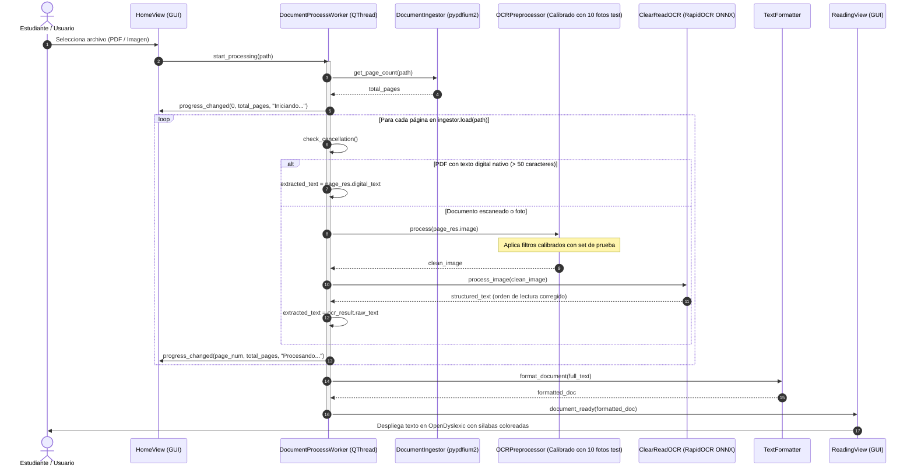
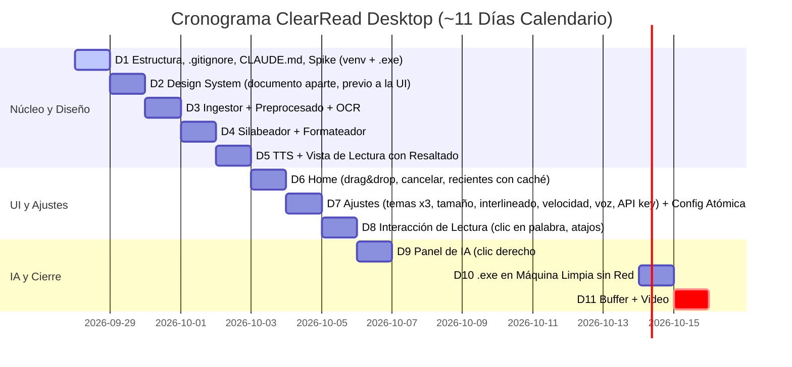

# ClearRead Desktop — Documentación Técnica de Arquitectura, Requisitos y Diseño

> **Versión:** 1.4.0 (Núcleo Offline + Asistente IA Opcional — Entrega Académica / Portafolio)  
> **Fecha de Actualización:** 2026-09-27  
> **Estado:** Aprobado para Implementación con Spikes Técnicos  
> **Contexto:** 1 de 5 proyectos en paralelo | Plazo disponible: ~11 días calendario | Distribución: `.exe` standalone Windows  
> **Idioma UI:** Español | **Idioma de Código y Nombres Técnicos:** Inglés  

---

## 1. Resumen Ejecutivo y Alcance del Sistema

### 1.1 Declaración del Problema Neuroeducativo
Los estudiantes con dislexia o dificultades específicas de decodificación fonológica enfrentan una sobrecarga cognitiva severa al interactuar con materiales de estudio impresos o digitalizados (guías fotocopiadas, exámenes o apuntes). Esta sobrecarga se manifiesta en:
- **Efecto de Hacinamiento Visual (*Visual Crowding*):** Dificultad para aislar grafemas debido a espaciados estrechos y fuentes no adaptadas.
- **Ruptura de Tracking Sacádico:** Pérdida recurrente de la línea activa de lectura en bloques densos o diseños multicolumna no lineales.
- **Déficit de Decodificación Fonológica:** Ausencia de apoyos ortográfico-silábicos que guíen la segmentación de palabras complejas en español.
- **Falta de Refuerzo Bimodal:** Ausencia de sincronización audiovisual estricta que ancle el estímulo fonético con el estímulo grafémico simultáneamente.

### 1.2 Propuesta de Solución: ClearRead Desktop
**ClearRead Desktop** es una aplicación de escritorio local para Windows con **núcleo 100% offline** una vez provisionados sus modelos locales: la ingesta, el OCR, el silabeo, la lectura en voz alta y la interfaz funcionan sin conexión. Sobre ese núcleo se ofrece un **asistente de IA generativa opcional con conexión** (explicación de palabras y simplificación de párrafos vía DeepSeek), que se deshabilita de forma transparente cuando no hay red. El sistema transforma documentos escaneados en una superficie de lectura de alta ergonomía cognitiva con:
1. **OCR con Inteligencia Artificial de Visión:** Núcleo de Deep Learning no negociable para extraer texto legible desde imágenes y PDFs sin intervención de servicios de nube.
2. **Segmentación Silábica Fonética Determinista:** Coloración alternada de sílabas conforme a la normativa ortográfica de la Real Academia Española (RAE).
3. **Lectura Aumentada Bimodal Sincronizada:** Síntesis de voz local vinculada a una regleta visual y resaltado por palabra con tolerancia perceptible mínima, incorporando soporte de pausa y reanudación en la oración activa.
4. **Entorno Visual de Bajo Estrés:** Paletas cromáticas suaves de contraste validado y tipografía OpenDyslexic.

---

## 2. Decisiones Arquitectónicas, Matriz de Tecnologías y Gestión de Riesgos

### 2.1 Justificación del Stack y Viabilidad Operativa
Para un equipo de desarrollo con restricciones severas de tiempo (ver plazo en la cabecera del documento) y múltiples entregas simultáneas, **Python 3.11+ junto a PySide6** constituye la opción de menor costo de desarrollo y mayor integración directa con bibliotecas de IA locales.

> [!IMPORTANT]
> **Honestidad en Estimaciones:** Las cifras de rendimiento (ej. latencia de silabeo $< 0.05\text{ ms}$ por palabra, renderizado a 60 FPS o inferencia de OCR en CPU entre 1.5s y 4s) corresponden a **estimaciones teóricas basadas en benchmarks sintéticos** y deben ser revalidadas empíricamente en el Spike Técnico de la Fase 1.

### 2.2 Stack Tecnológico Oficial y Planes de Contingencia (Plan B)

| Capa / Módulo | Tecnología Principal | Versión | Licencia | Plan B (Contingencia de Riesgo Alto) |
|:---|:---|:---:|:---:|:---|
| **Plataforma Base** | Python | 3.11+ | PSF | Mantener Python 3.11 x64 para compatibilidad binaria con PyInstaller. |
| **Framework GUI** | PySide6 | ≥ 6.7.0 | LGPL v3 | Si PySide6 presenta problemas de tamaño en el bundle, mantener `--onedir` sin compresión UPX. |
| **Renderizado PDF** | **pypdfium2** | ≥ 4.28.0 | Apache 2.0 / BSD-3 | Renderizado C nativo sin Poppler; libre de riesgos copyleft AGPL. |
| **Visión e IA (OCR Principal)** | **RapidOCR (ONNX Runtime)** | ≥ 1.3.0 | Apache 2.0 | **Plan B IA:** Si la precisión de reconocimiento de RapidOCR es insuficiente en tipografías degradadas del set de calibración, ajustar umbrales de detección (`box_thresh`, `unclip_ratio`) o incorporar preprocesamiento de contraste adaptativo en OpenCV. Mantiene 100% el uso de IA de Deep Learning con inferencia local ágil y huella mínima (~16 MB). |
| **Visión Artificial** | opencv-python-headless + Pillow | ≥ 4.8.0 / ≥ 10.0 | Apache / HPND | Calibración empírica con set curado de 10 imágenes reales de smartphones/fotocopias. |
| **Motor TTS** | pyttsx3 + pythoncom (SAPI5) | ≥ 2.98 | MPL 2.0 / PSF | **Plan B Audio:** Si los eventos `started-word` de SAPI5 resultan inestables en ciertas voces de Windows, degradar el resaltado bimodal a nivel de oración completa con temporizador `QTimer` proporcional a las PPM. |
| **Segmentación Fonética** | silabeador | ≥ 1.1.0 | MIT | Algoritmo determinista RAE. Plan B: módulo interno de reglas regex fonológicas. |
| **Tipografía Accesible** | OpenDyslexic | Open Font | SIL OFL | Empaquetada localmente en recursos del proyecto. |
| **Cliente HTTP IA** | httpx | ≥ 0.27.0 | BSD-3 | Solo importable en `services/ai_client.py`; ningún otro módulo del núcleo offline depende de librerías de red. |

> [!NOTE]
> **Alternativa Evaluada y Descartada:** Se evaluó formalmente **PaddleOCR / PPStructure** y se resolvió **descartarlo definitivamente** del proyecto debido al alto riesgo comprobado de empaquetado en Windows mediante PyInstaller (conflictos de DLLs de PaddlePaddle, dependencias de MKL/OneDNN y tamaño de bundle > 1.5 GB). Su sustitución por **RapidOCR sobre ONNX Runtime** erradica el principal punto de falla de despliegue preservando al 100% el núcleo de visión artificial por Deep Learning.

---

## 3. Arquitectura del Sistema y Flujo de Datos

### 3.1 Diagrama de Arquitectura Simplificada
Para minimizar el riesgo de sobreingeniería en un proyecto universitario de 3 semanas, se elimina el bus global `AppState` complejo en favor de **comunicación directa desacoplada por Señales y Slots de Qt** entre vistas y workers:

```mermaid
graph TB
    subgraph UI_Layer["Capa de Presentación (PySide6 - Hilo Principal)"]
        MW["MainWindow"]
        HV["HomeView (Carga & Estado)"]
        RV["ReadingView (Lector Aumentado)"]
        RW["ReaderWidget (QTextEdit + ExtraSelections)"]
        MSG["Diálogos de Error Accesibles (QMessageBox Estilizado)"]
    end

    subgraph Processing_Worker["Capa de Procesamiento Asíncrono (QThread)"]
        ING["DocumentIngestor (pypdfium2)"]
        PRE["OCRPreprocessor (OpenCV Calibrado)"]
        OCR["ClearReadOCR (RapidOCR / ONNX Runtime)"]
        FMT["TextFormatter (HTML Seguro + Token Map)"]
    end

    subgraph Audio_Worker["Capa de Síntesis de Audio (QThread Dedicado + COM STA)"]
        TTS["TTSWorker (SAPI5 Engine)"]
    end

    HV -->|Solicitar Procesamiento| Processing_Worker
    Processing_Worker -->|Error de Archivo / OCR| MSG
    Processing_Worker -->|Documento Formateado| RV
    RV --> RW
    RV -->|speak(script, start_offset)| TTS
    TTS -->|word_spoken(index)| RV
    RV -->|highlight_token()| RW
```

### 3.2 Diagrama de Secuencia y Calibración con Datos Reales



---

## 4. Especificación Técnica de Módulos Críticos

---

### 4.1 Módulo Ingestor (`services/ingestor.py`)
**Propósito:** Cargar y convertir documentos garantizando streaming estricto sin materializar arrays completos en memoria, con soporte de desrotación EXIF, licencia compatible y validación de archivos protegidos por contraseña.

#### Requisitos de Ingeniería
- **ING-F01:** Ingestión de PDFs mediante `pypdfium2` (licencia permisiva Apache 2.0 / BSD-3).
- **ING-F02:** Normalización de orientación EXIF automática en imágenes JPG/PNG provenientes de dispositivos móviles.
- **ING-F03:** Detección de texto digital nativo previo al renderizado: si la página contiene texto extraíble íntegro, debe marcarse para omitir el OCR.
- **ING-F04:** Detección y manejo de PDFs protegidos por contraseña (`pypdfium2.PdfPasswordError`), notificando con claridad a la interfaz.
- **ING-NF01 (Memoria):** Meta de diseño estimada a validar empíricamente: consumo de memoria residente proyectado en $\le 450\text{ MB}$ procesando un PDF estándar de 100 páginas (uso estricto de generadores con cierre asegurado mediante `try...finally`).

#### Contrato de Interfaz y Código

```python
"""Document ingestion service using pypdfium2 and Pillow."""

from dataclasses import dataclass
from enum import Enum
from pathlib import Path
from typing import Generator
import numpy as np
import pypdfium2 as pdfium
from PIL import Image, ImageOps


class DocumentType(Enum):
    PDF = "pdf"
    IMAGE = "image"


@dataclass
class PageResult:
    page_number: int
    total_pages: int
    image: np.ndarray          # Array RGB (H, W, 3) optimizado
    digital_text: str | None   # Texto nativo si existe, sino None
    source_type: DocumentType


class DocumentIngestor:
    SUPPORTED_IMAGE_EXT = {".jpg", ".jpeg", ".png", ".bmp", ".tiff", ".tif"}
    SUPPORTED_PDF_EXT = {".pdf"}
    DEFAULT_DPI = 300
    DIGITAL_TEXT_THRESHOLD = 50

    def __init__(self, dpi: int = DEFAULT_DPI) -> None:
        self._dpi = dpi

    def get_page_count(self, file_path: str | Path) -> int:
        path = Path(file_path)
        if not path.exists():
            raise FileNotFoundError(f"Documento no encontrado: {path}")
        if path.suffix.lower() in self.SUPPORTED_PDF_EXT:
            try:
                doc = pdfium.PdfDocument(str(path))
                count = len(doc)
                doc.close()
                return count
            except pdfium.PdfPasswordError:
                raise PermissionError("El archivo PDF está protegido con contraseña.")
        elif path.suffix.lower() in self.SUPPORTED_IMAGE_EXT:
            return 1
        raise ValueError(f"Formato de archivo no soportado: {path.suffix}")

    def load(self, file_path: str | Path) -> Generator[PageResult, None, None]:
        path = Path(file_path)
        if path.suffix.lower() in self.SUPPORTED_PDF_EXT:
            yield from self._load_pdf_streaming(path)
        elif path.suffix.lower() in self.SUPPORTED_IMAGE_EXT:
            yield self._load_single_image(path)
        else:
            raise ValueError(f"Formato no soportado: {path.suffix}")

    def _load_pdf_streaming(self, path: Path) -> Generator[PageResult, None, None]:
        try:
            doc = pdfium.PdfDocument(str(path))
        except pdfium.PdfPasswordError:
            raise PermissionError("El archivo PDF está protegido con contraseña.")

        try:
            total_pages = len(doc)
            scale = self._dpi / 72.0
            for page_idx in range(total_pages):
                page = doc[page_idx]
                textpage = page.get_textpage()
                extracted_text = textpage.get_text_range().strip()
                has_digital = len(extracted_text) >= self.DIGITAL_TEXT_THRESHOLD

                # Renderizado directo a bitmap a través de PDFium C-engine
                bitmap = page.render(scale=scale)
                pil_image = bitmap.to_pil()
                img_rgb = np.array(pil_image.convert("RGB"))

                yield PageResult(
                    page_number=page_idx + 1,
                    total_pages=total_pages,
                    image=img_rgb,
                    digital_text=extracted_text if has_digital else None,
                    source_type=DocumentType.PDF,
                )
                del img_rgb
                del pil_image
                del bitmap
        finally:
            doc.close()

    def _load_single_image(self, path: Path) -> PageResult:
        with Image.open(path) as img:
            img = ImageOps.exif_transpose(img)
            if img.mode in ("RGBA", "LA", "P"):
                rgb_img = Image.new("RGB", img.size, (255, 255, 255))
                rgb_img.paste(img, mask=img.split()[-1] if "A" in img.mode else None)
            else:
                rgb_img = img.convert("RGB")
            return PageResult(
                page_number=1,
                total_pages=1,
                image=np.array(rgb_img),
                digital_text=None,
                source_type=DocumentType.IMAGE,
            )
```

---

### 4.2 Módulo de Preprocesamiento (`services/preprocessor.py`)
**Propósito:** Optimizar y estabilizar imágenes de baja calidad (fotocopias o fotos con sombras) previo al reconocimiento de layout y texto.

#### Requisitos de Ingeniería
- **PRE-F01:** Corrección de iluminación por división de fondo (estimación morfológica) para atenuar sombras de flexión de hojas de cuadernos.
- **PRE-F02:** Enderezado geométrico (*deskew*) automático acotado en el rango $[-45^\circ, 45^\circ]$ con umbral de activación mínima en $| \theta | \ge 0.5^\circ$.
- **PRE-NF01:** Consumo de CPU $\le 800\text{ ms}$ por página A4 mediante el uso exclusivo de primitivas vectorizadas de `opencv-python-headless`.

```python
"""Image preprocessing pipeline using OpenCV headless."""

import cv2
import numpy as np


class OCRPreprocessor:
    """Prepares raw images for optimal OCR and layout detection."""

    @staticmethod
    def process(image_rgb: np.ndarray, is_camera_photo: bool = True) -> np.ndarray:
        if len(image_rgb.shape) == 3:
            gray = cv2.cvtColor(image_rgb, cv2.COLOR_RGB2GRAY)
        else:
            gray = image_rgb.copy()

        if is_camera_photo:
            # Eliminación de sombras morfológica
            kernel = cv2.getStructuringElement(cv2.MORPH_RECT, (25, 25))
            background = cv2.morphologyEx(gray, cv2.MORPH_DILATE, kernel)
            diff = cv2.absdiff(gray, background)
            gray = cv2.normalize(255 - diff, None, alpha=0, beta=255, norm_type=cv2.NORM_MINMAX)

        # Denoise bilateral liviano (preserva bordes de caracteres finos)
        denoised = cv2.medianBlur(gray, 3)

        # Deskew por análisis de contornos
        deskewed = OCRPreprocessor._deskew(denoised)

        # Realce de contraste adaptativo local (CLAHE)
        clahe = cv2.createCLAHE(clipLimit=2.0, tileGridSize=(8, 8))
        enhanced = clahe.apply(deskewed)

        return enhanced

    @staticmethod
    def _deskew(image_gray: np.ndarray) -> np.ndarray:
        thresh = cv2.threshold(image_gray, 0, 255, cv2.THRESH_BINARY_INV + cv2.THRESH_OTSU)[1]
        kernel = cv2.getStructuringElement(cv2.MORPH_RECT, (30, 3))
        dilated = cv2.dilate(thresh, kernel, iterations=2)
        contours, _ = cv2.findContours(dilated, cv2.RETR_LIST, cv2.CHAIN_APPROX_SIMPLE)

        angles = []
        for c in contours:
            if cv2.contourArea(c) < 120:
                continue
            rect = cv2.minAreaRect(c)
            angle = rect[-1]
            if angle < -45:
                angle = -(90 + angle)
            elif angle > 45:
                angle = 90 - angle
            else:
                angle = -angle
            if abs(angle) <= 45.0:
                angles.append(angle)

        if not angles:
            return image_gray

        median_angle = float(np.median(angles))
        if abs(median_angle) < 0.5:
            return image_gray

        h, w = image_gray.shape[:2]
        rot_matrix = cv2.getRotationMatrix2D((w // 2, h // 2), median_angle, 1.0)
        return cv2.warpAffine(
            image_gray, rot_matrix, (w, h),
            flags=cv2.INTER_CUBIC,
            borderMode=cv2.BORDER_CONSTANT,
            borderValue=255
        )
```

---

### 4.3 Módulo OCR y Reconocimiento de Visión (`services/ocr_engine.py`)
**Propósito:** Extracción estructurada del texto utilizando modelos de Deep Learning ejecutados sobre **ONNX Runtime** (100% offline y altamente portable en Windows), con ordenación espacial de líneas/párrafos y des-hifenización en español.

#### Requisitos de Ingeniería
- **OCR-F01:** Inferencia de OCR mediante modelos Deep Learning ONNX (`RapidOCR`), 100% offline y local.
- **OCR-F02:** Des-hifenización en español para fusionar palabras partidas al final de línea (`cons-` + `trucción` $\rightarrow$ `construcción`).
- **OCR-F03:** Filtrado de detecciones espurias y reconstrucción topológica de líneas y párrafos respetando el orden natural de lectura.
- **OCR-NF01:** Tiempo de inferencia acotado ($\le 2.5\text{ s}$ por página en CPU de 4 núcleos), sin dependencias de compiladores externos. *(Estimación a medir; ver protocolo en §5.2. Se retiró la meta separada de memoria $\le 250\text{ MB}$ del OCR: queda cubierta por la meta general NFR-MEM01 de §5.2, evitando duplicar el mismo consumo bajo dos metas distintas.)*

```python
"""OCR and layout analysis engine using RapidOCR (ONNX Runtime)."""

import os
import re
import time
from dataclasses import dataclass
import numpy as np
from rapidocr_onnxruntime import RapidOCR


@dataclass
class OCRResult:
    page_number: int
    raw_text: str = ""
    processing_time_ms: float = 0.0


class ClearReadOCR:
    """Offline Deep Learning OCR engine powered by ONNX Runtime."""

    def __init__(self, model_dir: str | None = None) -> None:
        params = {}
        if model_dir and os.path.exists(model_dir):
            det_path = os.path.join(model_dir, "ch_PP-OCRv4_det_infer.onnx")
            rec_path = os.path.join(model_dir, "ch_PP-OCRv4_rec_infer.onnx")
            cls_path = os.path.join(model_dir, "ch_ppocr_mobile_v2.0_cls_infer.onnx")
            if os.path.exists(det_path):
                params["det_model_path"] = det_path
            if os.path.exists(rec_path):
                params["rec_model_path"] = rec_path
            if os.path.exists(cls_path):
                params["cls_model_path"] = cls_path

        # Inicialización del motor ONNX Runtime (rápido, liviano y sin fricción de empaquetado)
        self._engine = RapidOCR(**params)

    def process_image(self, image_gray_or_rgb: np.ndarray) -> OCRResult:
        t_start = time.perf_counter()

        if len(image_gray_or_rgb.shape) == 2:
            import cv2
            img_input = cv2.cvtColor(image_gray_or_rgb, cv2.COLOR_GRAY2BGR)
        else:
            img_input = image_gray_or_rgb

        ocr_results, _ = self._engine(img_input)

        if not ocr_results:
            return OCRResult(page_number=1, raw_text="", processing_time_ms=0.0)

        # Ordenamiento topológico: filtrar por umbral de confianza y extraer cajas
        valid_boxes = []
        for box, text, score in ocr_results:
            text_clean = text.strip()
            if score >= 0.45 and text_clean:
                # box tiene 4 vértices [[x0,y0], [x1,y1], [x2,y2], [x3,y3]]
                y_top = min(pt[1] for pt in box)
                x_left = min(pt[0] for pt in box)
                height = max(pt[1] for pt in box) - y_top
                valid_boxes.append({
                    "box": box,
                    "text": text_clean,
                    "y": y_top,
                    "x": x_left,
                    "h": max(height, 10),
                    "score": score
                })

        if not valid_boxes:
            return OCRResult(page_number=1, raw_text="", processing_time_ms=0.0)

        # Agrupación topológica en líneas y párrafos respetando la jerarquía visual
        paragraphs = self._reconstruct_paragraphs(valid_boxes)
        elapsed_ms = (time.perf_counter() - t_start) * 1000.0

        return OCRResult(page_number=1, raw_text="\n\n".join(paragraphs), processing_time_ms=elapsed_ms)

    def _reconstruct_paragraphs(self, boxes: list[dict]) -> list[str]:
        # Altura promedio de línea para fijar la tolerancia vertical de agrupamiento
        avg_h = sum(b["h"] for b in boxes) / len(boxes)
        line_tolerance = max(avg_h * 0.6, 8.0)

        # Orden vertical inicial
        sorted_boxes = sorted(boxes, key=lambda b: (b["y"], b["x"]))

        # Agrupar en líneas horizontales
        lines: list[list[dict]] = []
        for b in sorted_boxes:
            placed = False
            for line in lines:
                ref_y = sum(item["y"] for item in line) / len(line)
                if abs(b["y"] - ref_y) <= line_tolerance:
                    line.append(b)
                    placed = True
                    break
            if not placed:
                lines.append([b])

        # Ordenar horizontalmente (izquierda a derecha) dentro de cada línea
        formatted_lines: list[tuple[float, str]] = []
        for line in lines:
            line.sort(key=lambda item: item["x"])
            avg_y = sum(item["y"] for item in line) / len(line)
            line_text = " ".join(item["text"] for item in line)
            formatted_lines.append((avg_y, line_text))

        # Ordenar líneas de arriba hacia abajo
        formatted_lines.sort(key=lambda t: t[0])

        # Unir en párrafos detectando saltos interlineales amplios
        paragraphs: list[str] = []
        current_para_lines: list[str] = []
        prev_y = None

        for y, text in formatted_lines:
            if prev_y is not None and (y - prev_y) > (avg_h * 2.2):
                if current_para_lines:
                    merged = self.dehyphenate(" ".join(current_para_lines))
                    paragraphs.append(merged)
                    current_para_lines = []
            current_para_lines.append(text)
            prev_y = y

        if current_para_lines:
            merged = self.dehyphenate(" ".join(current_para_lines))
            paragraphs.append(merged)

        return paragraphs

    @staticmethod
    def dehyphenate(text: str) -> str:
        """Remueve guiones de separación silábica tipográfica de fin de línea."""
        return re.sub(r'(\b\w+)-\s+(\w+\b)', r'\1\2', text)
```

---

### 4.4 Sincronización Bimodal: Token Position Map y Formateador (`services/text_formatter.py`)
**Solución al Problema Crítico #1:** Se erradica la dependencia de índices de caracteres brutos entre SAPI5 y `QTextEdit`. Se establece una **tabla de correspondencia de tokens (*Token Map*)** generada durante el formateo. Cada token sabe exactamente cuál es su orden ordinal, su forma fonética normalizada para el motor TTS y sus coordenadas exactas de cursor `(start_char, end_char)` dentro del documento de Qt.

> [!WARNING]
> **Pendiente de Contraste (NFR-A11Y01):** Los colores de sílabas usados en el código de referencia (`#1565C0` ≈ 5.7:1 y `#D84315` ≈ 4.4:1 sobre blanco) **no cumplen** el objetivo WCAG AAA de 7.0:1 declarado en §5.2. Se marcan como **pendientes** hasta que el documento de design system defina la paleta final validada; no se fijan colores nuevos en esta especificación.

`TextFormatter` **no fija colores propios**: recibe la paleta de sílabas del tema activo por inyección de dependencia (ver `SyllablePalette` abajo), definida y validada en el design system. Al cambiar de tema, la app regenera el `html_content` con la nueva paleta; el `TokenPositionMap` **no se recalcula**, porque el color no altera las posiciones `(doc_start_pos, doc_end_pos)` de cada `WordToken`.

```python
"""Linguistic text formatter and Token Position Map for bimodal reading."""

import html
import re
from dataclasses import dataclass
from clearread.services.syllabifier import SpanishSyllabifier


@dataclass(frozen=True)
class WordToken:
    word_index: int
    spoken_text: str          # Texto limpio entregado a la síntesis de voz
    doc_start_pos: int        # Índice exacto de inicio de carácter en el QTextDocument
    doc_end_pos: int          # Índice exacto de fin de carácter en el QTextDocument


@dataclass(frozen=True)
class SyllablePalette:
    """Injected by the active theme; colors and contrast ratios are owned by
    the design system, not hardcoded here."""
    color_even: str
    color_odd: str


class FormattedDocument:
    def __init__(self, html_content: str, token_map: list[WordToken], tts_script: str) -> None:
        self.html_content = html_content
        self.token_map = token_map
        self.tts_script = tts_script


class TextFormatter:
    """Segments Spanish text into colored syllables and creates the TTS alignment index."""

    def __init__(self, syllabifier: SpanishSyllabifier, palette: SyllablePalette) -> None:
        self.syllabifier = syllabifier
        self.color_even = palette.color_even
        self.color_odd = palette.color_odd

    def format_document(self, raw_text: str, enable_syllables: bool = True) -> FormattedDocument:
        paragraphs = raw_text.split("\n\n")
        html_paragraphs: list[str] = []
        token_map: list[WordToken] = []
        spoken_words: list[str] = []

        current_doc_pos = 0
        word_counter = 0

        for p_idx, para in enumerate(paragraphs):
            para_clean = para.strip()
            if not para_clean:
                continue

            tokens = re.split(r'(\s+)', para_clean)
            p_html: list[str] = []

            for token in tokens:
                if not token:
                    continue

                if token.isspace():
                    p_html.append(token)
                    current_doc_pos += len(token)
                    continue

                # Separar signos de puntuación iniciales y finales de la palabra núcleo
                match = re.match(r'^([^\w]*)([\w\'-]+)([^\w]*)$', token, re.UNICODE)
                if match:
                    prefix, word_core, suffix = match.groups()
                    if prefix:
                        p_html.append(html.escape(prefix))
                        current_doc_pos += len(prefix)

                    start_idx = current_doc_pos
                    end_idx = start_idx + len(word_core)

                    # Registrar mapeo de palabra exacto en el espacio del documento Qt
                    token_map.append(WordToken(
                        word_index=word_counter,
                        spoken_text=word_core,
                        doc_start_pos=start_idx,
                        doc_end_pos=end_idx
                    ))
                    spoken_words.append(word_core)
                    word_counter += 1

                    # Generar HTML coloreado por sílabas con escape de seguridad
                    if enable_syllables and len(word_core) > 2:
                        sylls = self.syllabifier.syllabify_word(word_core).syllables
                        word_spans = []
                        for s_idx, s in enumerate(sylls):
                            color = self.color_even if (s_idx % 2 == 0) else self.color_odd
                            safe_s = html.escape(s)
                            word_spans.append(f'<span style="color: {color};">{safe_s}</span>')
                        p_html.append("".join(word_spans))
                    else:
                        safe_word = html.escape(word_core)
                        p_html.append(f'<span style="color: {self.color_even};">{safe_word}</span>')

                    current_doc_pos += len(word_core)

                    if suffix:
                        p_html.append(html.escape(suffix))
                        current_doc_pos += len(suffix)
                else:
                    # Token no alfanumérico (ej. símbolos matemáticos, llaves) con escape HTML
                    p_html.append(html.escape(token))
                    current_doc_pos += len(token)

            html_paragraphs.append(f'<p style="margin-bottom: 14px;">{"".join(p_html)}</p>')
            # El salto de bloque en QTextDocument añade 1 carácter separator (0x2029)
            current_doc_pos += 1

        full_html = (
            f'<div style="font-family: \'OpenDyslexic\'; font-size: 16pt; '
            f'line-height: 1.8; letter-spacing: 1.5px; word-spacing: 4px;">'
            f'{"".join(html_paragraphs)}</div>'
        )
        tts_script = " ".join(spoken_words)

        return FormattedDocument(full_html, token_map, tts_script)
```

---

### 4.5 Módulo de Síntesis de Voz Robusto (`services/tts_controller.py`)
**Solución al Problema Crítico #2:** Eliminación de `threading.Thread(daemon=True)` arbitrario. El motor SAPI5 se aísla en un **`QThread` dedicado permanente** que inicializa su propio apartamento COM STA (`pythoncom.CoInitialize()`). Las comunicaciones entre la interfaz y el motor se canalizan exclusivamente a través de colas de eventos y señales asíncronas con `Qt.ConnectionType.QueuedConnection`.

```python
"""Thread-safe SAPI5 TTS Controller with isolated STA COM lifecycle."""

import pyttsx3
import pythoncom
from PySide6.QtCore import QObject, QThread, Signal, Slot


class SAPI5Worker(QObject):
    """Worker object living strictly inside a dedicated QThread."""

    word_started = Signal(int)  # Emite el índice ordinal global de la palabra (0, 1, 2...)
    speech_finished = Signal()
    error_occurred = Signal(str)

    def __init__(self) -> None:
        super().__init__()
        self._engine = None
        self._is_speaking = False
        self._base_word_offset = 0
        self._words_in_current_utterance = 0

    @Slot()
    def initialize(self) -> None:
        """Executed inside the target QThread context."""
        try:
            pythoncom.CoInitialize()
            self._engine = pyttsx3.init("sapi5")
            self._configure_voice()
            self._engine.connect("started-word", self._on_word_boundary)
        except Exception as e:
            self.error_occurred.emit(f"Fallo inicializando SAPI5: {e}")

    def _configure_voice(self) -> None:
        voices = self._engine.getProperty("voices")
        for v in voices:
            name = v.name.lower()
            if any(k in name for k in ["spanish", "español", "helena", "sabina", "es-es", "es-mx"]):
                self._engine.setProperty("voice", v.id)
                break
        self._engine.setProperty("rate", 150)
        self._engine.setProperty("volume", 1.0)

    @Slot(str, int)
    def speak(self, text: str, start_offset: int = 0) -> None:
        if not self._engine:
            return
        if self._is_speaking:
            self.stop()

        self._is_speaking = True
        self._base_word_offset = start_offset
        self._words_in_current_utterance = 0
        try:
            self._engine.say(text, name="doc_playback")
            self._engine.runAndWait()
        except Exception as err:
            self.error_occurred.emit(f"Error durante la reproducción: {err}")
        finally:
            self._is_speaking = False
            self.speech_finished.emit()

    @Slot()
    def stop(self) -> None:
        if self._engine and self._is_speaking:
            self._engine.stop()
            self._is_speaking = False

    @Slot(int)
    def set_rate(self, wpm: int) -> None:
        if self._engine:
            self._engine.setProperty("rate", max(80, min(320, wpm)))

    def _on_word_boundary(self, _name: str, _location: int, _length: int) -> None:
        # Emite el índice ordinal global (compensando si se reanudó desde la mitad)
        global_word_index = self._base_word_offset + self._words_in_current_utterance
        self.word_started.emit(global_word_index)
        self._words_in_current_utterance += 1

    @Slot()
    def cleanup(self) -> None:
        if self._engine:
            self.stop()
        pythoncom.CoUninitialize()


class TTSController(QObject):
    """Public interface for thread-safe audio synthesis management."""

    sig_speak = Signal(str, int)
    sig_stop = Signal()
    sig_set_rate = Signal(int)

    word_spoken = Signal(int)       # Índice global de palabra hacia la UI
    playback_ended = Signal()

    def __init__(self) -> None:
        super().__init__()
        self._thread = QThread()
        self._worker = SAPI5Worker()
        self._worker.moveToThread(self._thread)

        # Conexiones de ciclo de vida
        self._thread.started.connect(self._worker.initialize)
        self._thread.finished.connect(self._worker.cleanup)

        # Conexiones de control
        self.sig_speak.connect(self._worker.speak)
        self.sig_stop.connect(self._worker.stop)
        self.sig_set_rate.connect(self._worker.set_rate)

        # Retransmisión de señales a la GUI
        self._worker.word_started.connect(self.word_spoken)
        self._worker.speech_finished.connect(self.playback_ended)

        self._thread.start()

    def speak_text(self, text: str, start_offset: int = 0) -> None:
        self.sig_speak.emit(text, start_offset)

    def stop(self) -> None:
        self.sig_stop.emit()

    def set_speed(self, wpm: int) -> None:
        self.sig_set_rate.emit(wpm)

    def shutdown(self) -> None:
        self.stop()
        self._thread.quit()
        self._thread.wait(2000)
```

---

### 4.6 Módulo de Persistencia Robusta (`core/config.py`)
**Solución al Problema #7:** Escritura atómica a disco para blindar las configuraciones ante cortes súbitos o terminaciones forzadas.

```python
"""Atomic configuration manager with crash-resilience."""

import json
import os
import tempfile
from dataclasses import dataclass, asdict
from pathlib import Path
from clearread.core.paths import get_user_data_dir


@dataclass
class AppConfig:
    theme: str = "Sepia"
    font_size_pt: int = 16
    syllables_enabled: bool = True
    reading_speed_wpm: int = 150
    voice_volume: float = 1.0

    @classmethod
    def load(cls) -> "AppConfig":
        config_path = get_user_data_dir() / "config.json"
        if not config_path.exists():
            return cls()
        try:
            with open(config_path, "r", encoding="utf-8") as f:
                data = json.load(f)
            return cls(**{k: v for k, v in data.items() if k in cls.__dataclass_fields__})
        except Exception:
            return cls()

    def save(self) -> None:
        target_path = get_user_data_dir() / "config.json"
        target_path.parent.mkdir(parents=True, exist_ok=True)

        # Patrón Atomic Write: escribir a temporal y renombrar atómicamente a nivel de SO
        temp_fd, temp_file = tempfile.mkstemp(
            dir=str(target_path.parent),
            prefix="cfg_",
            suffix=".tmp"
        )
        try:
            with os.fdopen(temp_fd, "w", encoding="utf-8") as f:
                json.dump(asdict(self), f, indent=2, ensure_ascii=False)
            os.replace(temp_file, str(target_path))
        except Exception:
            if os.path.exists(temp_file):
                os.remove(temp_file)
            raise
```

---

### 4.7 Módulo Worker y Orquestador de Procesamiento (`workers/ocr_worker.py`)
**Solución a Problemas Críticos #3, #4 y #6:** Inyección de dependencias, bypass de OCR ante texto digital preexistente y streaming estricto página a página.

```python
"""Orchestrator worker for streaming document ingestion and OCR."""

from PySide6.QtCore import QThread, Signal
from clearread.services.ingestor import DocumentIngestor
from clearread.services.preprocessor import OCRPreprocessor
from clearread.services.ocr_engine import ClearReadOCR
from clearread.services.text_formatter import TextFormatter, FormattedDocument


class DocumentProcessWorker(QThread):
    progress_changed = Signal(int, int, str)
    document_ready = Signal(FormattedDocument)
    error_occurred = Signal(str)

    def __init__(
        self,
        file_path: str,
        ingestor: DocumentIngestor,
        preprocessor: OCRPreprocessor,
        ocr_engine: ClearReadOCR,
        formatter: TextFormatter
    ) -> None:
        super().__init__()
        self.file_path = file_path
        self.ingestor = ingestor
        self.preprocessor = preprocessor
        self.ocr_engine = ocr_engine
        self.formatter = formatter
        self._is_cancelled = False

    def cancel(self) -> None:
        self._is_cancelled = True

    def run(self) -> None:
        try:
            total_pages = self.ingestor.get_page_count(self.file_path)
            collected_paragraphs: list[str] = []

            # Streaming página por página: la memoria no acumula arrays en bucle
            for page_res in self.ingestor.load(self.file_path):
                if self._is_cancelled:
                    return

                page_num = page_res.page_number
                self.progress_changed.emit(
                    page_num, total_pages,
                    f"Analizando página {page_num} de {total_pages}..."
                )

                # BYPASS DE OCR: Si el documento ya cuenta con texto nativo de alta calidad
                if page_res.digital_text and len(page_res.digital_text.strip()) > 50:
                    collected_paragraphs.append(page_res.digital_text.strip())
                else:
                    # Inferencia de imagen
                    clean_image = self.preprocessor.process(page_res.image)
                    ocr_res = self.ocr_engine.process_image(clean_image)
                    if ocr_res.raw_text.strip():
                        collected_paragraphs.append(ocr_res.raw_text.strip())

            if self._is_cancelled:
                return

            self.progress_changed.emit(total_pages, total_pages, "Generando estructura fonética y regleta...")
            merged_text = "\n\n".join(collected_paragraphs)
            formatted_doc = self.formatter.format_document(merged_text)

            self.document_ready.emit(formatted_doc)

        except (FileNotFoundError, ValueError) as client_err:
            self.error_occurred.emit(f"Error de documento: {client_err}")
        except Exception as unhandled:
            self.error_occurred.emit(f"Fallo inesperado durante el procesamiento: {unhandled}")
```

---

### 4.8 Módulo de Interfaz Gráfica (`ui/views/reading_view.py`)
**Implementación del resaltado bimodal por mapa de tokens:**

```python
"""Reading view using token map addressing to prevent cursor drifting."""

from PySide6.QtWidgets import QWidget, QVBoxLayout, QHBoxLayout, QTextEdit, QPushButton, QSlider, QLabel, QFrame
from PySide6.QtGui import QTextCharFormat, QTextFormat, QTextCursor, QColor
from PySide6.QtCore import Qt, Slot
from clearread.services.text_formatter import FormattedDocument, WordToken
from clearread.services.tts_controller import TTSController


class ReaderWidget(QTextEdit):
    def __init__(self) -> None:
        super().__init__()
        self.setReadOnly(True)
        self.setFrameShape(QFrame.Shape.NoFrame)
        self.setHorizontalScrollBarPolicy(Qt.ScrollBarPolicy.ScrollBarAlwaysOff)

        # Resaltado de palabra ámbar suave
        self.word_fmt = QTextCharFormat()
        self.word_fmt.setBackground(QColor("#FFE082"))
        self.word_fmt.setForeground(QColor("#1A1A1A"))
        self.word_fmt.setFontWeight(700)

        # Regleta de lectura de línea completa
        self.ruler_fmt = QTextCharFormat()
        self.ruler_fmt.setBackground(QColor(240, 230, 214, 160))
        self.ruler_fmt.setProperty(QTextFormat.Property.FullWidthSelection, True)

    def highlight_token(self, token: WordToken) -> None:
        word_cursor = self.textCursor()
        word_cursor.setPosition(token.doc_start_pos)
        word_cursor.setPosition(token.doc_end_pos, QTextCursor.MoveMode.KeepAnchor)

        word_sel = QTextEdit.ExtraSelection()
        word_sel.cursor = word_cursor
        word_sel.format = self.word_fmt

        ruler_cursor = self.textCursor()
        ruler_cursor.setPosition(token.doc_start_pos)
        ruler_sel = QTextEdit.ExtraSelection()
        ruler_sel.cursor = ruler_cursor
        ruler_sel.format = self.ruler_fmt

        self.setExtraSelections([ruler_sel, word_sel])
        self.setTextCursor(word_cursor)
        self.ensureCursorVisible()

    def clear_highlights(self) -> None:
        self.setExtraSelections([])


class ReadingView(QWidget):
    def __init__(self, tts_controller: TTSController) -> None:
        super().__init__()
        self.tts = tts_controller
        self.token_map: list[WordToken] = []
        self.tts_script: str = ""
        self.current_word_idx: int = 0
        self.is_paused: bool = False
        self._init_ui()
        self._connect_signals()

    def _init_ui(self) -> None:
        main_layout = QHBoxLayout(self)
        main_layout.setContentsMargins(0, 0, 0, 0)
        main_layout.addStretch(1)

        self.reading_frame = QFrame()
        self.reading_frame.setMaximumWidth(820)
        self.reading_frame.setMinimumWidth(550)

        col_layout = QVBoxLayout(self.reading_frame)
        col_layout.setContentsMargins(25, 20, 25, 20)

        self.editor = ReaderWidget()
        col_layout.addWidget(self.editor)

        controls = QFrame()
        c_layout = QHBoxLayout(controls)
        self.btn_play = QPushButton("▶ Reproducir")
        self.btn_stop = QPushButton("⏹ Detener")
        self.lbl_speed = QLabel("Velocidad: 150 PPM")
        self.slider_speed = QSlider(Qt.Orientation.Horizontal)
        self.slider_speed.setRange(100, 280)
        self.slider_speed.setValue(150)

        c_layout.addWidget(self.btn_play)
        c_layout.addWidget(self.btn_stop)
        c_layout.addSpacing(15)
        c_layout.addWidget(self.lbl_speed)
        c_layout.addWidget(self.slider_speed)

        col_layout.addWidget(controls)
        main_layout.addWidget(self.reading_frame, stretch=3)
        main_layout.addStretch(1)

    def _connect_signals(self) -> None:
        self.btn_play.clicked.connect(self.toggle_play)
        self.btn_stop.clicked.connect(self.stop_reading)
        self.slider_speed.valueChanged.connect(self._on_speed_change)

        self.tts.word_spoken.connect(self._on_word_spoken)
        self.tts.playback_ended.connect(self._on_playback_ended)

    @Slot(FormattedDocument)
    def load_document(self, doc: FormattedDocument) -> None:
        self.token_map = doc.token_map
        self.tts_script = doc.tts_script
        self.current_word_idx = 0
        self.is_paused = False
        self.editor.setHtml(doc.html_content)

    def toggle_play(self) -> None:
        if self.btn_play.text() == "⏸ Pausar":
            # Pausar: detener reproducción activa sin resetear el índice de palabra
            self.tts.stop()
            self.is_paused = True
            self.btn_play.setText("▶ Reanudar")
        else:
            if not self.token_map:
                return

            self.btn_play.setText("⏸ Pausar")
            if self.is_paused and self.current_word_idx < len(self.token_map):
                # Reanudación precisa desde la palabra actual
                remaining_tokens = self.token_map[self.current_word_idx:]
                remaining_script = " ".join([t.spoken_text for t in remaining_tokens])
                self.tts.speak_text(remaining_script, start_offset=self.current_word_idx)
            else:
                # Inicio desde el comienzo
                self.current_word_idx = 0
                self.tts.speak_text(self.tts_script, start_offset=0)
            self.is_paused = False

    def stop_reading(self) -> None:
        self.tts.stop()
        self.is_paused = False
        self.current_word_idx = 0
        self.editor.clear_highlights()
        self.btn_play.setText("▶ Reproducir")

    def _on_speed_change(self, value: int) -> None:
        self.lbl_speed.setText(f"Velocidad: {value} PPM")
        self.tts.set_speed(value)

    @Slot(int)
    def _on_word_spoken(self, word_index: int) -> None:
        self.current_word_idx = word_index
        if 0 <= word_index < len(self.token_map):
            token = self.token_map[word_index]
            self.editor.highlight_token(token)

    @Slot()
    def _on_playback_ended(self) -> None:
        if not self.is_paused:
            self.btn_play.setText("▶ Reproducir")
            self.editor.clear_highlights()
            self.current_word_idx = 0
```

---

### 4.9 Módulo de Vista Principal y Manejo de Errores Accesibles (`ui/views/home_view.py` y `ui/dialogs.py`)
**Propósito:** Ingestión intuitiva mediante *drag-and-drop* y diálogo de archivos, barra de progreso con etapas comprensibles y diálogos de error de **baja carga cognitiva**: sin cuadros de diálogo estándar de Windows con texto técnico incomprensible ni stack traces, sino mensajes en español con tipografía clara y recomendaciones de acción inmediata.

```python
"""Home view with drag-and-drop ingestion, progress feedback, and accessible dialogs."""

from pathlib import Path
from PySide6.QtWidgets import (
    QWidget, QVBoxLayout, QPushButton, QLabel, QFileDialog,
    QProgressBar, QMessageBox, QFrame
)
from PySide6.QtCore import Qt, Signal, Slot
from clearread.services.text_formatter import FormattedDocument


class AccessibleErrorDialog:
    """Accessible, low-cognitive-load error modal dialog."""

    @staticmethod
    def show_error(parent: QWidget, title: str, user_message: str, suggestion: str) -> None:
        msg_box = QMessageBox(parent)
        msg_box.setWindowTitle(title)
        msg_box.setIcon(QMessageBox.Icon.Warning)

        # Diseño accesible: alto contraste, fuente grande y lenguaje empático sin tecnicismos
        styled_text = (
            f"<div style='font-family: Arial, sans-serif; font-size: 13pt; color: #1A1A1A; line-height: 1.5;'>"
            f"<p style='margin-bottom: 8px;'><b>{user_message}</b></p>"
            f"<p style='color: #424242; font-size: 11.5pt;'>💡 <b>Qué puedes hacer:</b> {suggestion}</p>"
            f"</div>"
        )
        msg_box.setText(styled_text)
        btn_ok = msg_box.addButton("Entendido", QMessageBox.ButtonRole.AcceptRole)
        btn_ok.setStyleSheet(
            "QPushButton { font-size: 12pt; font-weight: bold; background-color: #1565C0; "
            "color: white; border-radius: 6px; padding: 8px 20px; min-width: 110px; }"
            "QPushButton:hover { background-color: #0D47A1; }"
        )
        msg_box.exec()


class HomeView(QWidget):
    """Initial landing view with drag-and-drop ingestion and progress feedback."""

    request_open_document = Signal(str)

    def __init__(self) -> None:
        super().__init__()
        self.setAcceptDrops(True)
        self._init_ui()

    def _init_ui(self) -> None:
        layout = QVBoxLayout(self)
        layout.setAlignment(Qt.AlignmentFlag.AlignCenter)

        # Contenedor con borde discontinuo amigable
        self.drop_frame = QFrame()
        self.drop_frame.setFixedSize(540, 340)
        self.drop_frame.setStyleSheet(
            "QFrame { border: 3px dashed #1976D2; border-radius: 16px; background-color: #F8F9FA; }"
            "QFrame:hover { background-color: #E3F2FD; border-color: #0D47A1; }"
        )
        frame_layout = QVBoxLayout(self.drop_frame)
        frame_layout.setAlignment(Qt.AlignmentFlag.AlignCenter)

        self.lbl_icon = QLabel("📄")
        self.lbl_icon.setStyleSheet("font-size: 40pt; border: none; background: transparent;")
        self.lbl_icon.setAlignment(Qt.AlignmentFlag.AlignCenter)

        self.lbl_title = QLabel("Arrastra tu documento aquí\n(PDF o foto de libro)")
        self.lbl_title.setAlignment(Qt.AlignmentFlag.AlignCenter)
        self.lbl_title.setStyleSheet("font-size: 15pt; font-weight: bold; color: #1A1A1A; border: none; background: transparent;")

        self.btn_browse = QPushButton("📁 Seleccionar archivo...")
        self.btn_browse.setStyleSheet(
            "QPushButton { font-size: 12pt; font-weight: bold; background-color: #1565C0; "
            "color: white; border-radius: 8px; padding: 10px 24px; border: none; }"
            "QPushButton:hover { background-color: #0D47A1; }"
        )
        self.btn_browse.clicked.connect(self._on_browse_clicked)

        self.progress_bar = QProgressBar()
        self.progress_bar.setVisible(False)
        self.progress_bar.setStyleSheet(
            "QProgressBar { height: 20px; border-radius: 10px; text-align: center; border: 1px solid #CCC; }"
            "QProgressBar::chunk { background-color: #2E7D32; border-radius: 9px; }"
        )

        self.lbl_status = QLabel("")
        self.lbl_status.setAlignment(Qt.AlignmentFlag.AlignCenter)
        self.lbl_status.setStyleSheet("font-size: 11pt; color: #424242; border: none; background: transparent;")
        self.lbl_status.setVisible(False)

        frame_layout.addWidget(self.lbl_icon)
        frame_layout.addWidget(self.lbl_title)
        frame_layout.addSpacing(10)
        frame_layout.addWidget(self.btn_browse)
        frame_layout.addSpacing(15)
        frame_layout.addWidget(self.progress_bar)
        frame_layout.addWidget(self.lbl_status)

        layout.addWidget(self.drop_frame)

    def _on_browse_clicked(self) -> None:
        file_path, _ = QFileDialog.getOpenFileName(
            self, "Seleccionar documento", "",
            "Documentos soportados (*.pdf *.png *.jpg *.jpeg *.bmp *.tiff)"
        )
        if file_path:
            self.request_open_document.emit(file_path)

    def dragEnterEvent(self, event) -> None:
        if event.mimeData().hasUrls():
            event.acceptProposedAction()

    def dropEvent(self, event) -> None:
        urls = event.mimeData().urls()
        if urls:
            file_path = urls[0].toLocalFile()
            ext = Path(file_path).suffix.lower()
            if ext in [".pdf", ".png", ".jpg", ".jpeg", ".bmp", ".tiff", ".tif"]:
                self.request_open_document.emit(file_path)
            else:
                AccessibleErrorDialog.show_error(
                    self, "Formato no compatible",
                    "El archivo que arrastraste no es un documento PDF ni una imagen soportada.",
                    "Por favor selecciona un archivo con formato .pdf, .jpg o .png."
                )

    @Slot(int, int, str)
    def update_progress(self, current: int, total: int, message: str) -> None:
        self.progress_bar.setVisible(True)
        self.lbl_status.setVisible(True)
        self.btn_browse.setEnabled(False)
        self.progress_bar.setMaximum(total)
        self.progress_bar.setValue(current)
        self.lbl_status.setText(message)

    @Slot(str)
    def handle_processing_error(self, error_message: str) -> None:
        self.progress_bar.setVisible(False)
        self.lbl_status.setVisible(False)
        self.btn_browse.setEnabled(True)

        err_lower = error_message.lower()
        if "protegido con contraseña" in err_lower:
            AccessibleErrorDialog.show_error(
                self, "Documento con Contraseña",
                "Este documento PDF está protegido por una contraseña.",
                "Por favor guarda una versión libre de contraseña antes de abrirlo."
            )
        elif "no se detectó texto" in err_lower or "vacío" in err_lower:
            AccessibleErrorDialog.show_error(
                self, "Texto no Reconocido",
                "No logramos identificar palabras legibles en el documento.",
                "Verifica que la foto no esté borrosa y tenga buena iluminación."
            )
        else:
            AccessibleErrorDialog.show_error(
                self, "Aviso de Lectura",
                "No fue posible abrir el archivo seleccionado.",
                "Comprueba que el archivo no esté dañado ni abierto en otro programa."
            )
```

---

### 4.10 Asistente IA (`services/ai_client.py`)
**Propósito:** Ofrecer dos capacidades de asistencia con IA generativa (explicar una palabra en contexto y simplificar un párrafo) como capa **opcional** sobre el núcleo 100% offline (§1.2, NFR-OFF01), con control estricto de costo y sin exponer la API key en el repositorio ni en el binario. Las llamadas de red se ejecutan fuera del hilo de UI (AI-F04) y todo el código de este módulo está en inglés; los textos en español al usuario viven en la capa de UI.

**Proveedor:** DeepSeek, vía su API compatible con el formato OpenAI (*OpenAI-compatible*). El identificador de modelo y el endpoint base **se toman de la documentación oficial de DeepSeek** (https://api-docs.deepseek.com/) y deben verificarse contra esa fuente antes de fijarlos en `AppConfig`; no se inventan en esta especificación. La API key, el `model_id` y el `base_url` se introducen en la pantalla de Ajustes (CFG-F02, §5.1, §6.5 Día 7) y se persisten mediante `AppConfig` (§4.6).

#### Requisitos de Ingeniería
- **AI-F01:** `explain_word(word, context_sentence)` — explica el significado de una palabra usando la oración como contexto.
- **AI-F02:** `simplify_paragraph(text)` — reescribe un párrafo en lenguaje más simple, preservando el sentido.
- **AI-F03:** Degradación elegante sin red: la app detecta conectividad **sin generar tráfico de red** mediante `QNetworkInformation` (Qt ≥ 6.1, backend de *reachability* del sistema operativo). Si `QNetworkInformation` no está disponible en el SO, el botón de IA permanece habilitado y, ante el primer fallo real de la llamada, se informa con un mensaje amable en vez de deshabilitarse preventivamente.
- **AI-F04:** Toda llamada a `AIClient` se ejecuta en un worker (`QThread`/`QRunnable`) dedicado; la UI nunca invoca `httpx` en el hilo principal y solo recibe el resultado (texto u error) a través de señales Qt.
- **NFR-SEC01:** La API key se guarda únicamente en el archivo de configuración del usuario (`%APPDATA%`), nunca en el repositorio ni embebida en el `.exe`; solo se envía a la API el texto explícitamente seleccionado por el usuario, con aviso de privacidad visible antes del primer uso.

#### Control de Costo (presupuesto total: $1.99 USD)
| Control | Valor |
|:---|:---|
| `max_tokens` en `explain_word` | ~80 tokens |
| `max_tokens` en `simplify_paragraph` | ~250 tokens |
| Alcance del texto enviado | Solo el texto seleccionado por el usuario, nunca el documento completo |
| Caché | Local en disco, por clave `(función, texto normalizado)`, evita reconsultar la API |
| Tope de llamadas | 30 llamadas por sesión de la aplicación |
| Timeout de red | 15 s por llamada |
| Longitud de respuesta al usuario | Máx. 2 frases en `explain_word`, máx. 4 frases en `simplify_paragraph`; si `finish_reason == "length"`, se recorta a la última frase completa |

#### Contrato de Interfaz y Código

```python
"""Optional generative-AI assistant client (English-only code; Spanish user-facing
strings live in the UI layer). The only module allowed to import network HTTP
libraries (see AI-F04 / NFR-SEC01 / NFR-OFF01). Must only be invoked from a
worker thread/runnable, never from the UI thread (AI-F04)."""

from abc import ABC, abstractmethod
from dataclasses import dataclass
from enum import Enum


class AIErrorKind(Enum):
    """Machine-readable error kind. Spanish messages are mapped in the UI
    strings module (e.g. ui/strings.py), not here."""
    NO_NETWORK = "no_network"
    INVALID_KEY = "invalid_key"
    NO_BALANCE = "no_balance"
    TIMEOUT = "timeout"
    SESSION_LIMIT = "session_limit"
    BAD_RESPONSE = "bad_response"


class AIUnavailableError(Exception):
    def __init__(self, kind: AIErrorKind) -> None:
        self.kind = kind
        super().__init__(kind.value)


@dataclass(frozen=True)
class AIResponse:
    text: str
    from_cache: bool = False


class AIClient(ABC):
    """Abstract interface so the UI never depends on a concrete provider.
    Allows swapping DeepSeek for a future proxy backend without touching callers."""

    @abstractmethod
    def explain_word(self, word: str, context_sentence: str) -> AIResponse:
        ...

    @abstractmethod
    def simplify_paragraph(self, text: str) -> AIResponse:
        ...


class DeepSeekClient(AIClient):
    """DeepSeek implementation over its OpenAI-compatible API (httpx).

    Model id and base endpoint: confirm against the official DeepSeek docs
    (https://api-docs.deepseek.com/) before deploying; not hardcoded here.
    Must only run inside a worker (see AIExplainWorker below), never on the UI thread.
    """

    MAX_CALLS_PER_SESSION = 30
    TIMEOUT_SECONDS = 15.0
    EXPLAIN_MAX_TOKENS = 80
    SIMPLIFY_MAX_TOKENS = 250

    # Short, simple Spanish system prompts targeted at a dyslexic reader.
    EXPLAIN_SYSTEM_PROMPT = (
        "Explica en español simple, en máximo 2 frases cortas, "
        "para una persona con dislexia."
    )
    SIMPLIFY_SYSTEM_PROMPT = (
        "Reescribe en español simple, en máximo 4 frases cortas, "
        "para una persona con dislexia."
    )

    def __init__(self, api_key: str, base_url: str, model_id: str, cache) -> None:
        self._api_key = api_key
        self._base_url = base_url
        self._model_id = model_id
        self._cache = cache
        self._calls_this_session = 0

    def explain_word(self, word: str, context_sentence: str) -> AIResponse:
        cache_key = ("explain_word", word.strip().lower(), context_sentence.strip().lower())
        return self._call_or_cache(
            cache_key, self.EXPLAIN_MAX_TOKENS, self.EXPLAIN_SYSTEM_PROMPT,
            f"Palabra: '{word}'. Oración: {context_sentence}",
        )

    def simplify_paragraph(self, text: str) -> AIResponse:
        cache_key = ("simplify_paragraph", text.strip().lower())
        return self._call_or_cache(
            cache_key, self.SIMPLIFY_MAX_TOKENS, self.SIMPLIFY_SYSTEM_PROMPT, text,
        )

    def _call_or_cache(self, cache_key: tuple, max_tokens: int,
                        system_prompt: str, user_prompt: str) -> AIResponse:
        cached = self._cache.get(cache_key)
        if cached is not None:
            return AIResponse(text=cached, from_cache=True)

        if self._calls_this_session >= self.MAX_CALLS_PER_SESSION:
            raise AIUnavailableError(AIErrorKind.SESSION_LIMIT)

        import httpx
        try:
            response = httpx.post(
                f"{self._base_url}/chat/completions",
                headers={"Authorization": f"Bearer {self._api_key}"},
                json={
                    "model": self._model_id,
                    "messages": [
                        {"role": "system", "content": system_prompt},
                        {"role": "user", "content": user_prompt},
                    ],
                    "max_tokens": max_tokens,
                },
                timeout=self.TIMEOUT_SECONDS,
            )
            response.raise_for_status()
            choice = response.json()["choices"][0]
            content = choice["message"]["content"]
            result_text = (content or "").strip()
            if not result_text:
                raise AIUnavailableError(AIErrorKind.BAD_RESPONSE)
            if choice.get("finish_reason") == "length":
                result_text = self._trim_to_last_sentence(result_text)
        except httpx.TimeoutException as exc:
            raise AIUnavailableError(AIErrorKind.TIMEOUT) from exc
        except httpx.RequestError as exc:
            # Base class for ConnectError, ReadError, etc.: treated as no-network.
            raise AIUnavailableError(AIErrorKind.NO_NETWORK) from exc
        except httpx.HTTPStatusError as exc:
            if exc.response.status_code == 401:
                raise AIUnavailableError(AIErrorKind.INVALID_KEY) from exc
            if exc.response.status_code == 402:
                raise AIUnavailableError(AIErrorKind.NO_BALANCE) from exc
            raise AIUnavailableError(AIErrorKind.BAD_RESPONSE) from exc
        except (KeyError, ValueError, IndexError, TypeError, AttributeError) as exc:
            # Malformed/unexpected JSON payload: never let it escape uncaught.
            raise AIUnavailableError(AIErrorKind.BAD_RESPONSE) from exc

        self._calls_this_session += 1
        self._cache.set(cache_key, result_text)
        return AIResponse(text=result_text, from_cache=False)

    @staticmethod
    def _trim_to_last_sentence(text: str) -> str:
        last_stop = max(text.rfind("."), text.rfind("!"), text.rfind("?"))
        return text[: last_stop + 1] if last_stop > 0 else text
```

```python
"""Worker that runs AIClient calls off the UI thread (AI-F04).

Both ExplainWordWorker and SimplifyParagraphWorker are dispatched onto a
dedicated QThreadPool with maxThreadCount=1 (owned by the caller, e.g. the AI
panel controller), so calls are serialized and never race on
DeepSeekClient._calls_this_session or the on-disk cache.
"""

from PySide6.QtCore import QObject, QRunnable, Signal
from clearread.services.ai_client import AIClient, AIUnavailableError, AIErrorKind


class AIWorkerSignals(QObject):
    finished = Signal(str)      # AIResponse.text
    # object, not AIErrorKind: PySide6 signal typing does not handle
    # plain Python Enum members reliably across threads.
    failed = Signal(object)


class ExplainWordWorker(QRunnable):
    """Runs on the dedicated AI QThreadPool; the UI thread only connects to `signals`."""

    def __init__(self, client: AIClient, word: str, context_sentence: str) -> None:
        super().__init__()
        self.signals = AIWorkerSignals()
        self._client = client
        self._word = word
        self._context = context_sentence

    def run(self) -> None:
        try:
            response = self._client.explain_word(self._word, self._context)
            self.signals.finished.emit(response.text)
        except AIUnavailableError as exc:
            self.signals.failed.emit(exc.kind)
        except Exception:
            # Guarantees the UI never waits forever on an unexpected failure.
            self.signals.failed.emit(AIErrorKind.BAD_RESPONSE)


# SimplifyParagraphWorker follows the exact same pattern (calls
# client.simplify_paragraph and the same try/except/except Exception shape).
```

El mapeo `AIErrorKind → texto en español` vive en un módulo centralizado de la capa UI (p. ej. `ui/ai_error_messages.py`), consumido por `AccessibleErrorDialog`; por ejemplo `NO_NETWORK` → "No pudimos conectar con el asistente de IA. Verifica tu conexión a internet.", `INVALID_KEY` → "La clave de API no es válida. Revísala en Ajustes.", `SESSION_LIMIT` → "Alcanzaste el máximo de consultas de IA para esta sesión.".

Ambos workers se despachan sobre un `QThreadPool` **dedicado** a IA con `maxThreadCount=1` (independiente del pool general de la app), de modo que las llamadas a `DeepSeekClient` quedan serializadas y no hay condiciones de carrera sobre `_calls_this_session` ni sobre la caché en disco.

---

## 5. Matriz de Requisitos Verificables (RTM Actualizada)

### 5.1 Requisitos Funcionales

| ID | Módulo | Descripción Técnica Verificable | Criterio de Aceptación |
|:---|:---|:---|:---|
| **ING-F01** | Ingestor | Soporte de PDF mediante `pypdfium2` sin Poppler ni dependencias C externas. | Carga de PDFs estándar sin requerir variables de entorno `PATH`. |
| **ING-F02** | Ingestor | Auto-rotación de fotos JPG/PNG según cabecera `EXIF 0x0112`. | La imagen se carga vertical independientemente de la orientación del teléfono. |
| **ING-F03** | Ingestor | Extracción directa de texto embebido si cuenta con más de 50 caracteres. | Omite el pipeline de OCR reduciendo el tiempo de procesamiento a $< 200\text{ ms}$. |
| **ING-F04** | Ingestor | Detección y manejo de PDFs protegidos con contraseña mediante captura de `PdfPasswordError`. | Emite mensaje descriptivo impidiendo crashes silenciosos de la app. |
| **PRE-F01** | Preprocessor | Eliminación de sombras de curvatura mediante división morfológica de fondo. | Desvanece gradientes oscuros en lomos de libros preservando caracteres legibles. |
| **PRE-F02** | Preprocessor | Enderezado geométrico (*deskew*) automático mediante análisis de contornos con `cv2.minAreaRect`. | Corrige inclinaciones en el rango $[-45^\circ, 45^\circ]$ si $| \theta | \ge 0.5^\circ$. |
| **OCR-F01** | OCR Engine | Inferencia Deep Learning mediante RapidOCR (ONNX), 100% offline y local. | Detección robusta de texto en imágenes degradadas del set de calibración. |
| **OCR-F02** | OCR Engine | Supresión de guiones de corte de palabra al final de línea (*dehyphenation*). | Palabras como `ar- / quitectura` se emiten al buffer como `arquitectura`. |
| **OCR-F03** | OCR Engine | Reconstrucción topológica de líneas y párrafos respetando el orden natural de lectura. | Ordenación geométrica de líneas en secuencia natural de lectura, filtrando detecciones espurias. |
| **SYL-F01** | Syllabifier | Segmentación fonética conforme a normativas de hiatos y diptongos RAE. | Palabras con hiato acentual (`dí-a`) se separan; diptongos (`puer-ta`) permanecen unidos. |
| **FMT-F01** | Formatter | Generación de tabla de correspondencia `TokenPositionMap` y escape HTML riguroso. | Cero inyecciones o etiquetas rotas; cada palabra tiene coordenadas `(start, end)` exactas en Qt. |
| **TTS-F01** | TTS | Aislamiento de SAPI5 en hilo permanente STA con soporte de reanudación por `start_offset`. | Pausa y reanudación sin reiniciar desde el inicio ni lanzar excepciones COM. |
| **UI-F01** | ReaderWidget | Resaltado superpuesto mediante `QTextEdit.ExtraSelection` a 60 FPS. | Ausencia total de parpadeos (*flicker*) durante la lectura a 200 WPM. *(Meta de FPS fuera de alcance de medición en v1.4, ver §6.5.)* |
| **UI-F02** | ReaderWidget | Clic en una palabra del `ReaderWidget` inicia la lectura desde el `WordToken` correspondiente (`start_offset`). | Al hacer clic en la palabra N, la síntesis de voz y el resaltado arrancan exactamente en N, no desde el inicio del documento. |
| **UI-F03** | ReadingView | Atajos de teclado: `Espacio` alterna reproducir/pausar, `Esc` detiene la lectura. | Ambos atajos funcionan con el foco en la vista de lectura, sin requerir clic previo en los botones. |
| **CFG-F01** | Config | Escritura atómica a disco para persistencia de configuraciones de usuario. | El archivo `config.json` no se corrompe ante terminaciones forzadas del proceso. |
| **CFG-F02** | Settings View | Pantalla de Ajustes: 3 temas, tamaño de fuente, interlineado, espaciado, velocidad de lectura, voz TTS y API key de IA. | Cada control persiste en `AppConfig` y se refleja de inmediato en `ReadingView` sin reiniciar la app. |
| **HOME-F01** | HomeView | Lista de documentos recientes con caché local del `FormattedDocument` ya procesado. | Reabrir un documento reciente evita reprocesar OCR/formateo; carga desde caché en $< 500\text{ ms}$ *(estimación a medir)*. |
| **AI-F01** | AI Assistant | `explain_word(word, context_sentence)` explica el significado de una palabra usando DeepSeek. | Respuesta ≤ ~80 tokens (máx. 2 frases); solo disponible con conexión y API key configurada. |
| **AI-F02** | AI Assistant | `simplify_paragraph(text)` reescribe un párrafo en lenguaje más simple. | Respuesta ≤ ~250 tokens (máx. 4 frases); opera solo sobre el texto seleccionado por el usuario. |
| **AI-F03** | AI Assistant | Degradación sin red, detectada sin tráfico mediante `QNetworkInformation` (Qt ≥6.1). | Con `QNetworkInformation` disponible y sin red, el botón de IA aparece deshabilitado; si no está disponible en el SO, el botón queda habilitado y el primer fallo real se informa con un mensaje amable. |
| **AI-F04** | AI Assistant | Las llamadas a `AIClient` corren en un worker (`QThread`/`QRunnable`); la UI solo recibe resultados por señales Qt. | Inspección de código: ningún módulo de `ui/` importa ni invoca `httpx` directamente. |

### 5.2 Requisitos No Funcionales (NFRs Calibrados)

| ID | Categoría | Métrica Objetivo Cuantificable | Protocolo de Validación |
|:---|:---|:---|:---|
| **NFR-MEM01** | Consumo RAM | Meta de diseño estimada: Residencia $\le 450\text{ MB}$ procesando un PDF estándar de 100 páginas a 300 DPI. | Medición de `WorkingSet` en Windows Resource Monitor durante el procesamiento en streaming. |
| **NFR-LAT01** | Latencia Ingesta | Meta estimada: Renderizado de página $\le 1.2\text{ s}$ en Intel Core i5-8250U / 8GB RAM (o equivalente). | Benchmark interno mediante `time.perf_counter()` en pruebas de carga controlada. |
| **NFR-A11Y01** | Contraste | Relación de contraste $\ge 7.0:1$ (WCAG AAA) en todos los temas visuales (Sepia, Alto Contraste, Noche). | Verificación algorítmica de ratios con la fórmula oficial W3C de luminancia relativa. *(Ver pendiente de colores de sílabas en §4.4.)* |
| **NFR-OFF01** | Dependencia de Red | Todas las funciones principales (ingesta, OCR, silabeo, lectura en voz alta, resaltado, temas y configuración) operan con 0 conexiones de red. Las funciones de asistencia con IA generativa (DeepSeek) son opcionales: solo se habilitan con conexión a internet y API key configurada; sin red, la interfaz las deshabilita con un mensaje claro y el resto de la app funciona igual. | Prueba del `.exe` en máquina sin Python con WiFi/Ethernet deshabilitados: flujo completo PDF/foto → lectura con voz funciona; el botón de IA aparece deshabilitado sin errores. Auditoría: solo `services/ai_client.py` importa librerías de red. |
| **NFR-FON01** | Precisión Silábica | Tasa de acierto $\ge 98.0\%$ en banco curado de 50 palabras complejas en español (hiatos acentuales, diptongos, triptongos, prefijos y dígrafos ch/ll/rr). | Suite automatizada de pruebas unitarias ejecutadas mediante `pytest tests/test_syllabifier.py`. |
| **OCR-NF01** | Latencia OCR | Meta de diseño estimada: tiempo de inferencia $\le 2.5\text{ s}$ por página en CPU de 4 núcleos. *(Estimación a medir.)* | Benchmark interno mediante `time.perf_counter()` en el set de calibración de 10 imágenes reales. |
| **NFR-SEC01** | Seguridad de Credenciales | API key de DeepSeek fuera del repositorio y del binario `.exe`; solo se envía a la API el texto seleccionado por el usuario, con aviso de privacidad visible. | Auditoría: grep de la key en repositorio/binario da 0 resultados; revisión manual del aviso de privacidad antes del primer uso de IA. |

---

## 6. Procedimiento de Ejecución y Validación Local

### 6.1 Dependencias del Proyecto (`pyproject.toml`)

```toml
[build-system]
requires = ["hatchling"]
build-backend = "hatchling.build"

[project]
name = "clearread-desktop"
version = "1.4.0"
description = "Neuroeducational augmented reading assistant for dyslexia"
requires-python = ">=3.11"
dependencies = [
    "PySide6>=6.7.0",
    "pypdfium2>=4.28.0",
    "rapidocr-onnxruntime>=1.3.0",
    "onnxruntime>=1.16.0",
    "opencv-python-headless>=4.8.0",
    "Pillow>=10.0.0",
    "numpy>=1.24.0",
    "pyttsx3>=2.98",
    "pywin32>=306",
    "silabeador>=1.1.0",
    "httpx>=0.27.0",
]

[project.optional-dependencies]
dev = [
    "pytest>=7.4.0",
    "pytest-qt>=4.2.0",
    "ruff>=0.1.9",
]

[project.scripts]
clearread = "clearread.__main__:main"

[tool.hatch.build.targets.wheel]
packages = ["src/clearread"]
```

### 6.2 Despliegue y Ejecución desde Código Fuente

```powershell
# 1. Creación del entorno virtual aislado
python -m venv .venv
.\.venv\Scripts\Activate.ps1

# 2. Instalación de dependencias en modo editable
pip install --upgrade pip
pip install -e ".[dev]"

# 3. Verificación de modelos offline de RapidOCR
# RapidOCR incluye modelos ONNX embebidos (~16 MB) o permite cargarlos desde resources/models
python -c "from rapidocr_onnxruntime import RapidOCR; engine = RapidOCR(); print('RapidOCR inicializado con éxito')"

# 4. Ejecución de la suite de pruebas unitarias y lingüísticas
pytest tests/ -v

# 5. Ejecución del asistente en entorno local
python -m clearread
```

---

### 6.3 Empaquetado Standalone Windows (`clearread.spec` de PyInstaller)
Para usuarios no técnicos y presentaciones de portafolio, la aplicación debe distribuirse como un ejecutable autónomo. Se utiliza la modalidad **`--onedir`** en lugar de `--onefile` por motivos críticos de rendimiento y estabilidad:
- **Arranque Inmediato:** `--onefile` descomprime cientos de megabytes de librerías nativas (`PySide6`, `pypdfium2`, bibliotecas de inferencia OCR) en `%TEMP%` en cada ejecución, causando retrasos de 15 a 30 segundos. `--onedir` arranca en $< 2$ segundos.
- **Inmunidad a Antivirus:** Evita falsos positivos y bloqueos por extracción dinámica de binarios temporales en directorios del sistema.
- **Mapeo Directo de Recursos:** Permite ubicar las carpetas `resources/fonts` y `resources/models` de forma transparente junto al ejecutable.

```python
# -*- mode: python ; coding: utf-8 -*-
"""PyInstaller build specification for ClearRead Desktop (Windows onedir)."""

import os
import sys
from PyInstaller.utils.hooks import collect_data_files, collect_submodules

block_cipher = None

# Recolección de activos estáticos: tipografías OpenDyslexic y modelos offline
datas = [
    ('resources/fonts', 'resources/fonts'),
    ('resources/models', 'resources/models'),
]

# Recolectar datos y binarios embebidos de pypdfium2 y rapidocr_onnxruntime
datas += collect_data_files('pypdfium2')
datas += collect_data_files('rapidocr_onnxruntime')

# Módulos dinámicos que PyInstaller no detecta por análisis estático
hiddenimports = [
    'pypdfium2',
    'rapidocr_onnxruntime',
    'onnxruntime',
    'pyttsx3.drivers',
    'pyttsx3.drivers.sapi5',
    'win32com.client',
    'pythoncom',
    'silabeador',
]

a = Analysis(
    ['src/clearread/__main__.py'],
    pathex=['src'],
    binaries=[],
    datas=datas,
    hiddenimports=hiddenimports,
    hookspath=[],
    hooksconfig={},
    runtime_hooks=[],
    excludes=['tkinter', 'matplotlib', 'scipy', 'notebook', 'IPython'],
    win_no_prefer_redirects=False,
    win_private_assemblies=False,
    cipher=block_cipher,
    noarchive=False,
)

pyz = PYZ(a.pure, a.zipped_data, cipher=block_cipher)

exe = EXE(
    pyz,
    a.scripts,
    [],
    exclude_binaries=True,
    name='ClearRead',
    debug=False,
    bootloader_ignore_signals=False,
    strip=False,
    upx=False,
    console=False,  # GUI pura: sin ventana de consola negra
    disable_windowed_traceback=False,
    argv_emulation=False,
    target_arch=None,
    codesign_identity=None,
    entitlements_file=None,
    icon='resources/icons/app.ico',
)

coll = COLLECT(
    exe,
    a.binaries,
    a.zipfiles,
    a.datas,
    strip=False,
    upx=False,
    upx_exclude=[],
    name='ClearRead',
)
```

**Comando de compilación:**
```powershell
pyinstaller clearread.spec --clean --noconfirm
```

---

### 6.4 Spike Técnico Inicial (Días 1–2: Validación Previa de Factibilidad)
Para evitar descubrir incompatibilidades críticas al final del proyecto, **antes de programar cualquier pantalla de la interfaz**, se ejecutará un *Technical Spike* de ~30 líneas (`tests/spike_pipeline.py`) que valida la cadena fundamental de dependencias en un entorno mínimo:

```python
"""Minimal Spike Pipeline: Ingestion -> RapidOCR Inference -> TTS Speech."""

import numpy as np
import pypdfium2 as pdfium
import pyttsx3
import pythoncom

def test_spike():
    print("[1/3] Probando Ingestor con pypdfium2...")
    doc = pdfium.PdfDocument("tests/samples/sample_page.pdf")
    page = doc[0]
    bitmap = page.render(scale=2.0)
    img_array = np.array(bitmap.to_pil().convert("RGB"))
    doc.close()
    assert img_array.shape[0] > 0, "Fallo al renderizar imagen de página"
    print(f" -> Ingesta OK: imagen de dimensiones {img_array.shape}")

    print("[2/3] Probando Inferencia de Visión con IA (RapidOCR ONNX)...")
    from clearread.services.ocr_engine import ClearReadOCR
    ocr = ClearReadOCR()
    result = ocr.process_image(img_array)
    assert len(result.raw_text.strip()) > 0, "OCR no produjo texto"
    print(f" -> OCR OK: '{result.raw_text.strip()[:40]}...' (Tiempo: {result.processing_time_ms:.1f}ms)")

    print("[3/3] Probando Síntesis SAPI5 con hilo COM STA...")
    pythoncom.CoInitialize()
    eng = pyttsx3.init("sapi5")
    eng.say("Prueba de integración exitosa")
    eng.runAndWait()
    pythoncom.CoUninitialize()
    print(" -> TTS OK")

if __name__ == "__main__":
    test_spike()
```

> [!IMPORTANT]
> **Enfoque Directo y Calibración en Día 3:**
> La adopción definitiva de **RapidOCR sobre ONNX Runtime** como tecnología principal elimina el riesgo de empaquetado de DLLs de PaddlePaddle. El script del spike valida la cadena completa y su compilación a `.exe` durante el **Día 1**.
> La **calibración de los parámetros de RapidOCR y OpenCV contra el set de 10 fotos reales** (capturas con cámara de smartphone, páginas curvas y fotocopias con sombras) se realiza dentro del **Día 3** (Ingestor + Preprocesado + OCR, ver §6.5), garantizando alta precisión antes de continuar con las siguientes fases.

---

### 6.5 Cronograma Realista de Desarrollo (~11 Días Calendario)
Cronograma de **11 días**, dado el plazo real disponible indicado en la cabecera del documento. Se antepone el documento de design system (Día 2) a cualquier pantalla de UI, y se deja la capa de IA e interacciones avanzadas para el tramo final, sobre un núcleo offline ya funcional:



| Día | Entregables Principales |
|:---:|:---|
| **D1** | Estructura del proyecto, `.gitignore`, `CLAUDE.md`, spike técnico validado en `venv` y compilado a `.exe`. |
| **D2** | Documento de design system (jerarquía, navegación, UI/UX), previo a cualquier pantalla. |
| **D3** | `DocumentIngestor`, `OCRPreprocessor` y `ClearReadOCR` integrados y calibrados con el set de 10 fotos reales. |
| **D4** | Silabeador RAE y `TextFormatter` con `TokenPositionMap`. |
| **D5** | `TTSController` (SAPI5/QThread STA) y `ReadingView` con resaltado bimodal. |
| **D6** | `HomeView`: drag-and-drop, cancelar procesamiento, documentos recientes con caché local del `FormattedDocument` (HOME-F01). |
| **D7** | Pantalla de Ajustes: 3 temas, tamaño de fuente, interlineado, espaciado, velocidad de lectura, voz, API key de IA (CFG-F02); `AppConfig` atómico. |
| **D8** | Interacción de lectura: clic en palabra inicia lectura desde ese token (UI-F02); atajos de teclado Espacio/Esc (UI-F03). |
| **D9** | Panel de IA: clic derecho sobre una palabra o párrafo → explicar / simplificar (AI-F01–AI-F04). |
| **D10** | Compilación `.exe` con `clearread.spec`, prueba en máquina limpia sin Python y sin red. |
| **D11** | Buffer de contingencia y video de entrega. |

> [!NOTE]
> **Si da tiempo (stretch, fuera del compromiso base):** exportar el documento procesado a TXT/PDF, modo foco (oscurece todas las líneas excepto la activa, sin ocultar los controles), recordar la posición de lectura entre sesiones.
>
> **Fuera de alcance v1.4 (no se hará en esta entrega):** medición formal de consumo de RAM procesando 100 páginas (NFR-MEM01 queda como estimación no verificada) y métricas de FPS del resaltado (UI-F01 queda como estimación no verificada).

---

## 7. Dictamen Final de Ingeniería

Con las refactorizaciones y calibraciones introducidas en la versión `1.4.0`, y manteniendo el **núcleo 100% offline** con **IA generativa opcional con conexión** (§1.2, NFR-OFF01):

1. **Riesgo Legal y Empaquetado Mitigado:** Se ha eliminado la dependencia de licencias AGPLv3 incompatibles mediante `pypdfium2` (Apache 2.0 / BSD-3). La selección de **RapidOCR sobre ONNX Runtime** como tecnología central reduce de raíz los conflictos de DLLs y el peso excesivo de dependencias nativas en Windows (como PaddlePaddle), buscando un ejecutable autónomo (`--onedir`) ligero, rápido y predecible.
2. **Arquitectura Concurrente Diseñada para Estabilidad:** El motor de síntesis de voz SAPI5 se aísla en un `QThread` dedicado con inicialización explícita del apartamento COM STA (`CoInitialize`/`CoUninitialize`); este diseño busca evitar congelamientos de interfaz, carreras críticas y excepciones no controladas, **pendiente de confirmación en el Spike Técnico de Día 1** (ver riesgo de `runAndWait()` en §8).
3. **UX Empática y sin Frustración:** 
   - La sincronización bimodal se basa en un mapa de correspondencia ordinal (`WordToken`), diseñado para precisión visual sin derivas de cursor (la meta de 60 FPS queda fuera de alcance de medición en esta entrega, ver §6.5).
   - El soporte de reanudación mediante `start_offset` permite pausar y reanudar la lectura sin reiniciar el documento desde el inicio.
   - Los diálogos de error (`AccessibleErrorDialog`) evitan tecnicismos incomprensibles y orientan de forma práctica al estudiante.
4. **Viabilidad Operativa Realista:** Se eliminó la sobreingeniería teórica en favor de pruebas ágiles (banco de 50 palabras complejas, máquina en modo avión) y un *Technical Spike* temprano en el Día 1, dejando la calibración empírica con imágenes reales para el Día 3 (§6.4, §6.5).

**Veredicto Final: APPROVED (Aprobado condicionado a validación en Spike Técnico de Día 1).**  
La especificación de arquitectura, el diseño de interfaces y el plan de contingencia están **diseñados** para la implementación dentro del plazo académico previsto, quedando su validación efectiva sujeta al resultado del Spike Técnico de Día 1 y a los pendientes listados en §8.

---

## 8. Pendientes Abiertos

- **Requisito de "desplegada":** confirmar con el profesor si la entrega exige un backend accesible remotamente, o si el `.exe` local standalone satisface el criterio de "desplegada" del curso.
- **Riesgos del spike técnico por verificar:**
  - Si la pausa de reproducción SAPI5 queda bloqueada por la naturaleza sincrónica de `engine.runAndWait()` al invocar `stop()` desde otro hilo.
  - Reconocimiento de `ñ` y tildes del español con los modelos `ch_PP-OCRv4` (entrenados primariamente en chino/inglés).
  - Existencia real del atributo `pypdfium2.PdfPasswordError` en la versión de `pypdfium2` fijada en §2.2 (verificar en el spike de Día 1, no asumido).
  - Desfase del `TokenPositionMap` cuando el HTML colapsa espacios múltiples, pudiendo desalinear `doc_start_pos`/`doc_end_pos` respecto al texto hablado.
  - `QNetworkInformation` (AI-F03) requiere el plugin de backend de *reachability* de Windows de Qt; verificar que `clearread.spec` y PyInstaller lo incluyen en el `.exe` (Día 10). Si falta o no se detecta en tiempo de ejecución, debe aplicarse el mismo comportamiento de *fallback* de AI-F03 (botón habilitado, error informado en el primer fallo real).
- **Máquina limpia de prueba:** aún no se definió qué equipo (marca/modelo, versión de Windows) se usará para la prueba sin Python y sin red del Día 10.